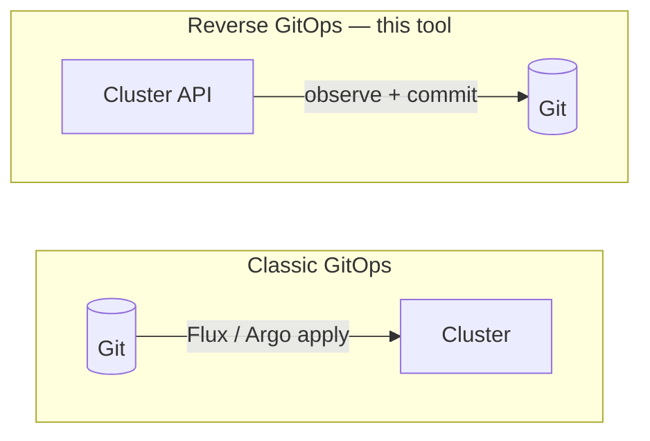
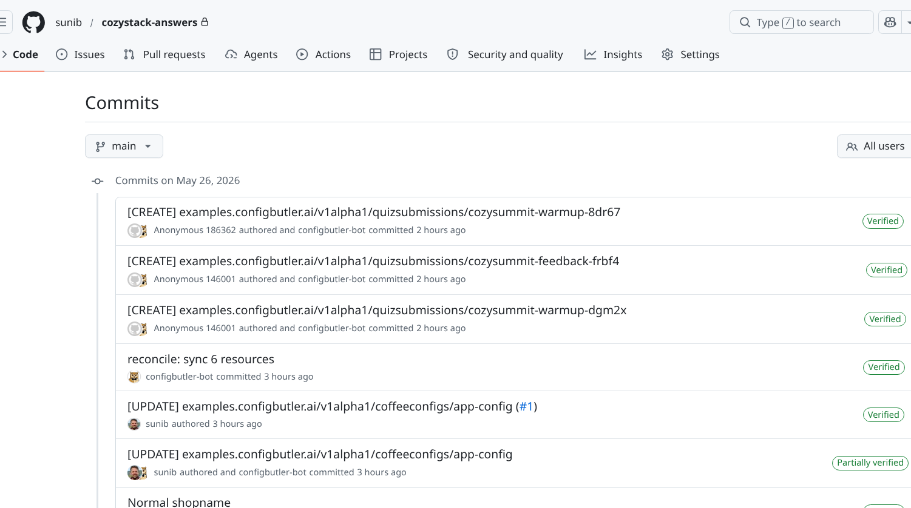
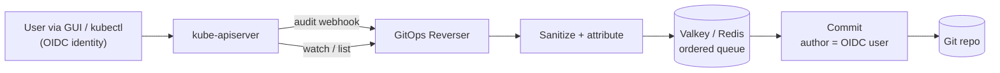
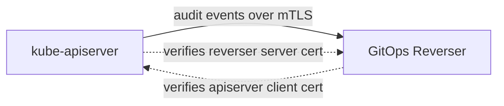
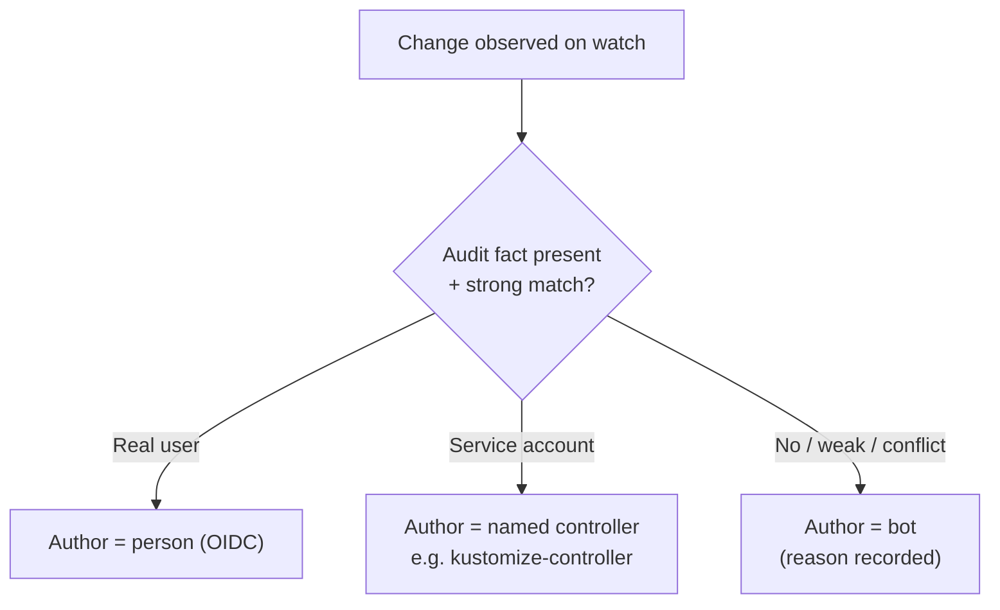
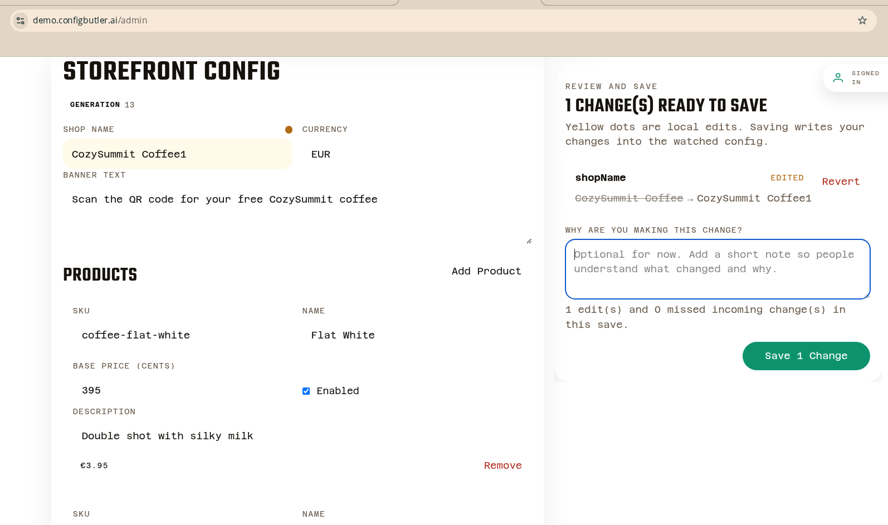
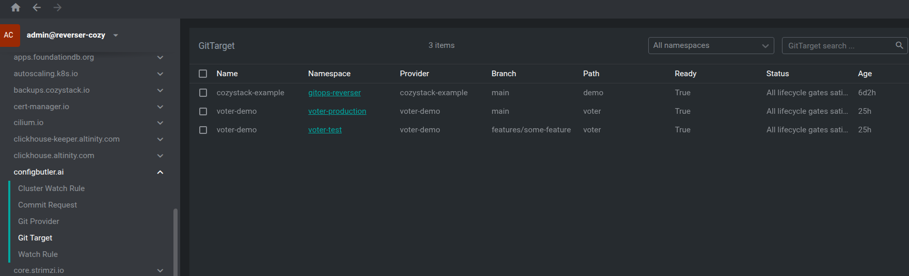
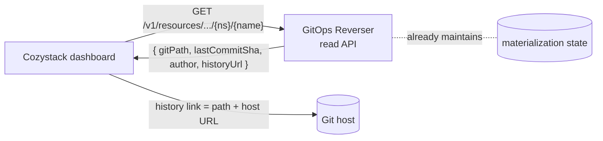
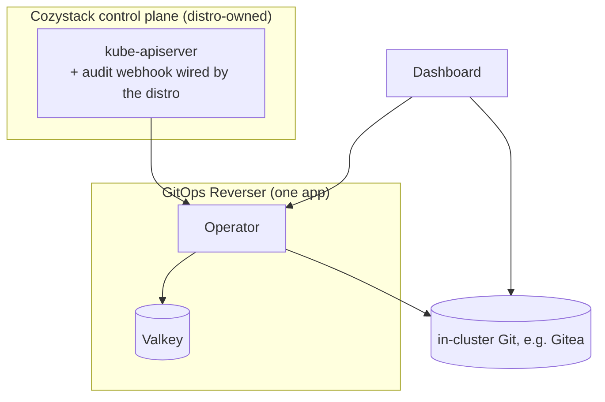

# GitOps Reverser × Cozystack

### API-first Kubernetes — with a Git audit trail that *just happens*

Every change to the cluster becomes a clean, attributed Git commit.
No new workflow for users. No giving up history.

Run this deck: <code>npm install && npm run dev</code>

<!--
One-liner: keep using the API. We turn live API activity into reviewable YAML in Git,
with the human's name on every commit. Today is about fit for Cozystack, not a live demo.
-->

---

## Agenda

1. What it is — the reverse-GitOps pattern
2. What I showed last time — *you* generated the data
3. **What's new since then** — the build log
4. Why **Cozystack** is a near-ideal fit
5. Attribution — and the **no-audit** mode
6. **Trust the source:** mutual TLS on the audit channel
7. **`CommitRequest`** + the **configuration resources**
8. **API** state, **file layout**, and a clean **install**
9. Secrets, open questions, and what we defer

---

## What it is

> Classic GitOps: Git is the source of truth, a controller applies it to the cluster.
> **Reverse GitOps: the cluster API is the source of truth, we project it into Git.**

Teams keep an **API-first** workflow (GUI, `kubectl`, operators) and still get a
reviewable, versioned, **attributed** history — for free.

> **The cluster API is the single source of truth — not Git.**
> So there are **no merge conflicts, ever.** Git is a projection: when the live
> state changes, we just **overwrite** the file to match. The cluster always wins.

<!-- The pattern page: reversegitops.dev. The "API is source of truth" line is the
     answer to "but what about merge conflicts / two-way sync?" — there is no two-way
     sync. One direction only. The cluster decides; Git records. -->

---

## What I showed last time — *you* made the data

**Last time, the room generated the demo.** You scanned a QR, answered a warm-up
quiz, and **every answer landed in the cluster as a real CR** — a `QuizSubmission`,
arriving through the **API** exactly like a Cozystack `Postgres` or `Bucket` would.

- You submit an answer in the browser →
- it hits the kube-apiserver as a real resource →
- within seconds a sanitized YAML commit lands in Git, **attributed to you**.

We captured **the public's own settings, live**, and they became Git history in
front of you. Then, in the dashboard, `git blame` showed the **OIDC user's name** —
not a robot. **It was boring. It just worked.** That is exactly the pitch.

> Today: **no live demo.** I'll show last time's result — *your* commits and the repo.

<!--
The callback: the audience IS the demo. Their quiz answers were captured as CRs and
turned into commits in real time. Lean into "boring" — a change-capture tool that is
dramatic is failing. It's invisible until you need the history, then it's all there.
-->

---
layout: two-cols
---

## Last time — the artifacts

**The room's quiz answers, as commits.** Each `QuizSubmission` arrived through
the API and was captured automatically — authored by the attendee.

{.rounded .shadow .mt-2}

Real example commit →
[`800a51e…`](https://github.com/ConfigButler/example-audit/commit/800a51e5a8edcccbc85c94d5fef7ef7cc8381b7b)

::right::

**The same mechanism on real Cozystack resources.** `HelmRelease`s and `apps`
captured with the **OIDC user's real name** (`sunib`) — not a bot.

{.rounded .shadow .mt-2}

<!-- These are the actual artifacts from last time. Left: the audience-capture (quiz
     submissions, attendee authors). Right: the same flow on Cozystack CRs with real
     OIDC attribution. Walk one commit: human author, sanitized body, sensible path. -->

---

## What's new since last time

I didn't just talk about it — since the last meeting it grew **more honest history**
and **more control**:

- **`CommitRequest`** — batch the pending changes into **one commit** with your own
  message + ticket references.
- **Resource ↔ file mapping** — every resource maps to a **known file**; I can go from a
  live object to its exact path, and back.
- **Many files per folder** — a folder can hold lots of resources and stay readable.
- **Configurable file placement** *(in progress)* — decide how new files land:
  per namespace, per type, per tenant.
- **State via API** — ask the operator where a resource lives in Git (path, last commit,
  history link).
- **Trust hardening** — **mutual TLS** on the audit channel, so attribution is provably
  from the real apiserver.

<!-- The "build log" slide. Each item is detailed on a later slide. Land that this is a
     working tool that moved forward, not a concept. -->

---

## How it works (live path)

- **Audit webhook** answers *who changed it* (the human).
- **Watch / list** answers *what the object actually is* (full, clean body).
- Sanitization strips runtime noise; Redis keeps writes ordered; commits can be SSH-signed.

---

## Trust the source: mutual TLS

I care about producing output you can **trust**. A name on a commit is only worth as
much as the **channel the audit events arrive on**.

- **Without mutual TLS:** anything that reaches the webhook could **forge** audit events
  → fake human names in your history.
- **With mTLS:** the apiserver presents a client cert the reverser verifies → events are
  **provably from the real apiserver**.
- A little fiddly to set up — **but honestly not hard.** I ship a working example.

> Worked example → [`examples/audit-webhook-mtls.md`](examples/audit-webhook-mtls.md)

<!-- Trust is the product. mTLS is the thing that lets you *believe* the name on a commit.
     Don't gloss this — it's the difference between an audit trail and a nice-looking one. -->

---

## Why Cozystack is a near-ideal fit

The hardest install step everywhere else is **configuring the kube-apiserver audit
webhook** — managed clouds won't let you.

**Cozystack owns its own apiserver.** That friction disappears.

- The high-fidelity, **OIDC-attributed** mode (the wow from the demo) is fully available.
- The distro can ship a **curated audit policy** tuned for Cozystack's own controllers.
- Multi-tenant by design → natural per-tenant repos / paths.

> We're usually a "poor fit for managed control planes." Cozystack is the opposite of that.

---

## The main question: how much do we care about attribution?

**My answer: a lot. It's the difference between two products.**

|  | Without user names | With user names |
|---|---|---|
| What you get | A Git **mirror** of cluster state | An **accountable audit trail** |
| `git blame` says | `gitops-reverser-bot` | **the actual person** |
| Value | "what is configured" | "who changed what, when, and why" |

The catch: real user names require the **audit webhook** to be configured.
That's the one thing that raises the bar — and it's exactly the thing Cozystack
can do *for* the user.

<!--
This is the crux slide. Attribution is the moat. It is also the cost. On Cozystack the
cost is paid by the distro, not the end user — so we get the high-value mode by default.
-->

---

## Attribution is a confidence decision, not a guess

- A **wrong** name is worse than **no** name → we only name on strong evidence.
- A controller is a *named* author, not "unknown" → history reads as
  **human edits vs reconciles**.

> **Supported mode: no audit ingestion at all.** Simpler to install — but every commit
> is the **bot**, with *no* human names. It works… and honestly, **I find it a shame**:
> the names are most of the value.

---
layout: two-cols
---

## `CommitRequest` — let humans say *why*

Attribution gives us **who** and **when**. The last gap is **why**.

**A `CommitRequest`** lets anyone bundle the **current set of pending changes**
into a **single commit with their own message** — intent, not just a diff.

- Group several edits → **one meaningful commit**, not a scatter of robot commits.
- Reference an **internal ticket**, an incident, an RFC — whatever context matters.
- Turns the history from *a log of changes* into a **reviewed, explained changelog**.

::right::

You already saw the seed of this last time, in the **app edit**: the storefront
editor asked *"why are you making this change?"* — `CommitRequest` makes that
first-class, for **any** change in the cluster.

{.rounded .shadow .mt-2}

<!--
CommitRequest is the answer to the old When/Who/WHY motif. Who+when come from the audit
webhook; why comes from the human writing a message. Batching pending changes into one
commit is what makes the history read like a changelog instead of a firehose. The ticket
reference is the bridge to whatever the org already tracks work in.
-->

---
layout: two-cols
---

## Configurable, not hard-coded

`CommitRequest` is one of a small set of **configuration resources**. Everything is
driven by CRDs, so the same engine flexes to very different setups.

| Resource | What it controls |
|---|---|
| `GitProvider` | How to reach the Git host + credentials |
| `GitTarget` | Repo / branch / path to write to |
| `WatchRule` | Which namespaced resources to capture |
| `ClusterWatchRule` | Which cluster-scoped resources to capture |
| `CommitRequest` | Batch changes into one explained commit |

Per-tenant repos, per-type paths, capture-this-skip-that — **all configuration, no code.**

::right::

{.rounded .shadow .mt-12}

Opinionated defaults on top: most users get a profile, power users get the full surface.

<!-- The freelens sidebar shows these CRDs live. The pitch: flexibility comes from a small,
     composable CRD set — not forks or config flags. -->

---

## Returning state via an API call

*The ask from last time: "can I get something about that state from an API?"* — yes.

- The operator **already knows** each resource's file path + last commit SHA —
  on both the live and reconcile paths. Nothing to duplicate.
- The GUI gets a **"view history"** link per resource for free.
- **Read-only:** we don't write annotations back into the cluster (no second writer,
  no feedback loop).

---

## Resources → files: a readable tree

Every captured resource maps to a **known file** in the repo — and the mapping goes
**both ways**: from a live object to its path, and from a file back to its object.

- A single **folder can hold many files** (e.g. a whole namespace) and stay readable.
- **Configurable file placement** *(in progress)*: choose how new files land —
  by namespace, by type, by tenant — to match how your team already thinks.
- Stable, predictable paths are what make **`CommitRequest`** and the **history link**
  point at exactly the right thing.

<!-- File layout isn't cosmetic: stable paths are what make diffs reviewable and the
     state-via-API history links resolve. Configurable placement is the active work. -->

---

## What a new install could look like

**Goal: one opinionated profile**, not the full CRD surface on day one.

---

## Install walkthrough (the experience we want)

1. **Install the app** — operator + Valkey + an in-cluster Git host, bundled.
2. **Distro wires the audit webhook** to the operator (Cozystack's superpower).
3. **One `GitProvider` + `GitTarget`** pre-created → repo exists, bot can push.
4. **Default capture set**: the tenant-facing CR types, *not* internal plumbing.
5. Done — the GUI shows "view history" links; commits carry real names.

> Open question I want to settle: **can this just be a Cozystack "application"?**
> If yes, the whole thing is a one-click install with sane defaults.

<!--
The "install as an application" question is genuine. If Cozystack's app model can carry
the operator + valkey + gitea + the pre-created CRs, install friction → near zero.
-->

---

## Secrets: "use secrets for secrets"

- `Secret`s (and opted-in Secret-shaped CRs) are **encrypted with SOPS + age** before commit. ✅
- The gap: **credentials inlined into a CR `spec`.** Common best practice to avoid — but
  *not guaranteed*, especially across bundled apps.

**Plan (no fragile field-level encryption at launch):**

- Contract: *sensitive data belongs in `Secret`s.*
- Escape hatch: mark a whole CR **type** sensitive → encrypt it wholesale, **or** redact/skip.
- **Fail closed:** never commit plaintext; skip or redact instead.

Field-level encryption stays a later opt-in — it raises the bar the wrong way.

---

## Open questions (and where I lean)

| Question | Lean |
|---|---|
| **Where to host Git?** | In-cluster, auto-provisioned (Gitea); external remotes still supported. |
| **How to configure without friction?** | One opinionated distro profile; full CRDs for power users. |
| **Path back (Git → cluster via Flux)?** | **Defer.** Works in e2e, but it's the "two writers" trap until ownership is crisp. |
| **Aggregated APIs / the audit proxy?** | On its way out — watch carries the full object body. |
| **HA?** | Start single-replica (leader-elected); seams exist, don't oversell. |

---

## What we deliberately defer

- **Path back** (edit in Git → Flux reconciles into the cluster). Premature; nice future story.
- **Field-level secret encryption.** Coarse, fail-closed handling first.
- **External-cluster / managed-control-plane support.** Cozystack doesn't need it.
- **Multi-writer HA.** Single-writer-per-type ownership is the one real deferred item.

> Honest scope sells better than a wishlist.

---
layout: center
class: text-center
---

## The pitch, in short

1. **It already does the headline on Cozystack's home turf:** API-first writes →
   clean, **OIDC-attributed** Git history, on a distro that can wire the audit webhook.
2. **Attribution is the moat** — and Cozystack pays its one cost for the user.
3. **`CommitRequest` adds the *why*:** batch edits into one explained commit, with a
   ticket reference — history becomes a reviewed changelog, not a firehose.
4. **State via API** answers last time's question: path, SHA, history link, content — read-only.
5. **Fewer moving parts:** proxy on its way out; install is one opinionated app.

---
layout: center
class: text-center
---

## Backup / details

Full positioning note → [cozystack-integration-pitch.md](cozystack-integration-pitch.md)
Architecture deep-dive → [watch-only-ingestion-architecture.md](watch-only-ingestion-architecture.md)
Audit webhook over mutual TLS → [examples/audit-webhook-mtls.md](examples/audit-webhook-mtls.md)
The pattern → [reversegitops.dev](https://reversegitops.dev)
Live example repo → `github.com/ConfigButler/example-audit`

# Questions?
