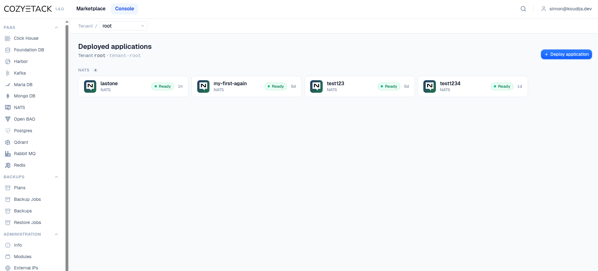
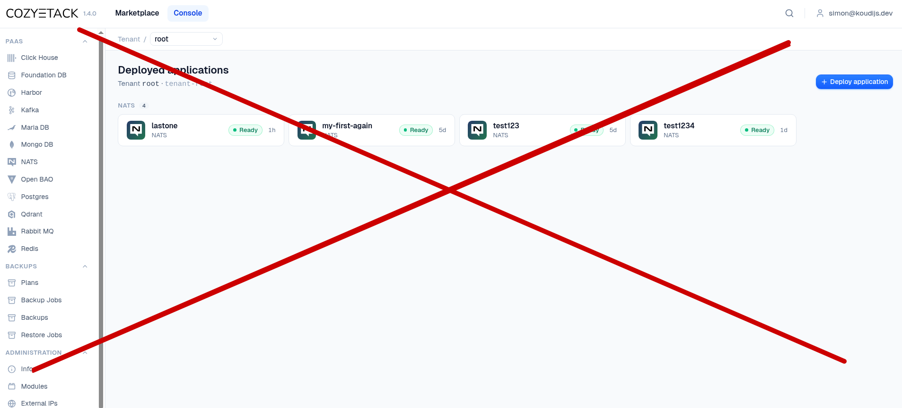
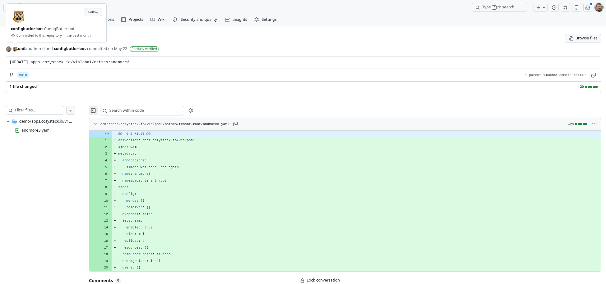

<!--
_class: lead
_color: white
-->


# gitops-reverser in CozyStack?

 

**Reverse GitOps for platform changes**

Simon Koudijs, ConfigButler

<!--
Hook: open with the question. Don't answer it yet.
-->

---


# Who am I?

`[Software|Product|Cloud|AI] engineer`

- Worked in startups, consultancy, and SaaS
- Left my job last summer to pursue building my own company

<!--
Since last summer: working open source, speaking to spread the word
-->

---

# What do I do?

- [koudijs.dev](https://koudijs.dev/)
  - consultancy, training
- [ConfigButler](https://configbutler.ai/)
  - startup, open source first
  - helps you build high quality configuration
- [Reverse GitOps](https://reversegitops.dev/) pioneer
  - manifest, feel free to comment! :slightly_smiling_face:

---



<!--
## API First

Cozystack exposes platform services as Kubernetes API resources:

- Postgres
- Redis
- Bucket
- Kubernetes (clusters as a resource)

Users interact via **kubectl**, the **dashboard**, or even an **MCP** feeding an AI agent.
-->

---

# Why these resources?

- 🕐 When? :white_check_mark:
- 👤 Who? ❌
- 🤔 Why? ❌

Git seems far away.

<!--
Land the pain. Pause here.
Who added this huge resource? Why did he/she do this?
Kubernetes API makes it easier: but it's not easy, and it would help if you at least would know users intent!
-->

---

## Your options

- Accept it
- Periodic reset 
- Limited access
- Audit files ([kube-api](https://kubernetes.io/docs/tasks/debug/debug-cluster/audit/) to the rescue)

<!--
Accept it: "it's not important, we can live with uncertainty, it's for experiments, people don't do weird stuff
Periodic reset: wipe it every night to a known state, it's only for shorter experiments.
Limited acces: only a select group of people with good docs, run books, manual changelogs are making adjustments
Configur audit logs: kube-api has a lot of options to push important resources, and changes into audit log files. They do provide answers: but it does take skills to find what you need.

These work, but they trade autonomy for control. Could be fine, but it could also be painfull
-->

---

## Your options: GitOps

Flip the interface: **Git is the only way in**.

- YAML files / PRs
- Controllers (Argo, Flux)

But: edits can't go through kubectl, dashboard, MCP. The GUI and the API stop being the front door. Git is your `interface`.

<!--
This is the classic answer. It works — but it asks every user to speak YAML.
Controllers sync from git to cluster

-->

---



<!--
Shows a picture of the dashboard with a big red cross to indicate that you would loose it!

Pure GitOps is pretty hard when you want to use a GUI as well (at least for editting)
-->

---

## Where we are now

We have seen three things:

1. Kubernetes audit events can show **exactly what happened**
2. gitops-reverser can turn those events into **readable Git history**
3. The coffee-app demo made that concrete in a Cozystack-shaped workflow

<!--
This is the bridge from the earlier "Git seems far away" problem.
The point is not "please abandon the dashboard". The point is that we can keep
the dashboard and still have a durable trail.
-->

---


<!--
First proof: incoming Kubernetes API resources become a Git repository.
You can track what is going on without forcing the user to start in Git.
-->

---

## First proof: audit capture

The audit log gives the missing context:

- actor from OIDC
- verb and resource
- request and response
- timestamp from the API server

That is enough to write an attributed commit.

<!--
This is the technical core. Watch alone can tell you final state. Audit tells
you who asked the API server to make the change.
-->

---



<!--
Show that the commit exists and that the bot is the committer.
The important distinction: the bot writes, but the human remains the author
when the audit identity is trusted.
-->

---

## Reverse GitOps

Classic GitOps: **Git -> Platform**

Reverse GitOps: **Platform -> Git**

Git stops being the interface.
Git becomes the memory.

<!--
Keep this short. Cozystack is already API-first. The story is stronger when
we do not fight that.
-->

---


<!--
The operator observes API activity, writes clean files, and preserves the
connection between a live resource and the Git evidence.
-->

---

## Then: the coffee app

Together we used the coffee-app demo:

- create higher-level platform resources
- change configuration through the normal interface
- resolve merge conflicts as we go

---


<!--
This is the "why" slide. A configuration change is much easier to discuss
when it is a normal Git diff.
-->

---

## What we learned

- We can answer **when**
- We can answer **who**
- With good resource diffs, we can often answer **why**

And we can do that without making Git the only front door.

---


<!--
GitTarget keeps the repository layout configurable.
For a Cozystack integration, I would prefer one opinionated default profile
over asking every user to understand all of the knobs.
-->

---

## New feature idea

For every captured resource, serve provenance back by API:

```http
GET /resources/{group}/{version}/{resource}/{namespace}/{name}
```

```json
{
  "gitPath": "clusters/demo/apps/coffee/order.yaml",
  "lastCommitUrl": "https://git/.../commit/abc123",
  "historyUrl": "https://git/.../commits/main/.../order.yaml"
}
```

<!--
This answers the request for file location and the last URL.
The GUI can call this and show "open in Git" or "view history" without us
writing annotations back into live objects.
-->

---

## Why API, not annotations?

Annotations are tempting, but they make the reverser a writer in the cluster.

- every annotation write creates another event
- the operator has to filter its own changes
- live objects become coupled to Git layout

A read API keeps the mirror read-only.

<!--
This is a product boundary slide. Staying read-only is part of the value.
-->

---

## Trust boundary

I want this to be a **trustable source**.

If a commit says "Noa changed the coffee config", that should mean:

- the API server authenticated Noa
- the audit event really came from that API server
- the commit author was derived from that trusted event

<!--
Credibility matters here. The whole product becomes weaker if people can
forge audit events into the webhook.
-->

---

## The annoying part: mTLS

The kube-apiserver audit webhook should use mutual TLS:

- apiserver verifies the reverser endpoint
- reverser verifies the apiserver client certificate
- only verified audit facts attach a human name to a commit

This is hard and annoying for easy rollout.

<!--
Say this plainly. mTLS is not the fun demo part. But it is what lets the
system claim to be more than a nice log collector.
-->

---

```yaml
apiServer:
  extraArgs:
    audit-policy-file: /var/audit-policy.yaml
    audit-webhook-config-file: /var/audit-webhook.yaml
    audit-webhook-batch-max-wait: 1s
    audit-webhook-batch-max-size: "100"
```

<!--
This is the concrete Cozystack/Talos angle. On managed clusters this is often
the blocker. In Cozystack, the distro can own the apiserver wiring.
-->

---

## Is it worth it?

For generic Kubernetes: maybe not for everyone.

For Cozystack: I think yes.

- Cozystack owns the kube-apiserver
- the dashboard already uses the Kubernetes API
- high-level resources create human-readable diffs
- the distro can hide the difficult default setup

---

## What I would propose

Start with a focused integration:

- read-only mirror of selected Cozystack resources
- OIDC-attributed commits from verified audit events
- default GitProvider and GitTarget
- GUI links to file location, latest commit, and history

No Git -> cluster write-back yet.

<!--
This keeps the scope honest. The repo becomes useful immediately as history
and desired-state backup, while avoiding the two-writers problem.
-->

---

## Open questions

- Which Cozystack resources should be captured first?
- Can `apps.cozystack.io/v1alpha1` secret fields be removed?
- Where should the default Git repository live?
- What should be visible per tenant?
- How much of the audit/mTLS setup can Cozystack ship as defaults?

---

## Takeaways

1. Keep Cozystack API-first
2. Git as trustworthy memory
3. Make provenance visible from the GUI by adding a link
4. Treat mTLS as the price of trustworthy attribution

---
<!-- 
_class: lead 
_backgroundColor: white
-->

Contact details and presentation at https://koudijs.dev
