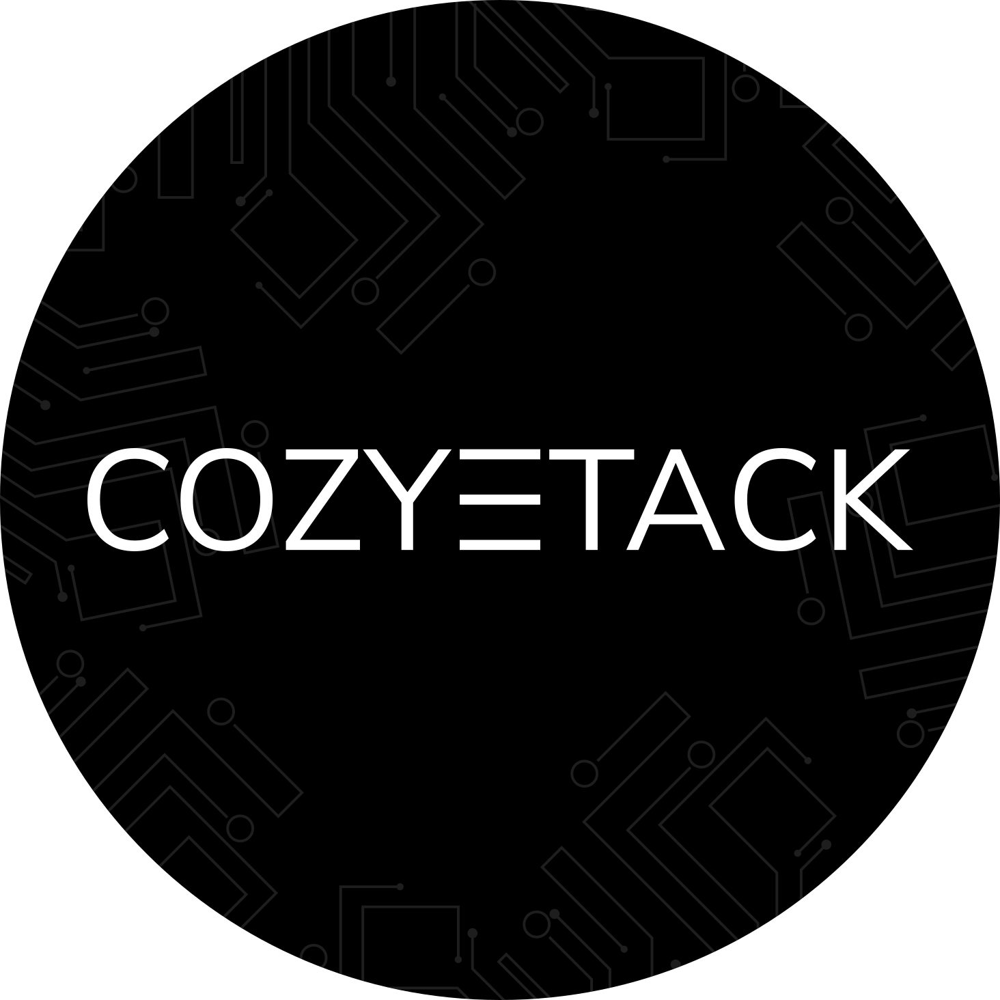
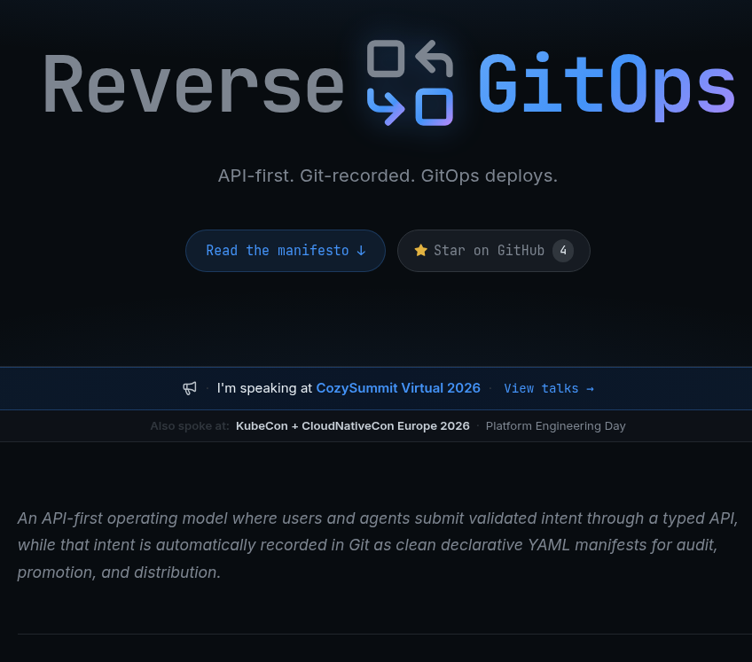
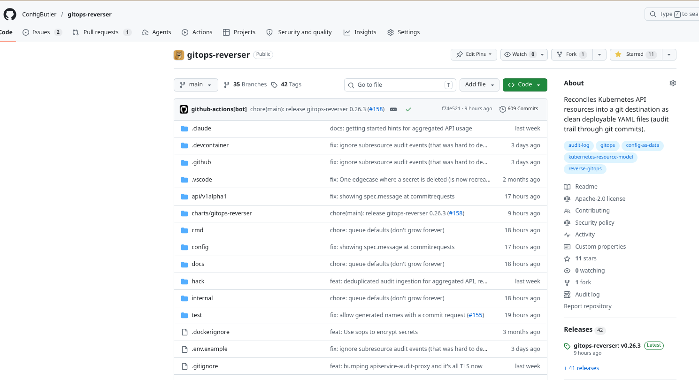
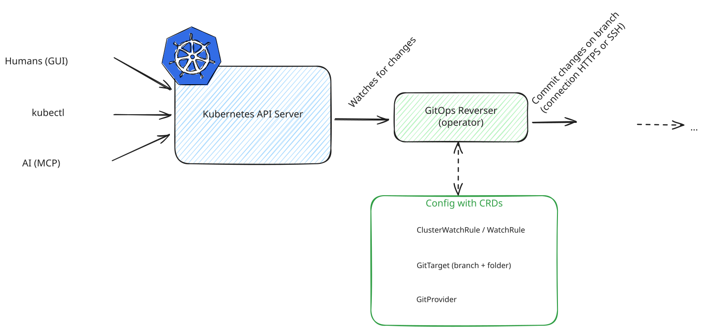
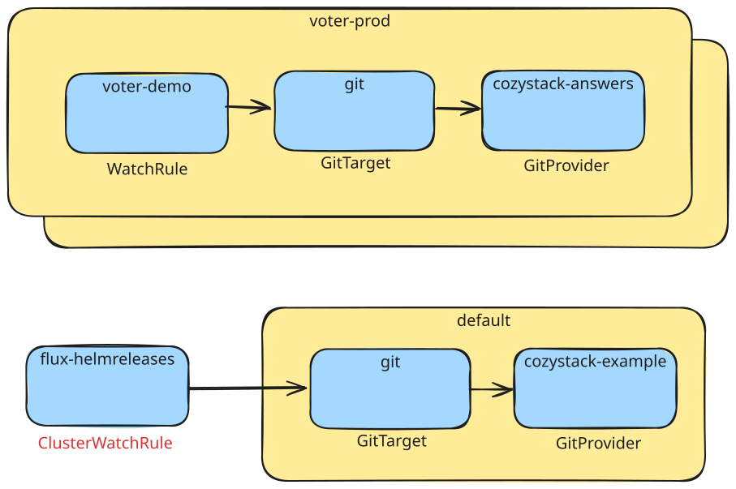
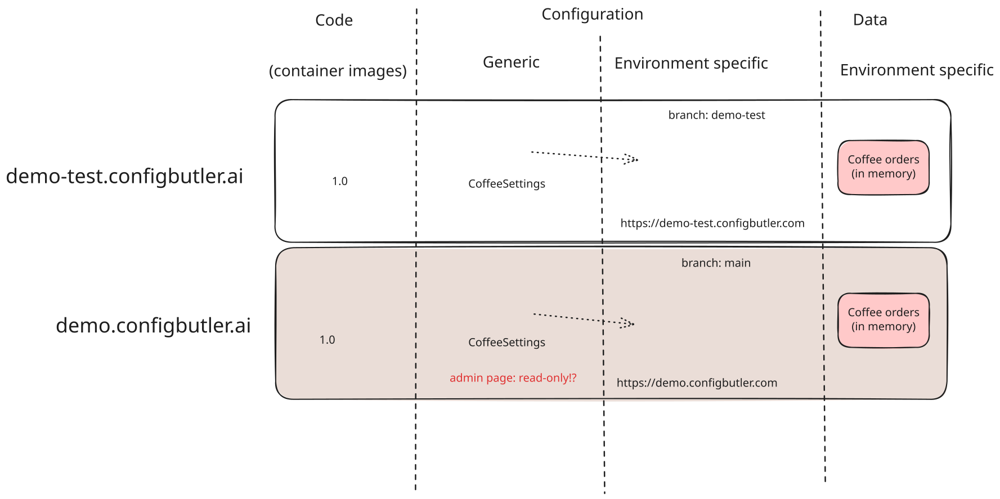
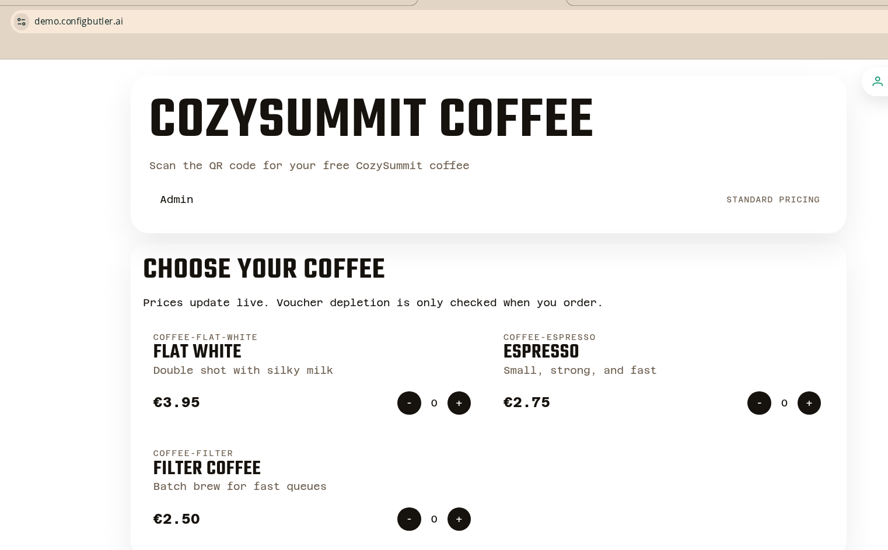
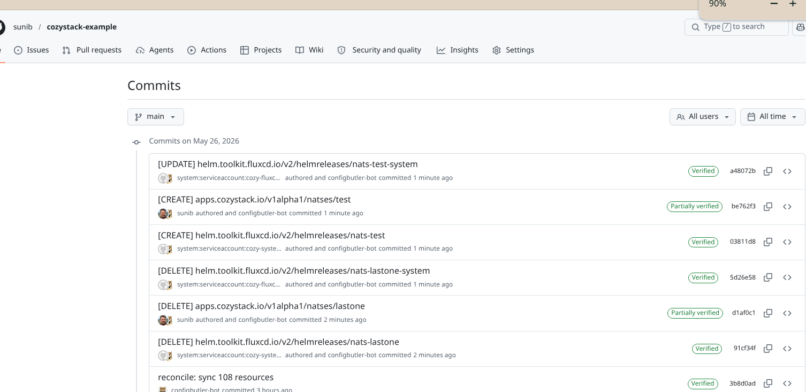

<!--
_class: lead
_color: white
-->


# What If Every Cozystack Change Became a Commit?

 

**Reverse GitOps for platform changes**

Simon Koudijs, ConfigButler

<!--
Hook: open with the question. Don't answer it yet.
-->

---


# Who am I?

`[Software|Product|Cloud|AI] engineer`

- Worked in startups, consultancy, and SaaS
- Left my job last summer to pursue building my own company

<!--
Since last summer: working open source, speaking to spread the word
-->

---

# What do I do?

- [koudijs.dev](https://koudijs.dev/)
  - consultancy, training
- [ConfigButler](https://configbutler.ai/)
  - startup, open source first
  - helps you build high quality configuration
- [Reverse GitOps](https://reversegitops.dev/) pioneer
  - manifest, feel free to comment! :slightly_smiling_face:

---


<!--
## API First

Cozystack exposes platform services as Kubernetes API resources:

- Postgres
- Redis
- Bucket
- Kubernetes (clusters as a resource)

Users interact via **kubectl**, the **dashboard**, or even an **MCP** feeding an AI agent.
-->

---

# Why these resources?

- 🕐 When? :white_check_mark:
- 👤 Who? ❌
- 🤔 Why? ❌

Git seems far away.

<!--
Land the pain. Pause here.
Who added this huge resource? Why did he/she do this?
Kubernetes API makes it easier: but it's not easy, and it would help if you at least would know users intent!
-->

---

## Your options

- Accept it
- Periodic reset 
- Limited access
- Audit files ([kube-api](https://kubernetes.io/docs/tasks/debug/debug-cluster/audit/) to the rescue)

<!--
Accept it: "it's not important, we can live with uncertainty, it's for experiments, people don't do weird stuff
Periodic reset: wipe it every night to a known state, it's only for shorter experiments.
Limited acces: only a select group of people with good docs, run books, manual changelogs are making adjustments
Configur audit logs: kube-api has a lot of options to push important resources, and changes into audit log files. They do provide answers: but it does take skills to find what you need.

These work, but they trade autonomy for control. Could be fine, but it could also be painfull
-->

---

## Your options: GitOps

Flip the interface: **Git is the only way in**.

- YAML files / PRs
- Controllers (Argo, Flux)

But: edits can't go through kubectl, dashboard, MCP. The GUI and the API stop being the front door. Git is your `interface`.

<!--
This is the classic answer. It works — but it asks every user to speak YAML.
Controllers sync from git to cluster

-->

---


<!--
Shows a picture of the dashboard with a big red cross to indicate that you would loose it!

Pure GitOps is pretty hard when you want to use a GUI as well (at least for editting)
-->

---

<!-- 
_class: lead 
_backgroundColor: white
-->


https://demo.configbutler.ai/login?next=/answer/cozysummit-warmup&code=abc94689412


<!--
Show the incomming CRs

* interactive demo
* your answers are recorded in my kube-api server as a CRD
* It's Cozystack like: kube-api first
* meet voter-app
* does this handle your ingress?
* You scan to code or enter the url, and you pick your own e-mail and display name. I won't send you e-mails, and I won't make it public (except for what I might show on screen during the presentation).

-->

---

```YAML
apiVersion: examples.configbutler.ai/v1alpha1
kind: QuizSubmission
metadata:
  name: cozysummit-warmup-dgm2x
  namespace: voter-production
spec:
  answers:
  - questionId: q1
    singleChoice: Heard of it
  - multiChoice:
    - kubectl
    - Git (PR-based)
    questionId: q2
  - number: 6
    questionId: q3
  sessionRef:
    group: examples.configbutler.ai
    kind: QuizSession
    name: cozysummit-warmup
  submittedAt: "2026-05-26T13:32:56.779Z"
```

---

# Why these resources?

- 🕐 When? :white_check_mark:
- 👤 Who? ❌
- 🤔 Why? ❌

<!-- The why: is clear but you get the point. -->

---

## What if?

What if **every platform change** automatically appeared as clean YAML in Git?

- Fully automated
- Identity
- A silent layer
- API activity → durable, readable history of intent

<!-- You gave me identity for this demo, let's see! -->

---

## Reverse GitOps

Classic GitOps: **Git → Platform**

Reverse GitOps: **Platform → Git**

Git stops being the *interface*.
Git becomes the *memory*.

---

<!-- 
_class: lead 
_backgroundColor: white
-->



1. API First
2. Capture Intent, Not Implementation
3. GitOps Still Applies

## [reversegitops](https://reversegitops.dev)

---



<!--
# Meet gitops-reverser

* Implements Reverse Gitops
* Configurable by CRD
* Inspired by great tools like Flux
* Fully open-source
-->

---

<!-- 
_class: lead 
_backgroundColor: white
-->




---

<!-- 
_class: lead 
_backgroundColor: white
-->




---


---


---

# Git commits

```bash
❯ git log -1 --pretty=fuller
commit 0c242f2fd35d89d2189a6be849220ccce6cc60e2 (HEAD -> main, origin/main, origin/HEAD)
Author:     Anonymous 146001 <146001@demo.configbutler.ai>
AuthorDate: Tue May 26 13:35:24 2026 +0000
Commit:     ConfigButler bot <286979421+configbutler-bot@users.noreply.github.com>
CommitDate: Tue May 26 13:35:24 2026 +0000

    [CREATE] examples.configbutler.ai/v1alpha1/quizsubmissions/cozysummit-feedback-frbf4
```

---

# Why these resources?

- 🕐 When? :white_check_mark:
- 👤 Who? :white_check_mark:
- 🤔 Why? ❌ -> commit message?

---

# Demo part 2

* Let's do some coffee ordering
* Artifacts
* And let's make some changes

---
<!-- 
_class: lead 
_backgroundColor: white
-->


---
<!-- 
_class: lead 
_backgroundColor: white
-->


---
<!-- 
_class: lead 
_backgroundColor: white
-->


---

# Why these resources?

- 🕐 When? :white_check_mark:
- 👤 Who? :white_check_mark:
- 🤔 Why? :white_check_mark:

---

## Why Cozystack fits

- Kubernetes API first
- GUI uses OIDC
- Talos

<!--
- Platform intent already lives in the Kubernetes API
- High-level resources (Postgres, Bucket) → small, meaningful diffs
- This is experimental
- I'm not an Cozystack expert, but I do want to learn
- It can do more than I would have hoped
-->
---


<!--
Now lets make some changes
-->

---


<!--
Now let's show that we also can see who did this! Thanks to directly using the Kubernetes API this works, with OIDC and  -->

---

## How can this work?

| Option | Phase | Identity | Why not enough |
|---|---|---|---|
| Watch | Post | No | Sees resulting state, not who changed it. |
| Admission webhook | Pre | Yes | Sees the request, not the final persisted outcome. |
| [Audit webhooks](https://kubernetes.io/docs/tasks/debug/debug-cluster/audit/) | Post-ish | Yes | Best fit: who did what, to which resource, and how the API server responded. |

<!--
Audit policy is the closest fit — but configuration isn't easy and aggregated API bodies aren't written by default.
-->


---

## What you gain

- **Auditability** — versioned, diffable, shareable
- **Easier on-ramp to GitOps** — no YAML fight, the API answers fast
- **GUI without guilt** — click in the dashboard, still get a commit
- **Non-engineers can propose changes** — through the tools they already use
- **Test-cluster → PR → prod** — promote what worked

---

## The honest part

- Setup is not easy
  - api-audit-proxy
  - kube-api tuning
- Secrets
  - gitops-reverser can encrypt secrets with SOPS
  - Please keep them in dedicated resources, not inline fields

<!--
Don't hide the rough edges. Credibility comes from naming them.
-->

---

## What's next?

* Please let me know what you think!
* I can't cover everything
* Promotion (Cozystack test → PR → Cozystack prod)

---

## Takeaways

1. The Kubernetes API is already a record of intent: capture it
2. Reverse GitOps gives auditability without changing how operators work
3. Cozystack's high-level resources make the diffs *human-readable*

---
<!-- 
_class: lead 
_backgroundColor: white
-->

Contact details and presentation at https://koudijs.dev

https://demo.configbutler.ai/login?next=/answer/cozysummit-feedback&code=abc94689412
