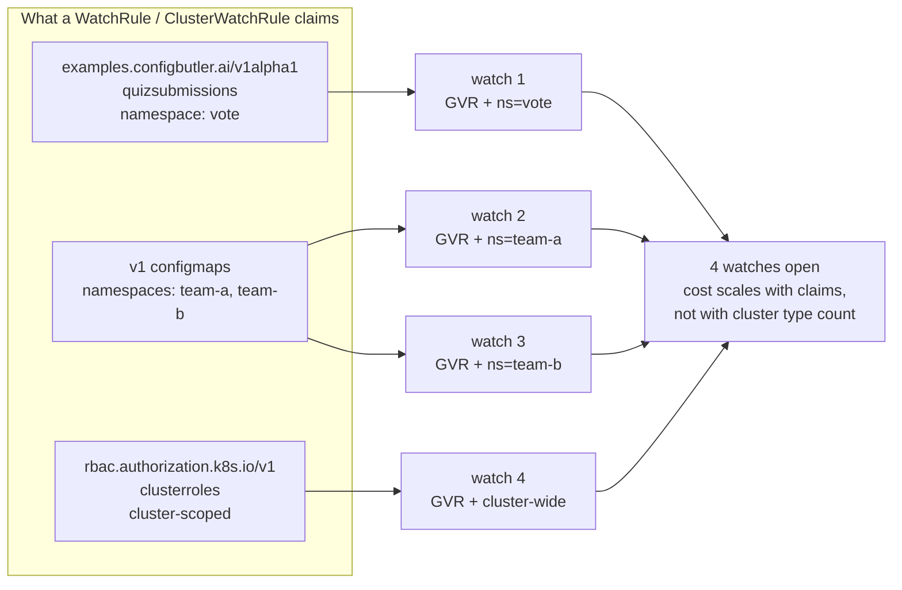
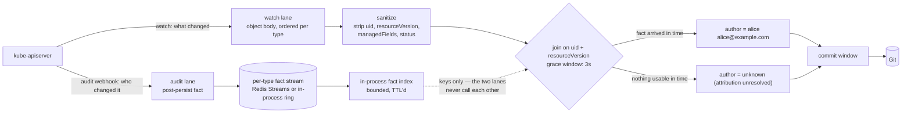
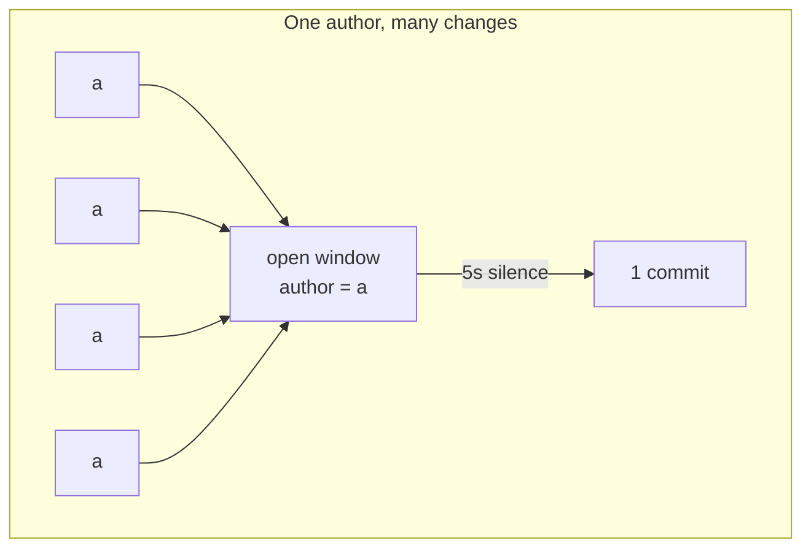
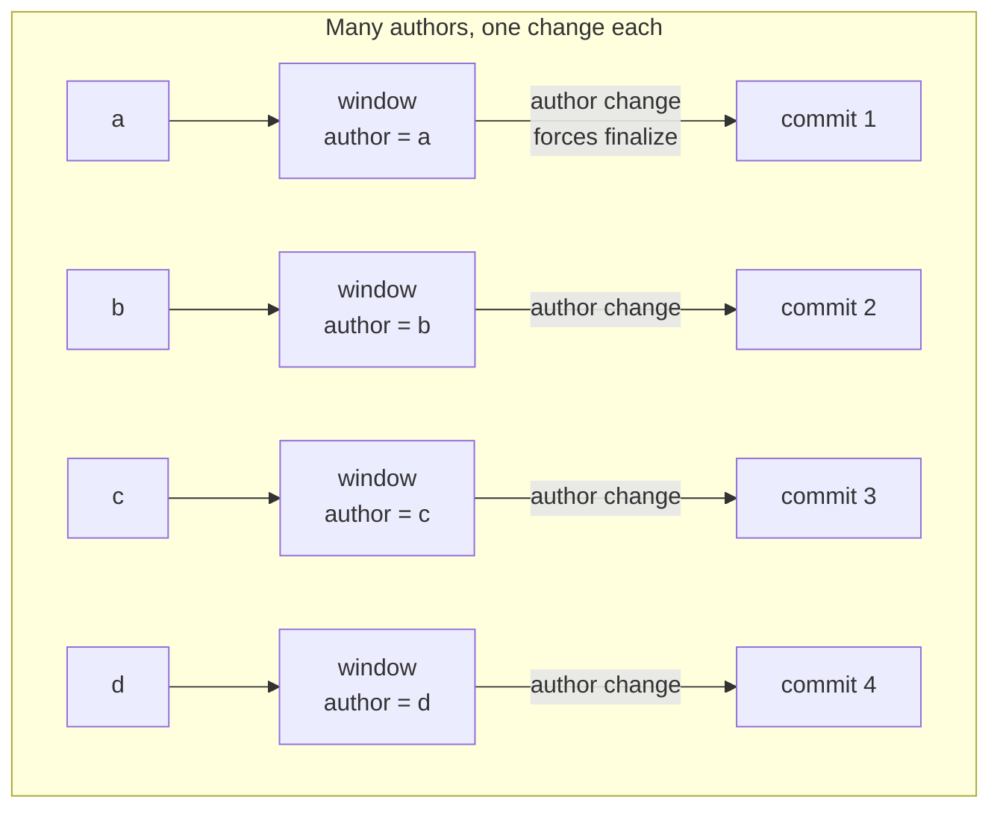
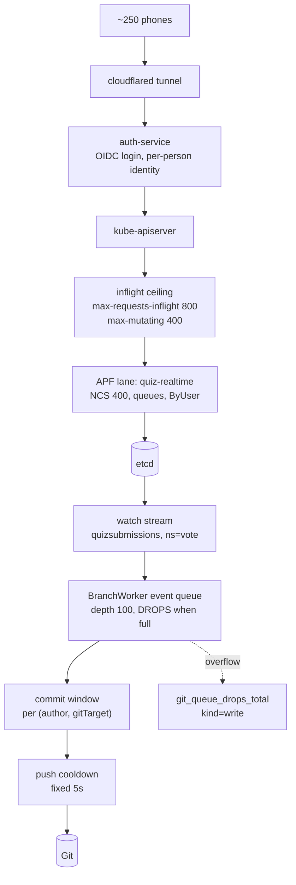

# Talk graphics + demo-day checklist — Swiss Cloud Native Day, 17 Sep 2026

> Scratch material (`*.ignore.md`): untracked, unlinted, not linked from `INDEX.md`, not binding.
> Companion to [`presentation.ignore.md`](presentation.ignore.md) (§14 = this talk) and
> [`presentation2.ignore.md`](presentation2.ignore.md).
>
> Scope: the four slide graphics for the **write-path mechanism** beat, plus the tuning checklist
> for a demo where every participant has their **own OIDC identity**.

---

## Part 1 — The graphics

Four diagrams. They are ordered as they should appear: claim → join → commit shape → demo-day path.
The fourth is a backup/Q&A slide, not a main-line one.

### Diagram 1 — Watch streams: one watch per `(GVR, scope)`

Use this immediately before the demo. It explains what produces the commits the room is about to see.



**Say:** "A namespaced type opens one watch per namespace it is claimed in. A cluster-scoped type
opens one. Three rules, four watches — and that is the whole scaling story: you pay for what you
claim, not for how many types the cluster has."

**Leave out** (hidden slide / Q&A only): resume cursors, `sendInitialEvents`, `410 Gone`,
mark-and-sweep. Reference: [`architecture.md`](architecture.md) → *State ingestion and not losing
deletes*.

### Diagram 2 — The join: watch says *what*, audit says *who*



**Build it in two clicks.** Click 1: watch lane only — the commit lands, authored by the configured
identity, product works. Click 2: add the audit lane — same commit, real actor. The build *is* the
claim "audit is optional and never blocks state capture"; you don't have to say it.

Draw the dotted line deliberately. The two halves meeting only through keys is the architecturally
interesting part, and a diagram says it better than a sentence.

**Say (the 60 seconds that earn the "advanced" billing):** "Everyone reaches for the admission
webhook first — the request already carries `userInfo`. We did too. It doesn't work, for two
reasons that aren't fixable. Admission runs *before* the write reaches etcd, so it sees attempts,
not persistence — a later webhook can still reject it, storage can still conflict, a dry-run looks
identical. And there is nothing to join on yet: no resourceVersion, and for a `generateName` create,
no name. Audit fires *after* the write persisted and carries the resourceVersion that joins it to
the watch event."

**Then the stance:** no usable fact → the author is literally `unknown (attribution unresolved)`,
never the committer identity substituted in. A commit authored by a person is a positive claim that
we know; the sentinel is a positive claim that we tried and couldn't tell.

**And the honesty beat, said before anyone asks it as a gotcha:** this needs kube-apiserver audit
webhook delivery, which EKS/GKE/AKS generally do not expose.

Reference: [`architecture.md`](architecture.md) → *Optional attribution*,
[`spec/attribution.md`](spec/attribution.md).

### Diagram 3 — The commit window is keyed by author

This is the strongest slide in the set, because it carries the feature *and* its limit in one shape.





**The mechanism:** the window coalesces into one commit per `(author, gitTarget)`
([`branch_worker.go:44`](../internal/git/branch_worker.go#L44)). An event whose author does not match
the open window force-finalizes it before appending — the finalize reason is literally
`author-or-target-change`
([`branch_worker.go:223`](../internal/git/branch_worker.go#L223), applied at
[`branch_worker.go:907-926`](../internal/git/branch_worker.go#L907-L926)).

**Say:** "So N submissions became N commits — and not by luck, and not because I set the window to
zero. Every submission is a different person, and a different author closes the window. Attribution
isn't decoration on the commit. It's what *shapes* the history."

**Then turn it over, in the same breath — this is the honest-checklist payoff:**

> "Same mechanism, read the other way: with many concurrent authors the window never coalesces. Your
> commit rate *is* your write rate. That's why this pattern is wrong for high-frequency writes — and
> I can show you the exact line of code that makes it true."

One mechanism, proving both the shine and the limit. That is the beat to build the section around.

### Diagram 4 — Demo-day path, with every tuning point marked

Backup slide, and the map for Part 2 of this document. Do not present it unless asked.



**Narrate this one thing even if you never show the slide:** commits are per-author, but pushes are
batched and rate-limited to one per 5 seconds
([`branch_worker.go:49`](../internal/git/branch_worker.go#L49)). The room will see commits arrive in
*clumps*, not a smooth stream. Say so before it happens — "commits are per-author, pushes are
polite" — or it reads as lag.

---

## Part 2 — Demo-day checklist

Ordered by (impact × cheapness). Everything in §A is a config change you can make today.

### A. Do before Wednesday

- [ ] **Map the two OIDC claim keys.** The operator never talks to your IdP; it reads exactly two
      fixed keys from `user.extra`:

      | `user.extra` key | OIDC claim | Fills |
      |---|---|---|
      | `configbutler.ai/claims/display-name` | `name` | git author `Name` |
      | `configbutler.ai/claims/email` | `email` | git author `Email` |

      Set them in the structured `AuthenticationConfiguration` (`apiserver.config.k8s.io/v1beta1`,
      beta since 1.30):

      ```yaml
      claimMappings:
        username:
          claim: email
        extra:
          - key: "configbutler.ai/claims/display-name"
            valueExpression: "claims.name"
          - key: "configbutler.ai/claims/email"
            valueExpression: "claims.email"
      ```

      Both mappings are optional and both fall back silently: a missing `name` falls back to the
      Kubernetes username, a missing `email` to a derived address under `noreply.cluster.local`.
      Still attributed, still correct — but on a projector `alice@example.com
      <aliceexample.com@noreply.cluster.local>` reads as machine output, which undercuts the entire
      point of the slide. Reference:
      [`architecture.md`](architecture.md) → *Wiring OIDC author claims*.

- [ ] **Verify it with the real command you'll run on stage**, today, as a non-admin OIDC user:

      ```console
      $ git show --no-patch --format=fuller HEAD
      Author:     alice <alice@example.com>
      AuthorDate: ...
      Commit:     GitOps Reverser <noreply@configbutler.ai>
      ```

      Distinct Author and Commit lines is the shot. `--format=fuller` is required — the default
      `git log` hides the committer, so the two-identity story is invisible without it.

- [ ] **Add an APF lane.** You said the new repo has none, which means every request falls through
      the built-in `service-accounts` FlowSchema (precedence 9000) into `workload-low`. Copy
      [`vote/apf.yaml`](../test/e2e/setup/demo-only/vote/apf.yaml) and adjust per §B below. The
      `matchingPrecedence: 800` is the load-bearing field — without something below 9000 the lane is
      never reached.

- [ ] **Raise the inflight ceiling at cluster creation.** It cannot be changed without recreating
      the cluster, so this is a Wednesday-morning-is-too-late item. See §B for the values.

- [ ] **Rehearse at 250, not 100.** [`test/loadtest/main.go`](../test/loadtest/main.go) defaults to
      `-users 100 -ramp-duration 30s`. The room is ~250. Run it at `-users 250` at least once
      against the new repo's cluster and watch the metrics in §C.

- [ ] **Decide on `branchWorkerQueueSize`** — see §D, it is the one item that needs a code change.

### B. The values that worked (with provenance)

Taken from this repo's KubeCon-era demo setup. **Caveat worth stating plainly:** these are the
values committed here around the KubeCon demo work (`ada9c8e4` "Loadtesting and APF tuning",
`558f47cf` "Improving demo support / performance", March 2026). I can verify they are what the repo
runs; I cannot verify from here that they are byte-identical to what ran on stage. Treat them as a
tested starting point, not a recording.

**Inflight ceiling** — [`start-cluster.sh:12-13`](../test/e2e/cluster/start-cluster.sh#L12-L13),
already doubled from the Kubernetes defaults of 400/200:

| Setting | Value used | k8s default |
|---|---|---|
| `max-requests-inflight` | **800** | 400 |
| `max-mutating-requests-inflight` | **400** | 200 |

```bash
k3d cluster create ... \
  --k3s-arg '--kube-apiserver-arg=max-requests-inflight=800@server:0' \
  --k3s-arg '--kube-apiserver-arg=max-mutating-requests-inflight=400@server:0'
```

**APF lane** — [`vote/apf.yaml`](../test/e2e/setup/demo-only/vote/apf.yaml):

| Field | Value used | Note |
|---|---|---|
| `nominalConcurrencyShares` | **400** | proportional, not absolute; with an 800 ceiling and other levels active this lane gets the large majority |
| `queues` | **16** | tuned for **2 service accounts** — see the change below |
| `handSize` | **4** | shuffle-shard width |
| `queueLengthLimit` | **200** | total buffer = `queues × queueLengthLimit` = 3200 |
| `matchingPrecedence` | **800** | must be < 9000 to beat the built-in `service-accounts` schema |
| `distinguisherMethod` | **`ByUser`** | only `ByUser` and `ByNamespace` exist — see the trap below |

**Two changes for the OIDC version of the demo:**

1. **`ByUser` flips from liability to asset — keep it, and raise `queues`.** The old demo funnelled
   everything through one or two service accounts, so `ByUser` hashed all 250 clients to the *same*
   flow key and they fought over `handSize: 4` queues. With per-person OIDC identities you get ~250
   distinct flow keys that spread across the queue space, which is exactly the case APF is designed
   for. But `queues: 16` was sized for two flows. For ~250 distinct users raise it toward the
   `queues: 64` the reference doc uses, keeping `handSize: 4-6`. More queues = better isolation at
   modest memory cost.

2. **Do not copy `distinguisherMethod: ByResource` from the reference doc.** The example in
   [`facts/kubernetes-apf-and-inflight-tuning.md`](facts/kubernetes-apf-and-inflight-tuning.md)
   uses `ByResource`, which **is not a valid value** — Kubernetes supports only `ByUser` and
   `ByNamespace`. The shipped `apf.yaml` carries a comment recording exactly this discovery. A
   FlowSchema with `ByResource` is rejected, the lane never exists, and you silently fall back to
   `workload-low`. *(That reference doc has a bug; worth fixing in this repo separately.)*

**Operator-side values** (defaults, all fine for the demo unless noted):

| Setting | Default | Where |
|---|---|---|
| `spec.commit.window` | `5s` | `GitTarget`; the vote demo used `0s`. With distinct authors this barely matters — author change finalizes first either way |
| push cooldown | **5s, fixed** | not configurable; commit cadence is yours, push cadence is not |
| `--branch-buffer-max-size` | **8 MiB** | flag; caps retained in-memory event data |
| `--author-attribution-grace` | **3s** | the join wait; head-of-line on its watch shard |
| `--author-attribution-transport` | `redis` | **required** for >1 replica; `memory` is single-replica only |

### C. Watch these three metrics during the rehearsal

| Metric | Means |
|---|---|
| `apiserver_flowcontrol_rejected_requests_total` | APF dropped requests. Any non-zero `reason=queue-full` or `reason=concurrency-limit` names your bottleneck exactly |
| `gitopsreverser_git_queue_drops_total{kind="write"}` | **Lost work.** Every increment is a write the operator threw away ([`interpreting-metrics.md`](interpreting-metrics.md)) |
| `gitopsreverser_git_queue_depth` | How close the branch worker is to the cliff |

Fastest live check: `kubectl get --raw /metrics | grep apiserver_flowcontrol_rejected`, and
`kubectl get --raw /debug/api_priority_and_fairness/dump_queues` for live queue depths.

### D. `branchWorkerQueueSize` — your instinct is right, but read the cost

You're right to be suspicious of it, and there is direct evidence in the code that it has already
bitten: the drop path carries the comment *"the 595-in-16-seconds storm was one GitTarget"*
([`branch_worker.go:562-564`](../internal/git/branch_worker.go#L562-L564)). 595 events in 16 seconds
saturated a 100-deep queue. 250 phones is that shape.

What happens when it fills: the enqueue is **non-blocking with a `default:` branch that drops the
write** ([`branch_worker.go:546-570`](../internal/git/branch_worker.go#L546-L570)). No backpressure,
no retry on that path — the work is discarded and `git_queue_drops_total{kind="write"}` increments.
State is not permanently lost (watch owns state, and a later resync heals it), but the *live commit*
for that change is gone, which in a demo means a submission that never appears in `git log`.

**The catch:** `branchWorkerQueueSize = 100` is a compile-time `const`
([`branch_worker.go:35-36`](../internal/git/branch_worker.go#L35-L36)) with **no flag and no Helm
value**. Changing it means a code change, a build, a release, and a redeploy — two days out, that is
a real decision, not a config tweak.

**If you do change it:** `100 → 500` is the proportionate move, not `1000+`. Note that
`--branch-buffer-max-size` (8 MiB) does **not** cover the channel — it bounds the window and pending
writes *after* dequeue. So queue depth × event size is additional unbounded memory, and a 10×
bump is a real memory trade, not a free one.

**If you don't:** the mitigations that need no code change, in order:

1. Split across **more branch workers**. One worker exists per
   `(GitProvider namespace, GitProvider name, branch)` — two GitTargets writing two branches means
   two independent queues. If the demo tolerates two branches, this is the cheapest real fix.
2. Reduce burst arrival: lengthen the loadtest ramp rather than the submission rate.
3. Accept it, and **watch the drop metric**. If it stays at zero at 250 users in rehearsal, the
   const is not your problem and you should not ship a release two days before a talk to fix a
   number that isn't hurting you.

My call: **rehearse at 250 first, then decide.** The drop counter answers this question definitively
in one run, and shipping an untested release into a demo is the larger risk.

---

## Open items I could not verify from this repo

- Whether the values in §B are identical to what actually ran at KubeCon (the rollout plan
  `docs/KUBECON_VOTING_ROLLOUT_PLAN.md` was deleted in `96b249d7`; recoverable with
  `git show 96b249d7^:docs/KUBECON_VOTING_ROLLOUT_PLAN.md`).
- The new OIDC repo's actual `AuthenticationConfiguration`, APF manifests, and GitTarget
  `spec.commit.window` — all of §A checks against that repo, not this one.
- Whether the `ByResource` error in
  [`facts/kubernetes-apf-and-inflight-tuning.md`](facts/kubernetes-apf-and-inflight-tuning.md)
  has been copied into the new repo.
