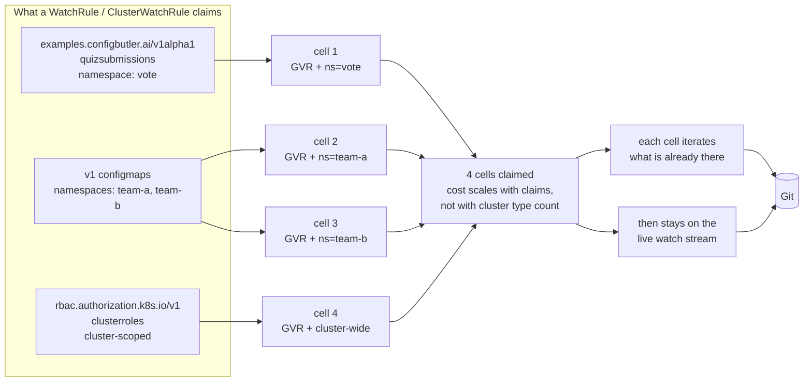
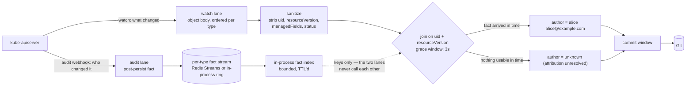
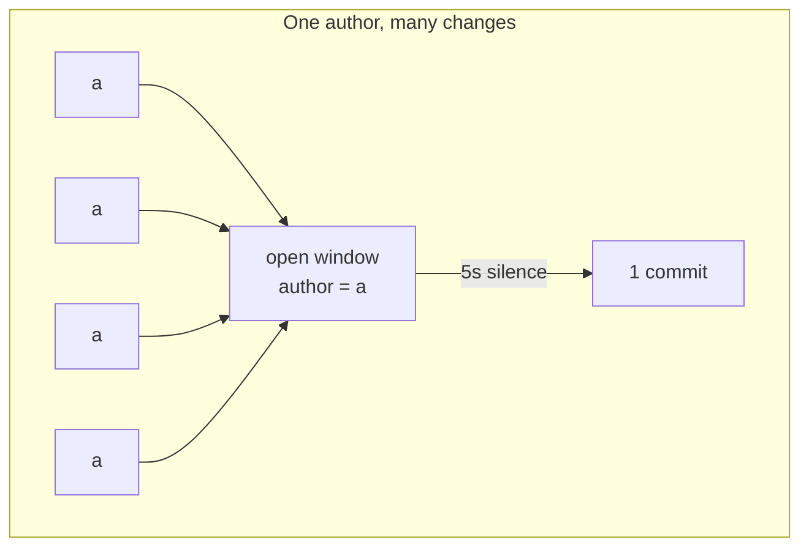
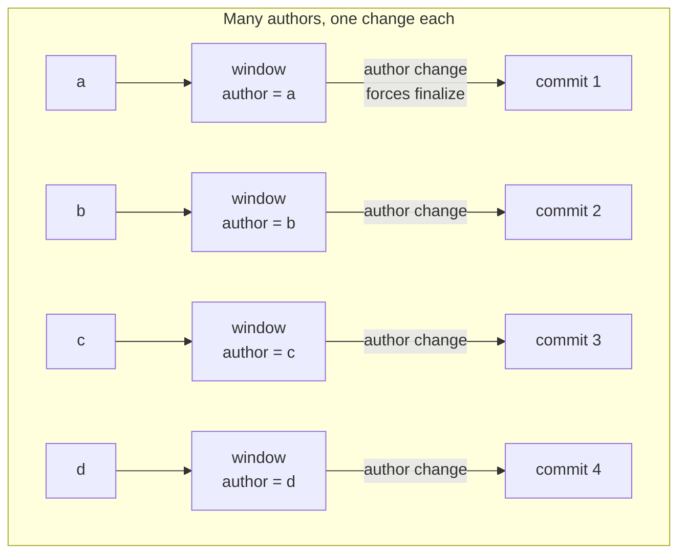

# Talk graphics + audience primer — Swiss Cloud Native Day, 17 Sep 2026

> Scratch material: untracked, unlinted, not binding. Companion to
> [`readme.md`](../gitops-needs-an-api/readme.md) and
> [`presentation.md`](../gitops-needs-an-api/presentation.md).
>
> Relative code links (`../internal/...`, `../test/...`) point into the **gitops-reverser** repo,
> not this one — they are provenance, not navigation.
>
> Scope: the things the room must already be holding before the demo means anything, plus the slide
> graphics for the **write-path mechanism** beat.
>
> Capacity, APF and loadtest material has moved to
> [`gitops-reverser-loadtest.md`](gitops-reverser-loadtest.md).

---

## Part 1 — The primer checklist

Ten things. If the room does not have these, they will watch commits appear and read it as "he wrote
a script that writes YAML". Each one is a sentence or two, not a slide each — items 4, 5 and 6 are
the ones that earn the *advanced* billing and deserve real time.

Order matters: 1–3 set the stage, 4–6 are the mechanism, 7–10 are the honesty that keeps it from
sounding like magic.

### 1. There are two clusters, and only one of them runs anything

- [ ] **Say:** "The intent cluster has no workloads. It is a kube-apiserver, etcd, and your CRDs —
      a typed API in front of a Git repo. The target clusters are the normal ones, syncing from Git
      with the Argo or Flux you already run."

Without this, every later question is "wait, is this production?". Say it once, early, and point at
the one big-picture slide.

### 2. Every write is authenticated as a *person*, and the person is the point

- [ ] **Say:** "Nobody gets a shared service account. Everyone in this room logs in with OIDC and
      writes as themselves. That identity is not for the audit log — it becomes the Git author."

This is the load-bearing setup for Diagram 3. If they think the demo commits as one bot, the
per-author commit split later reads as an arbitrary design choice rather than a consequence.

### 3. One API object is one file

- [ ] **Say:** "A resource in the API server maps 1:1 to a file in the repo. Placement is
      configurable; it is not clever. What you `kubectl apply` is what appears in the diff."

Cheapest credibility in the talk, and it pre-empts "what does it do about ordering / merging /
templating" — the answer is: nothing, because there is nothing to do.

### 4. `resourceVersion` — the single most important number in the talk

This one is worth a slide of its own, and the room will forgive you for spending a minute on it.
Everything downstream — ordering, resume, the audit join, deduplication — is this one field.

- [ ] **Say the guarantees** (these are safe, documented, and true on every cluster in the room):

      - Every write to an object produces a **new** `resourceVersion`. You never see one RV describe
        two different states of the same object.
      - A watch stream is **ordered**, and the RV attached to the events **does not go backwards**.
      - A watch is **resumable**: a cursor is just "everything since RV *X*". That is the entire
        state of the reader.
      - The API conventions call it **opaque**: do not parse it, do not do arithmetic on it, do not
        compare it across different resources to decide which is "newer".

- [ ] **Say what we actually depend on, and be precise about it:** "We never compare
      resourceVersions. We use them for **equality** — it is a join key. The watch lane and the
      audit lane describe the same write, and they carry the same number, so `uid + resourceVersion`
      matches the *what* to the *who*. Monotonicity is what lets us resume; equality is what lets us
      attribute."

- [ ] **The "it always increases" aside** — in practice, with etcd3 storage, the resourceVersion is
      the etcd revision: **one cluster-wide counter that ticks on every write to anything**. Not
      per-object, not per-type. That is why a number from a `configmaps` watch and a number in an
      audit event are literally the same number in the same space, and it is why the join works at
      all rather than merely being plausible.

      > ⚠️ **Verify before you put a version number on a slide.** You remember this becoming a hard
      > guarantee in a specific release, and an advanced room will contain someone who knows which
      > one. Nail it down against the upstream sources (the API-concepts `resourceVersion` semantics
      > table; KEP-3157 streaming list / `sendInitialEvents`; KEP-2340 consistent reads from cache,
      > which *requires* a monotonic store revision) before Wednesday. If you cannot pin it in time,
      > say "in every version you are running" and move on — that is true and unfalsifiable. Do not
      > guess a number out loud.

**The one-liner if you only get one sentence:** "resourceVersion is the primary key of *when*. It is
the reason two independent streams can describe the same write without ever talking to each other."

### 5. A watch is claimed per `(GVR, scope)` — think of them as cells

- [ ] **Say:** "You do not watch 'the cluster'. You claim cells: one type, one scope. A namespaced
      type opens one watch per namespace you claim it in; a cluster-scoped type opens one. Three
      rules, four cells. You pay for what you claim, not for how many types the cluster has."

The grid image is the useful one: types down one axis, scopes across the other, and a `WatchRule` /
`ClusterWatchRule` colours in cells. See [Diagram 1](#diagram-1--watch-cells-one-watch-per-gvr-scope).

### 6. A cell is an enumeration, not just a stream — existing resources come along

This is the item most likely to change what someone does on Monday, and it is currently the least
said. Give it its own beat.

- [ ] **Say:** "A cell is not only a live tap. When it opens, it **iterates what is already there**.
      So the first thing that lands in your repo is not the next change someone makes — it is the
      current state of everything you claimed. You point this at a cluster that has been running for
      two years, claim three cells, and the existing resources stream into the repo as commits."

- [ ] **The consequence to spell out:** adopting a cluster is not an export script, a one-shot
      dump, or a migration project. It is two lines of YAML, and the same iteration is also the
      **repair path** — if the live stream ever drops an event, a re-iteration heals it. Nothing in
      the design depends on having watched from the beginning of time.

- [ ] **Draw the boundary, or you will be asked about it:** this is *not* brownfield discovery.
      The cell does not decide **what** is worth claiming — that is still your judgement, and it is
      on your "things I won't touch today" list. What the cell guarantees is that once you have
      claimed it, **nothing already in it is missing**.

> Demo opportunity, if there is room: claim a cell against a namespace that already has objects in
> it and let the room watch the repo fill with things nobody just created. It lands harder than any
> diagram of it, and it costs one `kubectl apply`.

### 7. Audit is a second, independent lane — and it is optional

- [ ] **Say:** "Two streams from the same API server. The watch says *what* changed. The audit
      webhook says *who* changed it. They never call each other — they meet on a key. Turn the audit
      lane off and everything still works; you just lose the name."

See [Diagram 2](#diagram-2--the-join-watch-says-what-audit-says-who) — build it in two clicks.

### 8. Commits are coalesced per author; pushes are not

- [ ] **Say, before it happens:** "Commits are per-author. Pushes are batched and polite — one every
      five seconds. You will see commits arrive in **clumps**, not as a smooth stream. That is the
      push cooldown, not lag."

Thirty seconds of prevention. Without it, the most impressive part of the demo looks broken.

### 9. Git is still the source of truth, and this thing only writes

- [ ] **Say:** "gitops-reverser does **not** sync Git back into your cluster. That is still Flux or
      Argo, configured by you, ideally on a webhook. One direction per tool, and gitops-reverser is
      the boss of the write path."

### 10. The honest boundary, offered before it is asked

- [ ] **Say:** "This is for low-churn, high-impact configuration that deserves review and audit. It
      is the wrong tool for high-frequency writes, tight latency budgets, or anything that belongs
      in a database — and in [Diagram 3](#diagram-3--the-commit-window-is-keyed-by-author) I will
      show you the exact line of code that makes that true."

---

## Part 2 — The graphics

Four diagrams, ordered as they should appear: claim → join → commit shape → demo-day path. The
fourth is a backup/Q&A slide, not a main-line one.

### Diagram 1 — Watch cells: one watch per `(GVR, scope)`

Use this immediately before the demo. It explains what produces the commits the room is about to
see, and it carries primer items 5 and 6.



**Say:** "A namespaced type opens one watch per namespace it is claimed in. A cluster-scoped type
opens one. Three rules, four cells — and that is the whole scaling story: you pay for what you
claim, not for how many types the cluster has."

**Then the second half, which is the part people miss:** "And a cell is not only a tap on the
future. Opening it iterates the existing objects, so what is already in the cluster streams into the
repo too. Claiming a cell on a cluster that has been running for two years gives you a repo that
describes it — not a repo that starts describing it from now on."

**Leave out** (hidden slide / Q&A only): resume cursors, `sendInitialEvents`, `410 Gone`,
mark-and-sweep, and the exact re-iteration trigger. Reference: [`architecture.md`](architecture.md)
→ *State ingestion and not losing deletes*.

### Diagram 2 — The join: watch says *what*, audit says *who*



**Build it in two clicks.** Click 1: watch lane only — the commit lands, authored by the configured
identity, product works. Click 2: add the audit lane — same commit, real actor. The build *is* the
claim "audit is optional and never blocks state capture"; you don't have to say it.

Draw the dotted line deliberately. The two halves meeting only through keys is the architecturally
interesting part, and a diagram says it better than a sentence.

**Note the irony worth pointing at:** the resourceVersion is **stripped** from the file that gets
committed — it is cluster state, not intent, and it has no business in a Git diff. But it is the
key the whole join hangs on. It does all its work and then does not appear in the output. That is a
good ten seconds if the room is with you.

**Say (the 60 seconds that earn the "advanced" billing):** "Everyone reaches for the admission
webhook first — the request already carries `userInfo`. We did too. It doesn't work, for two
reasons that aren't fixable. Admission runs *before* the write reaches etcd, so it sees attempts,
not persistence — a later webhook can still reject it, storage can still conflict, a dry-run looks
identical. And there is nothing to join on yet: no resourceVersion, and for a `generateName` create,
no name. Audit fires *after* the write persisted and carries the resourceVersion that joins it to
the watch event."

**Then the stance:** no usable fact → the author is literally `unknown (attribution unresolved)`,
never the committer identity substituted in. A commit authored by a person is a positive claim that
we know; the sentinel is a positive claim that we tried and couldn't tell.

**And the honesty beat, said before anyone asks it as a gotcha:** this needs kube-apiserver audit
webhook delivery, which EKS/GKE/AKS generally do not expose.

Reference: [`architecture.md`](architecture.md) → *Optional attribution*,
[`spec/attribution.md`](spec/attribution.md).

### Diagram 3 — The commit window is keyed by author

This is the strongest slide in the set, because it carries the feature *and* its limit in one shape.





**The mechanism:** the window coalesces into one commit per `(author, gitTarget)`
([`branch_worker.go:44`](../internal/git/branch_worker.go#L44)). An event whose author does not match
the open window force-finalizes it before appending — the finalize reason is literally
`author-or-target-change`
([`branch_worker.go:223`](../internal/git/branch_worker.go#L223), applied at
[`branch_worker.go:907-926`](../internal/git/branch_worker.go#L907-L926)).

**Say:** "So N submissions became N commits — and not by luck, and not because I set the window to
zero. Every submission is a different person, and a different author closes the window. Attribution
isn't decoration on the commit. It's what *shapes* the history."

**Then turn it over, in the same breath — this is the honest-checklist payoff:**

> "Same mechanism, read the other way: with many concurrent authors the window never coalesces. Your
> commit rate *is* your write rate. That's why this pattern is wrong for high-frequency writes — and
> I can show you the exact line of code that makes it true."

One mechanism, proving both the shine and the limit. That is the beat to build the section around.

### Diagram 4 — Demo-day path, with every tuning point marked

Backup slide. Do not present it unless asked. The numbers on it are explained in
[`gitops-reverser-loadtest.md`](gitops-reverser-loadtest.md).


**Narrate this one thing even if you never show the slide** (primer item 8): commits are per-author,
but pushes are batched and rate-limited to one per 5 seconds
([`branch_worker.go:49`](../internal/git/branch_worker.go#L49)). The room will see commits arrive in
*clumps*, not a smooth stream. Say so before it happens — "commits are per-author, pushes are
polite" — or it reads as lag.

---

## Part 3 — The two things that make the money shot readable

Not capacity work, so they stay here rather than in the loadtest doc. Both are about whether the
attribution slide *looks* right on a projector.

### The two OIDC claim keys

The operator never talks to your IdP; it reads exactly two fixed keys from `user.extra`:

| `user.extra` key | OIDC claim | Fills |
|---|---|---|
| `configbutler.ai/claims/display-name` | `name` | git author `Name` |
| `configbutler.ai/claims/email` | `email` | git author `Email` |

Set them in the structured `AuthenticationConfiguration` (`apiserver.config.k8s.io/v1beta1`, beta
since 1.30):

```yaml
claimMappings:
  username:
    claim: email
  extra:
    - key: "configbutler.ai/claims/display-name"
      valueExpression: "claims.name"
    - key: "configbutler.ai/claims/email"
      valueExpression: "claims.email"
```

Both mappings are optional and both fall back **silently**: a missing `name` falls back to the
Kubernetes username, a missing `email` to a derived address under `noreply.cluster.local`. Still
attributed, still correct — but on a projector `alice@example.com
<aliceexample.com@noreply.cluster.local>` reads as machine output, which undercuts the entire point
of the slide. Reference: [`architecture.md`](architecture.md) → *Wiring OIDC author claims*.

### The command you will actually run on stage

- [ ] Verify it today, as a non-admin OIDC user, against the real demo cluster:

      ```console
      $ git show --no-patch --format=fuller HEAD
      Author:     alice <alice@example.com>
      AuthorDate: ...
      Commit:     GitOps Reverser <noreply@configbutler.ai>
      ```

Distinct Author and Commit lines is the shot. `--format=fuller` is **required** — the default
`git log` hides the committer, so the two-identity story is invisible without it.

---

## Open items I could not verify from here

- **The resourceVersion monotonicity guarantee and its release.** See the warning in primer item 4.
  This is the only factual claim in the primer that is not yet pinned, and it is one an advanced
  room can check.
- **How a cell's initial iteration is actually triggered and bounded** in the current build
  (`sendInitialEvents` vs an explicit list, and what happens on re-entry). Primer item 6 describes
  the behaviour and the guarantee; confirm the mechanism before answering a detailed question about
  it. Reference: [`architecture.md`](architecture.md) → *State ingestion and not losing deletes*.
- The new OIDC repo's actual `AuthenticationConfiguration` and GitTarget `spec.commit.window` — Part
  3 checks against that repo, not this one.
