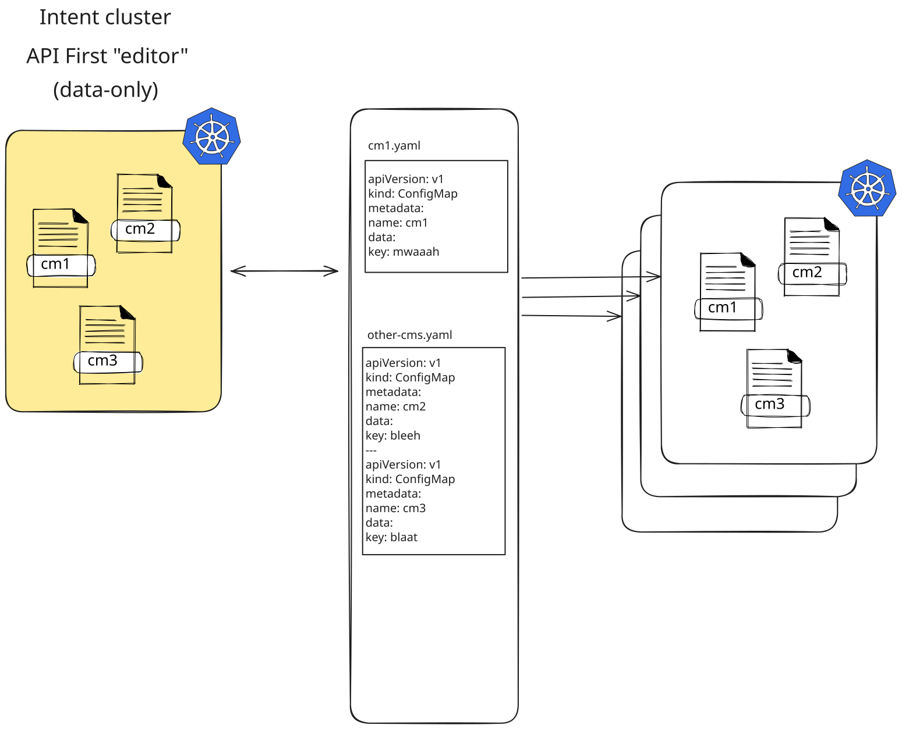
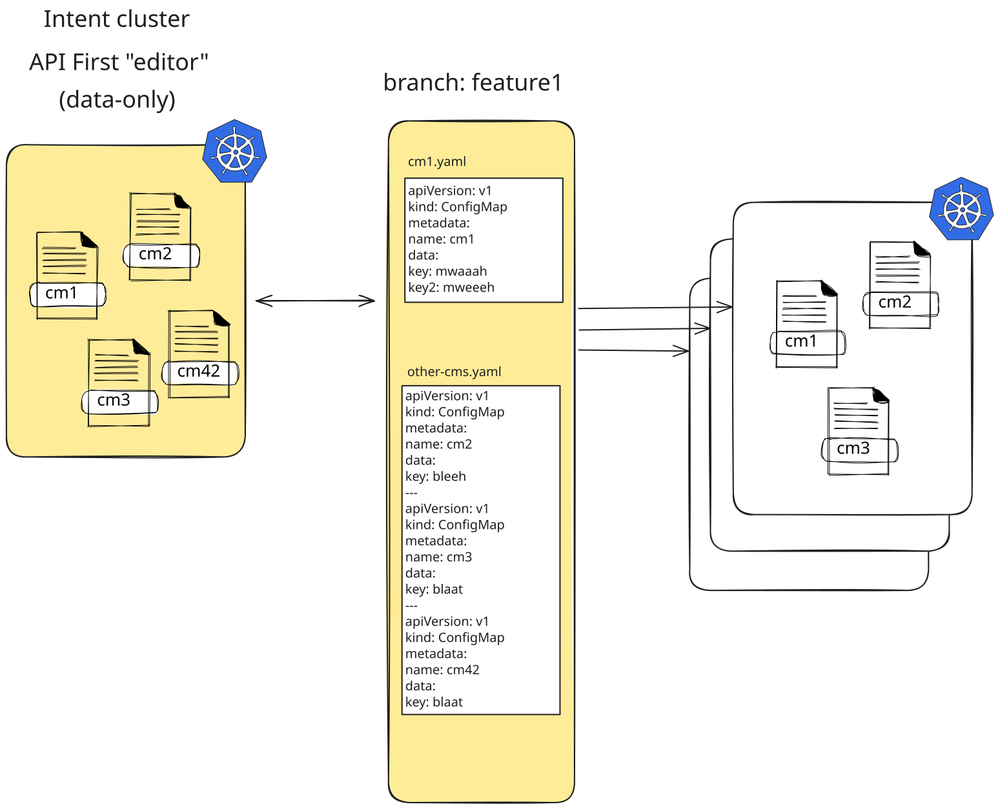
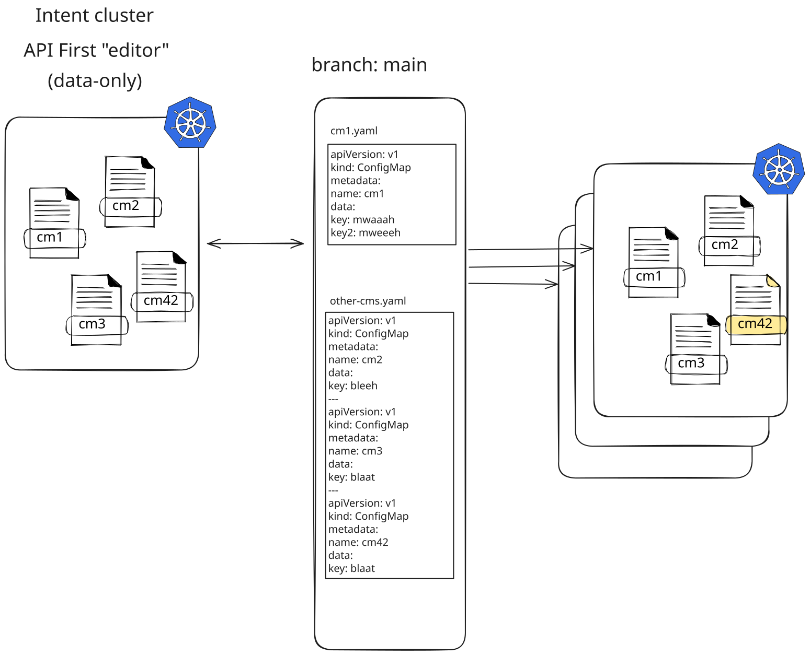
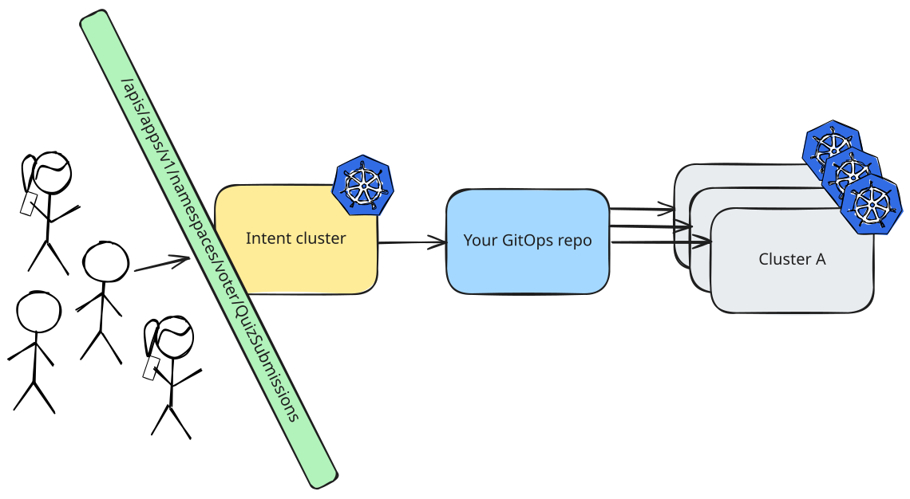
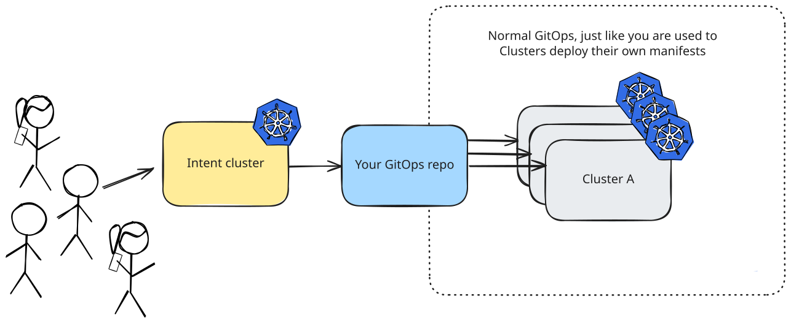
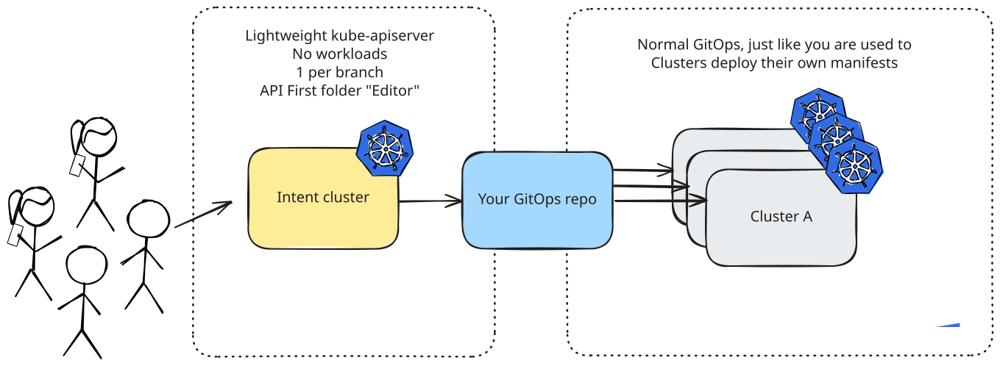
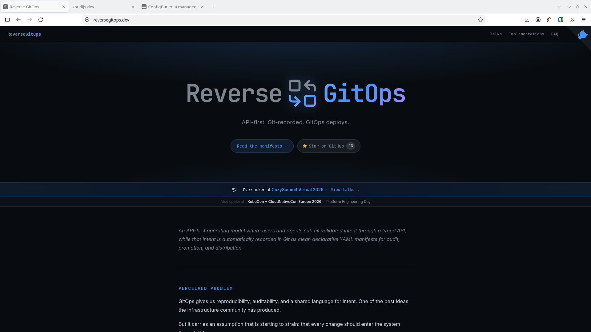

<style>
section {
  font-size: 29px;
  line-height: 1.3;
}

h1 {
  color: #16324f;
}

h2, h3 {
  color: #1f4e5f;
}

strong {
  color: #16324f;
}

code {
  background: #eef3f7;
  color: #16324f;
  padding: 0.08em 0.22em;
  border-radius: 0.2em;
}

blockquote {
  border-left: 8px solid #1f4e5f;
  background: #f3f8fb;
  padding: 0.55rem 0.8rem;
  border-radius: 12px;
  margin: 0.7rem 0 0;
  color: #16324f;
}

blockquote p {
  margin: 0;
}

table {
  width: 100%;
  border-collapse: separate;
  border-spacing: 0;
  font-size: 0.78em;
}

table th {
  background: #16324f;
  color: #fff;
  padding: 0.45rem 0.55rem;
  text-align: left;
}

table td {
  background: #f7fafc;
  padding: 0.45rem 0.55rem;
  border-bottom: 2px solid #d9e3ea;
}

.note {
  font-size: 0.64em;
  color: #7a5b11;
  margin-top: 0.6rem;
}

.subtle {
  font-size: 0.74em;
  color: #506070;
}

section.demo {
  background: #16324f;
  color: #fff;
}

section.demo h1,
section.demo h2,
section.demo strong {
  color: #fff;
}
</style>

<!-- _class: lead -->

<style scoped>
section { text-align: center; }
h1, h2, p { color: #fff; text-shadow: 0 2px 14px rgba(0, 0, 0, 0.55); }
</style>


# GitOps Needs an API

Swiss Cloud Native Day 2026 &nbsp;·&nbsp; Simon Koudijs

<!--
CLOCK 11:30 — the slot is 11:30–12:15. Content ends at 12:10, then 5 minutes of
questions. The two demos take 13 of those 40 minutes, so the slides get 27.

RUN SHEET (wall clock, not elapsed)

  11:30  title + bio .............................. 2 min
  11:32  GitOps is great → business intent ........ 4 min
  11:36  the problems + the hard API .............. 2 min
  11:38  the 1-5 → 1-8 build ...................... 2 min
  11:40  dream mode ............................... 2 min
  11:42  the revelation + 1-9 → 1-12 .............. 3 min
  11:45  guarding changesets + data-only cluster .. 2 min
  11:47  branch builds + the overview ............. 2 min
  11:49  DEMO 1 ................................... 6 min
  11:55  observing kube-apiserver ................. 3 min
  11:58  why / no loop / commits / a commit ....... 3 min
  12:01  DEMO 2 ................................... 7 min
  12:08  good fit, don't, in short, other options . 1 min
  12:09  reversegitops.dev + next ................. 1 min
  12:10  QUESTIONS ................................ 5 min

TWO HARD CHECKPOINTS. Everything else may slip; these two may not:
  11:49  demo 1 starts
  12:01  demo 2 starts
If you are not there, skip forward. Do not talk faster.

Diagram slides are builds — 20 to 30 seconds each, no more. The text slides are
the only ones worth a minute.

BEHIND AT 11:47?  Drop 2-0-start-overview and 2-1-normal. 2-2-intent carries it.
BEHIND AT 11:55?  Drop 16-watch-cells and 17-join.
STILL BEHIND?     Drop "Other options" at the close. It is the cheapest minute in the deck.
-->

---


# Simon Koudijs

`[Software|Product|Cloud|AI] engineer`

- Left my job 14 months ago to build my own company
- [koudijs.dev](https://koudijs.dev): consultancy, training, speaking
- [reversegitops.dev](https://reversegitops.dev): the pattern, and a manifest
- [ConfigButler](https://configbutler.ai): hosted product of this idea

<!--
CLOCK 11:31 — 60 seconds, hard stop. Nobody is here for the bio.
-->

---

# GitOps is great

- Desired state
- History
- Rollback
- Great tools like ArgoCD and FluxCD

<!--
CLOCK 11:32 — 4 minutes, up to and including 1-3-team-boundry.
Three claims, three diagrams. Keep moving.
-->

---


---

# Every commit answers

Who ✅
When ✅
What ✅
Why ✅ (intent, message)

---


---

# Business intent

- Which apps does my specific customer want to run
- Network ranges for my cluster
- Self-servicing clusters
- Etc.

---


---

# But GitOps also has problems

Complex constructs are possible, and if you give people the option...

<!--
CLOCK 11:36 — 2 minutes for this, "Then they do it!" and "GitOps has a hard API".
This is the setup, not the argument.
-->

---

# Then they do it!

- layers (app-of-apps-of-apps-of-apps)
- custom CD pipelines
- complex helm templates
- referencing other sources of truth
    - open PRs in your repo with an ApplicationSet
    - specific helm charts in an online repo

---

# GitOps has a hard API

- Not everybody knows Git
- Do you expect customers to open up a PR?
- Conflicts are annoying
- Small typo in your file contents results in a failed deployment (can take a while!)

<!--
CLOCK 11:38 — 2 minutes for the four-diagram build, ~30 seconds each:
API in front of the repo, what that API must do, it ends in Git, and the obvious
"just commit straight to Git" — which is the one you already tried.
-->

---


---


---


---


---

# Dream mode

- For now: forget about complex structures
- Just keep a flat folder
- "intent" in plain manifests

<!--
CLOCK 11:40 — 2 minutes for both dream-mode slides.
-->

---

# Dream mode (2)

- Keynote: KRO, Kratix or Crossplane are your friends!
- You can create and delete helm installs (ArgoCD application or HelmDeployment): but you don't edit the actual helm charts (that's a bad dream)
- Little bit of Kustomize is ok-ish, but be careful

---

# The revelation

> The Kubernetes API was designed so that every API resource has a standard, serializable representation that can be stored in a file and submitted back to the API.

<!--
CLOCK 11:42 — 3 minutes, including the 1-9 → 1-12 build that follows.
The intellectual centre of the talk. Slow down and let the quote sit.
-->

---


---


---


---

# N clusters, and you want to "guard" changesets

Don't forget that n clusters can watch your GitOps folder.

Most changes should also first happen on a branch, so that you can create your PR.

You should have the freedom to delete and create as you want.

But it should only be released on merge to main

<!--
CLOCK 11:45 — 2 minutes for this and the next slide.
Set up why branching needs its own environment.
-->

---

# Create a single data-only cluster per branch

- Load all existing manifests as a starting point (t=0)
- Make your change in Git
    - ArgoCD syncs to your data-only cluster
- Make a change in your intent objects
    - gitops-reverser converts your changes into commits
- Remove your data-only cluster at merge

<!--
CLOCK 11:47 — 2 minutes for the six builds that follow: the branch story (1-13),
then zoom out (2-0 → 2-2). Demo 1 starts at 11:49 whatever happens.
If you are past 11:48 here, drop 2-0 and 2-1.
-->

---



---



---



---



---



---



---

<!-- _class: demo -->

# Demo 1

## Who you are, who decides what you may do, and what a vote actually is

Scan. Pick a nickname you are happy for a room full of strangers to read.

<!--
CLOCK 11:49 → 11:55. SIX MINUTES. Runbook: demo-runbook.md in the voter repo, demo 1.

Git is not mentioned once, and definitely not SHOWN. Check your browser tabs.
The multi-select bars ARE the argument: GitOps and kubectl both lit up.
"You are all doing both, and only one of them leaves a story."
-->

---

# How do you observe kube-apiserver?

| Mechanism | Tells you *who* | Fires | AKS/EKS/... |
|---|---|---|---|
| **Watch stream** | No | after commit | **Yes** |
| **Audit webhook** | Yes | after commit | No |
| Mutating webhook | Yes | *before* commit | Yes |
| Validating webhook | Yes | *before* commit | Yes |
| Audit file | Yes | after commit | No |

<div class="note">
The watch says <strong>what</strong> changed.
The audit webhook says <strong>who</strong> changed it. They "merge" on <code>uid + resourceVersion</code>.
</div>

<!--
CLOCK 11:55 — 3 minutes: this table, then 14-gitops-reverser, 16-watch-cells, 17-join.
The table is the slide that earns the talk; the three diagrams are 30 seconds each.
BEHIND? Cut 16-watch-cells and 17-join and go straight to "So why again?".
-->

---


---


---


---

# So why again?

- Leave your production clusters alone
- The data-only cluster can sit in a different network (also more acceptable on the public internet)
- Of course you can only enter with your own identity (OIDC)

<!--
CLOCK 11:58 — 3 minutes for these four, through "What a commit looks like".
Demo 2 starts at 12:01.
-->

---

# Won't that create an infinite loop?

- gitops-reverser, ArgoCD and FluxCD stop when the spec is as desired
- No looping
- gitops-reverser controls when the sync is done

<!--
Expect this as a question anyway; answering it here saves Q&A time.
-->

---

# So you have commits

Who ✅
When ✅
What ✅
Why ❌ -> gitops-reverser CommitRequest

<!--
Callback to "Every commit answers". The ❌ is the punchline.
-->

---

# What a commit looks like

```
Author:     Simon7 <simon7@koudijs.dev.test>
AuthorDate: Wed Sep 16 03:51:25 2026 +0000
Commit:     ConfigButler Bot <bot@configbutler.ai>
CommitDate: Wed Sep 16 03:51:25 2026 +0000

    chore(demo1): 1 change from demo:CgZzaW1vbjcSCXJvb20tcGFzcw

    - [CREATE] quizsubmissions/demo1-simon7
```

The author is the human. The committer is the bot.

<!--
`git show --format=fuller` — plain git log hides the committer, and the whole
story is invisible without it.
-->

---

<!-- _class: demo -->

# Demo 2

## The same actions, in Git — and the one place the room works together

You are still signed in. You do not have to join again.

<!--
CLOCK 12:01 → 12:08. SEVEN MINUTES — the old runbook budgets nearly twelve, so
this is the reveal and the collision. Leave out the grant beat (runbook step 3).
Runbook: demo-runbook.md in the voter repo, demo 2.

`--type=json`, NEVER `--type=merge` — a merge patch eats the whole voucher list.
Containment line, say it before you are asked: nothing reconciles from that repo.
An attendee's commit cannot reach a cluster.
-->

---

# Good fit

- Full GitOps love: Who, When, What and Why
- Identify clear CRD-based, high-level resources that reflect intent

<!--
CLOCK 12:08 — 1 minute for all four closing slides. Be honest about the limits,
but do not read the bullets out.
-->

---

# Don't

- Try to reverse advanced GitOps stuff (you will fail)
- Use it for your really transactional data

---

# In short

- gitops-reverser reconciles API resources to Git
- Combine it with ArgoCD or FluxCD to sync from Git to API
- Branching requires a fresh data-only environment (or namespace*)

> It's just rsync on steroids

---

# Other options

- You could have something that quickly creates OCI artifacts from a commit on main
- Automatic "push" of someone click-ops-ing in ArgoCD's GUI
- What if every configuration API in the world used KRM?

<!--
Keep it speculative and short. This is the first slide to drop if you are late.
-->

---

[](https://reversegitops.dev)

<!--
CLOCK 12:09 — 1 minute for this and "Next". Do not read them out.
-->

---

# Next

- [reversegitops.dev](https://reversegitops.dev)
- Useful in any way? Fill a few questions on how I did.

---

# Questions?

<!--
CLOCK 12:10 — 5 minutes of questions, hard stop at 12:15.
-->
