<style>
section {
  font-size: 29px;
  line-height: 1.3;
}

h1 {
  color: #16324f;
}

h2, h3 {
  color: #1f4e5f;
}

strong {
  color: #16324f;
}

code {
  background: #eef3f7;
  color: #16324f;
  padding: 0.08em 0.22em;
  border-radius: 0.2em;
}

.lead {
  font-size: 1.2em;
  font-weight: 700;
  color: #16324f;
  margin-bottom: 0.9rem;
}

.subtle {
  font-size: 0.74em;
  color: #506070;
}

.small {
  font-size: 0.78em;
}

.tiny {
  font-size: 0.64em;
}

blockquote {
  border-left: 8px solid #1f4e5f;
  background: #f3f8fb;
  padding: 0.55rem 0.8rem;
  border-radius: 12px;
  margin: 0.7rem 0 0;
  color: #16324f;
}

blockquote p {
  margin: 0;
}

table {
  width: 100%;
  border-collapse: separate;
  border-spacing: 0;
  font-size: 0.78em;
}

table th {
  background: #16324f;
  color: #fff;
  padding: 0.45rem 0.55rem;
  text-align: left;
}

table td {
  background: #f7fafc;
  padding: 0.45rem 0.55rem;
  border-bottom: 2px solid #d9e3ea;
}

.note {
  font-size: 0.64em;
  color: #7a5b11;
  margin-top: 0.6rem;
}

/* ---- The four W's scorecard ---------------------------------------- */

.ws {
  display: flex;
  gap: 0.7rem;
  margin: 1.1rem 0 0.4rem;
}

.ws .w {
  flex: 1;
  text-align: center;
  border-radius: 16px;
  padding: 0.85rem 0.5rem 0.7rem;
  border: 3px solid #d9e3ea;
  background: #f5f8fa;
}

.ws .mark {
  font-size: 2.3em;
  line-height: 1;
  color: #b9c6d0;
}

.ws .letter {
  font-weight: 700;
  font-size: 1.05em;
  color: #16324f;
  margin-top: 0.15rem;
}

.ws .note {
  font-size: 0.55em;
  color: #506070;
  margin-top: 0.35rem;
  line-height: 1.25;
}

.ws .w.partial {
  border-color: #e3b63b;
  background: #fdf7e4;
}

.ws .w.partial .mark {
  color: #d9a400;
}

.ws .w.partial .note {
  color: #7a5b11;
}

.ws .w.full {
  border-color: #5cb87a;
  background: #eef8f1;
}

.ws .w.full .mark {
  color: #2e9e4f;
}

.ws .w.full .note {
  color: #2c6b45;
}

.verdict {
  margin-top: 0.7rem;
  font-size: 0.8em;
  color: #506070;
}

.cols {
  display: flex;
  gap: 1.4rem;
}

.cols > div {
  flex: 1;
}

/* ---- Mechanism diagrams -------------------------------------------- */

.flow {
  display: flex;
  align-items: center;
  gap: 1rem;
  margin-top: 0.9rem;
}

.flow .stack {
  flex: 1;
  display: flex;
  flex-direction: column;
  gap: 0.4rem;
}

.flow .arrow {
  font-size: 1.6em;
  color: #7f95a5;
}

.card, .chip {
  border-radius: 12px;
  padding: 0.4rem 0.65rem;
  font-size: 0.66em;
  line-height: 1.25;
}

.card {
  background: #eef3f7;
  border-left: 7px solid #1f4e5f;
  color: #16324f;
}

.card span {
  display: block;
  font-size: 0.85em;
  color: #607480;
}

.chip {
  background: #fdf7e4;
  border: 2px solid #e3b63b;
  color: #6b5210;
  text-align: center;
}

.cap {
  font-size: 0.6em;
  font-weight: 700;
  color: #506070;
  text-align: center;
  margin-top: 0.15rem;
}

/* the join */

.join {
  margin-top: 0.8rem;
  text-align: center;
}

.join .apiserver {
  background: #16324f;
  color: #fff;
  border-radius: 12px;
  padding: 0.4rem;
  font-size: 0.72em;
  font-weight: 700;
}

.join .lanes {
  display: flex;
  gap: 1rem;
  margin: 0.55rem 0;
}

.join .lane {
  flex: 1;
  border-radius: 12px;
  padding: 0.5rem 0.6rem;
  font-size: 0.68em;
  text-align: left;
}

.join .lane b {
  display: block;
  font-size: 1.1em;
}

.join .lane span {
  color: #607480;
  font-size: 0.9em;
}

.join .lane.watch {
  background: #eef3f7;
  border: 3px solid #1f4e5f;
}

.join .lane.audit {
  background: #fdf7e4;
  border: 3px dashed #d9a400;
}

.join .key {
  background: #f3f8fb;
  border-radius: 12px;
  padding: 0.4rem;
  font-size: 0.66em;
  color: #16324f;
}

.join .out {
  margin-top: 0.5rem;
  font-size: 0.72em;
  font-weight: 700;
  color: #2c6b45;
}

/* the commit window */

.win {
  margin-top: 1rem;
}

.win .row {
  display: flex;
  align-items: center;
  gap: 0.45rem;
  margin-bottom: 0.75rem;
}

.win .who {
  width: 1.9em;
  height: 1.9em;
  line-height: 1.9em;
  border-radius: 50%;
  text-align: center;
  font-size: 0.76em;
  font-weight: 700;
  color: #fff;
}

.win .a { background: #1f4e5f; }
.win .b { background: #b5762a; }
.win .c { background: #6a4b8a; }
.win .d { background: #2e7d5b; }

.win .to {
  font-size: 1.2em;
  color: #7f95a5;
  margin: 0 0.35rem;
}

.win .commit {
  font-size: 0.72em;
  font-weight: 700;
  color: #16324f;
  background: #eef3f7;
  border-radius: 10px;
  padding: 0.3rem 0.7rem;
}

.win .lbl {
  font-size: 0.6em;
  color: #607480;
  margin-left: 0.6rem;
}

section.demo {
  background: #16324f;
  color: #fff;
}

section.demo h1,
section.demo h2,
section.demo strong {
  color: #fff;
}

section.demo .subtle {
  color: #a9bcc9;
}
</style>

<!-- _class: lead -->
# GitOps Needs an API

## Reverse GitOps: typed intent in, reviewable commits out

<div class="subtle">
Swiss Cloud Native Day 2026<br>
Simon Koudijs
</div>

<!--
CLOCK 0:00 — you have 40 minutes, then 5 for questions.

- Set the frame: GitOps works. The storage is not the problem.
- The problem is who is expected to write YAML and open pull requests.
- Do not promise the demo yet. Promise a pattern.
-->

---


# Simon Koudijs

`[Software|Product|Cloud|AI] engineer`

- Left my job 14 months ago to build my own company
- [koudijs.dev](https://koudijs.dev/) — consultancy, training, speaking
- [ConfigButler](https://configbutler.ai/) — open source first
- [reversegitops.dev](https://reversegitops.dev/) — the pattern, and a manifest

<div class="note">
gitops-reverser &nbsp;·&nbsp; krm-stream &nbsp;·&nbsp; room-pass &nbsp;·&nbsp; voter — all open source
</div>

<!--
CLOCK 0:30 — 60 seconds, hard stop. Nobody is here for the bio.

- Presented an early version of this pattern at Platform Engineering Day Europe 2026.
- The manifest is an invitation, not a finished doctrine. Ask them to comment.
- "I don't know everything and I'm looking for feedback" — say it once, here.
-->

---

# Why do we like GitOps?

Because it tells a **story**.

Not just the state — the state *plus how we got here*. Every commit is a chapter,
and a chapter answers four questions:

<div class="ws">
  <div class="w"><div class="mark">?</div><div class="letter">Who</div><div class="note">the author</div></div>
  <div class="w"><div class="mark">?</div><div class="letter">When</div><div class="note">the timestamp</div></div>
  <div class="w"><div class="mark">?</div><div class="letter">What</div><div class="note">the diff</div></div>
  <div class="w"><div class="mark">?</div><div class="letter">Why</div><div class="note">the commit message</div></div>
</div>

<div class="verdict">
A cluster on its own cannot tell you any of these. Git can tell you all four.
</div>

<!--
CLOCK 1:30 — this is the scorecard. It comes back twice: yellow after demo 1,
green after demo 2. Plant it properly or the payoff does not land.

- Desired state, spec — what we *wanted* to happen.
- It is getting more important: we express bigger business things in Git now.
  A new tenant for a customer. Feature rollouts. Access policy.
- Say: "hold on to these four. I am going to come back and tick them off."
-->

---

# But Git is not easy

People get scared of it. They tell each other so, and it spreads.

So it is easy to fall back to the **what**: click around, fix it now, see it happen.
And honestly — most configuration screens in the world work exactly like that.

> **Hands up:** who manages their SaaS providers with GitOps?

<div class="note">
Expect roughly nobody. That is the gap this talk is about.
</div>

<!--
CLOCK 2:30 — 45 seconds. Actually wait for the hands. Count out loud if you like.

- This is the hinge of the whole talk: two worlds that do not touch.
- What if they could co-exist? That takes real effort — and that effort is the talk.
- Do not answer it yet. Let it hang and go to the diagrams.
-->

---

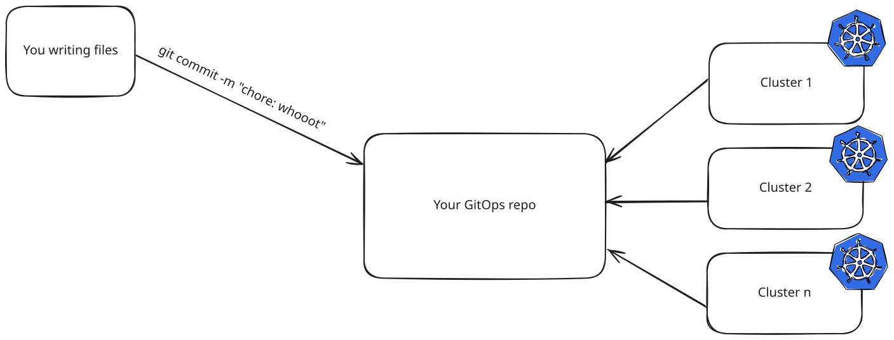

<!--
CLOCK 3:15 — from here to the pivot, these are BUILDS of one picture, not slides.
~30 seconds each. If you are still on 1-4 at 5:30 you are losing the demo.

Diagram 1 — the baseline.
- Your GitOps repo feeding cluster 1, 2, n.
- Two writers: you writing files, and your AI writing files.
- Commits land in the repo, the repo is the source of truth.
- Nothing controversial yet: this is the picture everyone recognises.
-->

---

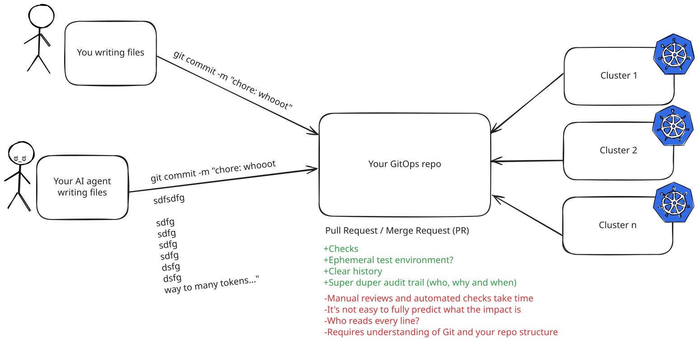

<!--
Diagram 2 - what the PR gives you, and what it costs.
- Adds the Pull Request / Merge Request box between writers and repo.
- Plus: checks, ephemeral test environment, clear history, audit trail (who, why, when).
- Minus: reviews take time, impact is hard to predict, who reads every line,
  requires understanding of Git and the repo structure.
- Also shows `kubectl apply -f my-quick-fix.yaml` - the shortcut everyone takes.
- Say out loud: this part is not what I'm going to touch.
-->

---

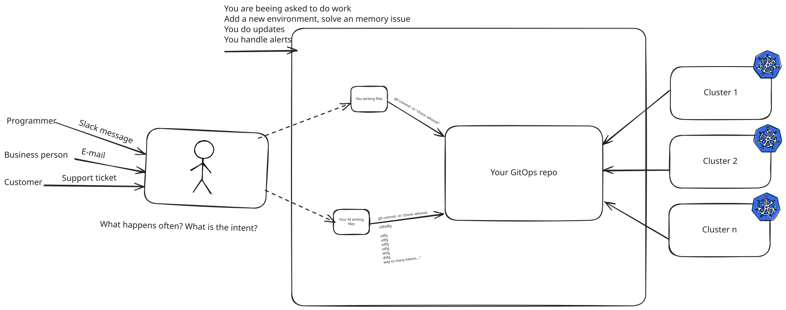

<!--
Diagram 3 - the work arrives from outside the team.
- Programmer, business person, customer all ask you for things.
- Add a new environment, solve a memory issue, do updates, handle alerts.
- The "API" today is a Slack message, an e-mail, a support ticket.
- Question for the room: what part of that work could we do better?
-->

---

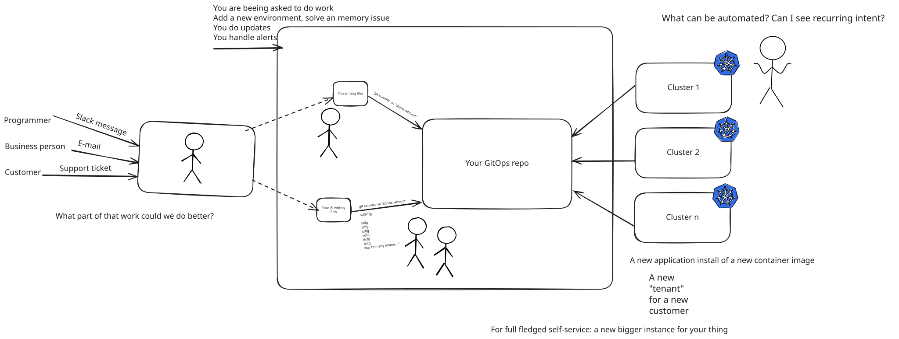

<!--
CLOCK 4:45 — checkpoint.

Diagram 4 - find the repeating intent.
- What can be automated? What is their actual intent?
- Examples: a new "tenant" for a new customer, a new application install of a
  new container image, a bigger instance for full self-service.
- The point: these are not arbitrary edits, they are a small set of shapes.
-->

---

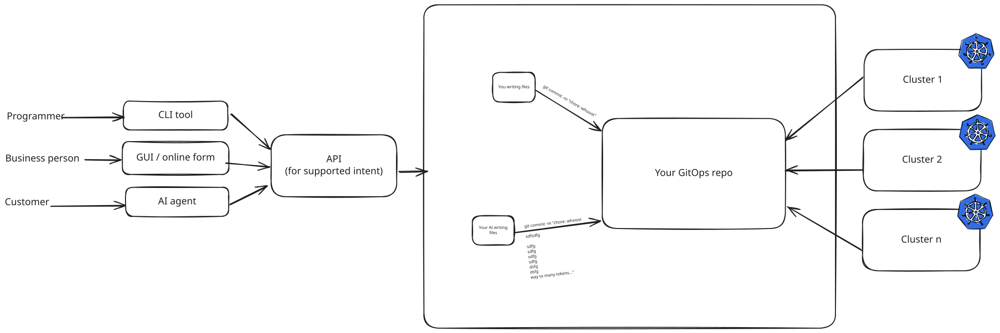

<!--
Diagram 5 - name that shape: an API for supported intent.
- One box in front of the repo, fed by GUI / online form, CLI tool, AI agent.
- You can still throw the rest in a ticket system and do it yourself.
- You only pick the part that is asked often.
- This is a business problem first: draw the line where it pays off.
-->

---

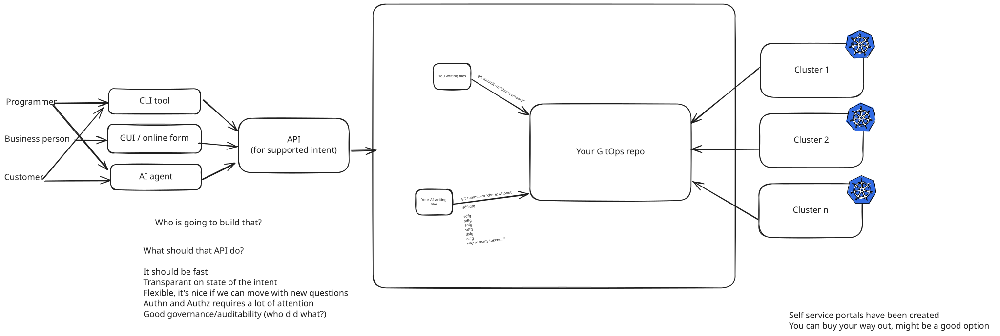

<!--
Diagram 6 - so what does that API have to do?
- Fast, transparent on the state of the intent, flexible for new questions.
- AuthN and AuthZ need a lot of attention.
- Good governance and auditability: who did what?
- Self-service portals exist, you can buy your way out - maybe a good option.
- But: who is going to build and maintain that?
-->

---

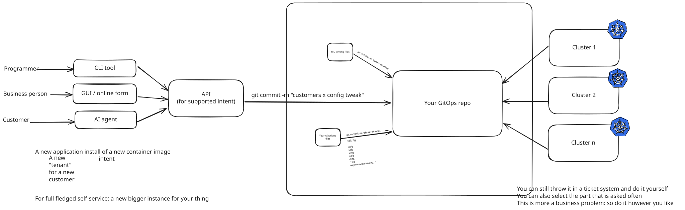

<!--
Diagram 7 - the API has to end up in Git.
- The intent becomes `git commit -m "customer x config tweak"`.
- Git stays the source of truth, the GitOps flow downstream is untouched.
-->

---

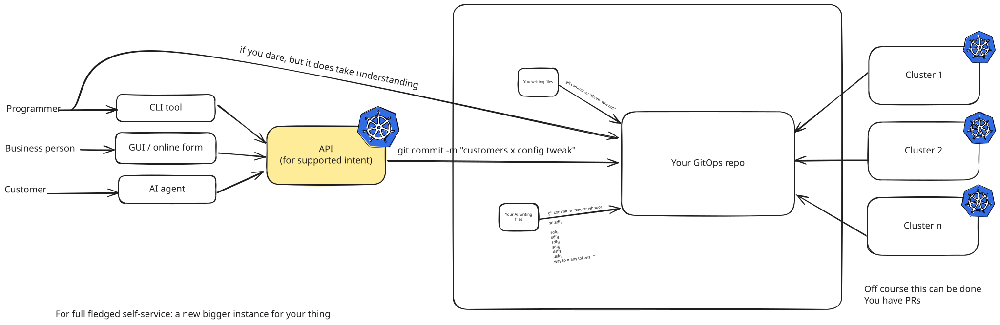

<!--
CLOCK 6:00 — checkpoint. The story beat is next; do not arrive here late.

Diagram 8 - the obvious option: let the API commit straight to Git.
- Of course this can be done, you have PRs.
- "If you dare" - it works, but it does not solve all your problems.
- Your API now owns Git credentials, repo layout, templating, conflicts.
- Hand-off line: "I know it works, because I built it."
-->

---

# I built that. It did not work.

Fourteen months ago I was at a 30-person SaaS company. The dream was
self-service: customers configure their own tenant.

So we built an API with **Git as the database**.

- Where do the secrets go?
- Who writes the GUI?
- What does the API even look like?

It was too hard in our context, and on its own it **did not make money**.
People just want to configure the thing. They want it to work *now*.

<!--
CLOCK 6:30 — 45 seconds. This is the only place you talk about yourself. Earn it.

- Be honest about the failure. A room trusts a speaker who lost something.
- The counter-argument to voice yourself: "you can build a log of who did what,
  why do you need GitOps at all?" — that is the fair question, do not dodge it.
- But it kept shouting at me: why can't we use GitOps for more things in the
  world? It is such a nice process. It is so nice to read that story.
-->

---

# Then it got obvious

<div class="lead">
What makes GitOps nice is not Git. It is that a resource is <em>completely</em> described by the contents of a file.
</div>

That is the property that makes `kubectl apply -f` possible at all: where the file
lives is not the point. It was an architectural decision, made a long time ago, and
it is exactly what my dream needed.

So among a room full of experts, the stupid-sounding question:

> Why don't we let the rest of the world express its intent in **KRM**?

<!--
CLOCK 7:15 — 45 seconds. This is the intellectual centre of the talk. Slow down.

- KRM: the API resource in etcd is essentially described by file content only.
  (Caveat honestly: not always, not everything — but it was designed for it.)
- We love kubectl because it turns files into API calls and back.
- But it is still a bit dark, on a terminal. How do you make it so easy that
  people actually like using it? That is what I spent 14 months on.
-->

---

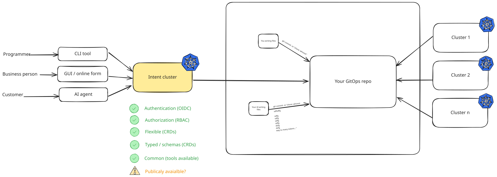

<!--
Diagram 9 - you already run an API that does all of this.
- Replace the generic API box with kube-api-server.
- Authentication (OIDC), Authorization (RBAC), flexible (CRDs),
  typed / schemas (CRDs), common - the tools already exist.
- Open question on the slide: publicly available?
- This is the pivot of the talk. Let it sit for a beat.
-->

---

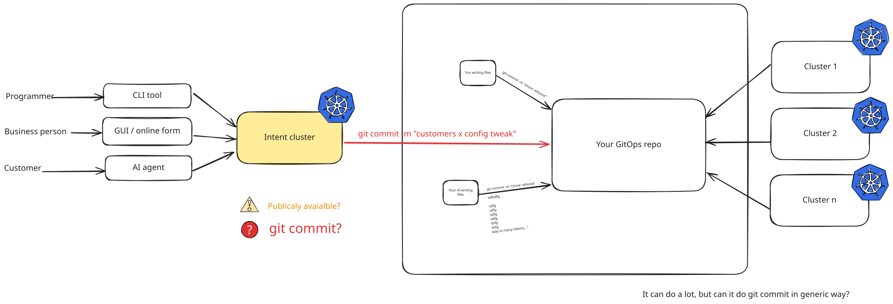

<!--
Diagram 10 - the one thing it does not do.
- It can do a lot, but can it do `git commit` in a generic way?
- The missing arrow from kube-api-server to the repo.
- This is exactly the gap gitops-reverser fills.
-->

---

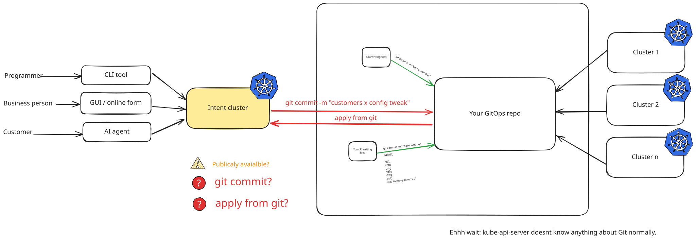

<!--
CLOCK 8:15 — checkpoint. Problem arc done.

Diagram 11 - and it has to work both ways.
- git commit AND git pull: the loop closes.
- Cluster state and repo state move together instead of drifting.
- Lands the promise: kubectl apply in pre-production without losing the source of truth.
-->

---

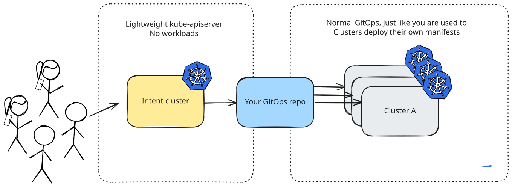

<!--
CLOCK 8:30 — THE one big-picture slide. Everything later points back here.

- Intent cluster: a lightweight kube-apiserver. No workloads. Your abstractions
  live here, and this is the API everybody may talk to.
- Your GitOps repo: intent-cluster actions are translated straight into it.
- Your clusters: normal GitOps. Flux and Argo are friends, nothing changes there.
- Address the elephant immediately: yes, we come back the other way too.
- Without this slide, every later question is "wait, is this production?".
-->

---

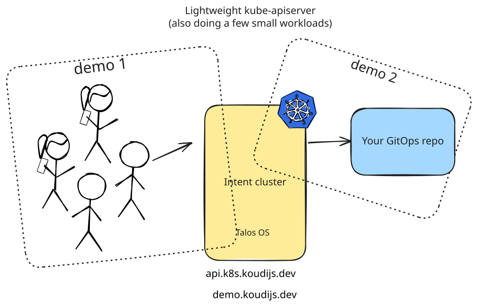

<!--
CLOCK 9:00 — what you are actually about to watch, on real infrastructure.

- Talos OS, api.k8s.koudijs.dev, demo.koudijs.dev.
- This one does run a few small workloads — be honest that it is combined.
- The API server is open to the world. That is the point, not an accident.
-->

---

# What I am *not* going to cover

- Encrypting secrets with SOPS *(referenced resources, kept separate)*
- Brownfield discovery — reconciling an existing cluster into objects
- Deep kube-apiserver configuration
- Building your own GUI — the one you are about to see is open source, and the
  auth is not yours to write anyway

<div class="note">
Hook it up to your GitHub org or your company SSO. This talk is not about auth —
but auth is the thing I have come to appreciate most inside Kubernetes.
</div>

<!--
CLOCK 9:20 — 30 seconds, fast. This buys enormous goodwill from an advanced room
and heads off four Q&A questions.
-->

---

# The API surface for the next ten minutes

<div class="cols">
<div>

### `examples.configbutler.ai`

- **QuizSession** — a round of questions, and whether it is open
- **QuizSubmission** — one person's answers

</div>
<div>

### `roompass.configbutler.ai`

- **Room** — who may join, and how
- **Participant** — you, once you have scanned

</div>
</div>

<div class="note">
Four CRDs. That is the whole contract. Everything you are about to do lands in etcd as a custom resource.
</div>

<!--
CLOCK 9:40 — 40 seconds.

- I designed these so I can define the questions and open/close them. That IS
  the API surface — not a REST endpoint I wrote.
- room-pass is itself an operator, so of course it got CRDs too.
- Normally this would be GitHub OIDC or your company SSO. Today it is the fact
  that you are in this room.
-->

---

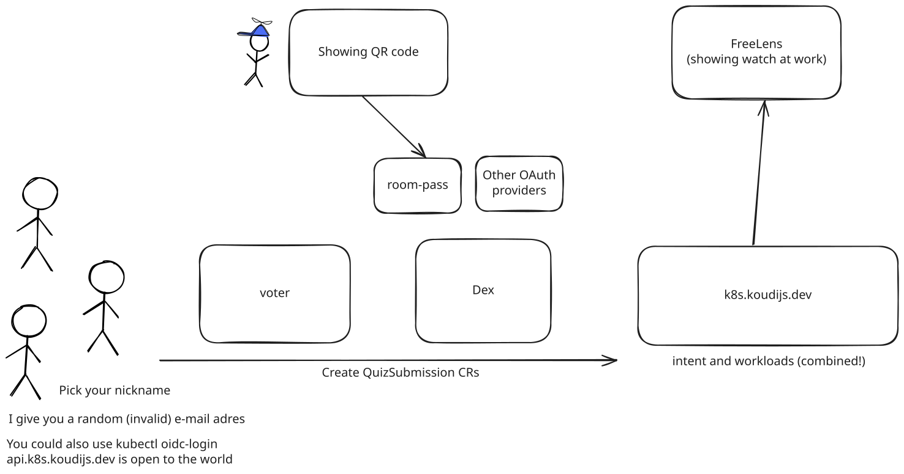

<!--
CLOCK 10:00 — the demo-1 architecture. Show it BEFORE you hand out the QR,
so the joining happens against a picture they have already seen.

- QR carries a room code, not a credential.
- room-pass validates it, writes a Participant, and is the only thing allowed to
  call Dex's header-trusting connector.
- The API SERVER derives the username from federated_claims.connector_id.
  Nobody can forge it. Everyone becomes demo:<subject> in group demo:voter-audience.
- The frontend queries the Kubernetes API directly. Your vote is your own CR.
- You could also just use kubectl oidc-login. Same API, different door.
-->

---

<!-- _class: demo -->

# Demo 1

## Who you are, who decides what you may do, and what a vote actually is

<div class="subtle">
Scan. Pick a nickname you are happy for a room full of strangers to read.
</div>

<!--
CLOCK 10:30 → 18:00, seven and a half minutes. Runbook demo 1, with step 4
(the interloper) DROPPED.
Git is not mentioned once, and definitely not SHOWN. Check your browser tabs.

1. Get them in (2 min) — /room projected, code rotates every 30s, valid 120s.
2. Let them vote, then show them what they wrote (3 min).
   Four questions, in demo-questions.yaml: Argo/Flux, Helm/Kustomize, how they
   change config today (multi-select), and one free-text line.
   TWO FREE CALLBACKS off the bars, take them:
     - Argo vs Flux — "whichever you picked, nothing in this talk changes it.
       Both of them live downstream of everything I am about to show you."
     - Helm's share — remember it. At the honest-limits slide you get to say
       "N% of this room said Helm, and a chart is the one thing I cannot
       reverse into readable intent."
   The multi-select bars ARE the argument: GitOps and kubectl both lit up.
   Say it out loud — "you are all doing both, and only one of them leaves a story."
     kubectl -n voter get quizsubmissions
     kubectl -n voter get quizsubmission demo1-<somebody> -o yaml
     kubectl -n voter get coffeeconfig demo-coffee
   Their answer is an object. The coffee menu is an object. Let it sit unresolved.
3. Show what they CANNOT do (2.5 min) — every refusal is a real 403:
     - vote twice           -> already voted, create is atomic
     - open/close a round   -> 403, no patch on quizsessions
     - edit the coffee menu -> 403, and the page says so before they try
   Then: "open your own name in the top bar" -> /me permission grid.
   Then from the other side:
     A="--as=demo:some-subject --as-group=demo:voter-audience --as-group=system:authenticated"
     kubectl -n voter auth can-i create quizsubmissions $A   # yes
     kubectl -n voter auth can-i patch  quizsessions   $A    # no
     kubectl -n voter auth can-i patch  coffeeconfigs  $A    # no  <- sets up demo 2
   THE POINT: the application never decided any of this.

If you are running long, cut the coffee menu out of beat 2. It reappears in demo 2.
-->

---

# So where are we?

<div class="ws">
  <div class="w partial"><div class="mark">✓</div><div class="letter">Who</div><div class="note">OIDC identity, on the object</div></div>
  <div class="w partial"><div class="mark">✓</div><div class="letter">When</div><div class="note">creationTimestamp</div></div>
  <div class="w partial"><div class="mark">✓</div><div class="letter">What</div><div class="note">the resource itself</div></div>
  <div class="w partial"><div class="mark">✓</div><div class="letter">Why</div><div class="note">implied by the CRD — nobody wrote it down</div></div>
</div>

<div class="verdict">
All four are answerable. <strong>None of it is GitOps.</strong> It is bolted on top of
an API, it lives in etcd, and there is no commit message anywhere.
</div>

<!--
CLOCK 18:00 — 45 seconds. THE YELLOW SLIDE. This is the turn of the talk.

- Say the yellow out loud: "these are ticked, but they are amber on purpose."
- For this particular use case you could argue the intent is obvious — someone
  answered a question. But there is no message saying WHY.
- Then the question that opens the second half:
  "Could we have these resources in Git as well? And how would you get them there?"
-->

---

# gitops-reverser

One job: **watch what happens in kube-apiserver, and write it down as a clean file.**

- Only `spec` and useful metadata
- Nothing that points back at the cluster it came from
- `kubectl neat`, as an operator, on a loop

<div class="note">
So the real question is: how do you find out what is happening inside a cluster?
There is more than one way, and the choice has consequences.
</div>

<!--
CLOCK 18:45 — 25 seconds. Bridge into the five mechanism slides.

- The output is a file that could have been hand-written. That is deliberate:
  the diff has to be readable by a human reviewer.
-->

---

# You do not watch a cluster. You claim **cells**.

<div class="flow">
  <div class="stack">
    <div class="card">quizsubmissions<span>namespace: voter</span></div>
    <div class="card">configmaps<span>namespaces: team-a, team-b</span></div>
    <div class="card">clusterroles<span>cluster-scoped</span></div>
    <div class="cap">3 rules</div>
  </div>
  <div class="arrow">➜</div>
  <div class="stack">
    <div class="chip">one type + ns=voter</div>
    <div class="chip">one type + ns=team-a</div>
    <div class="chip">one type + ns=team-b</div>
    <div class="chip">one type + cluster-wide</div>
    <div class="cap">4 cells — one watch each</div>
  </div>
</div>

<div class="verdict">
You pay for what you <strong>claim</strong>, not for how many types the cluster has.
</div>

<!--
CLOCK 19:10 — 60 seconds. If you are behind, drop the mermaid slide that
follows this one rather than this one: the 14-gitops-reverser slide covers
WatchRule again, but this is the version that reads from the back row.

- A namespaced type opens one watch per namespace it is claimed in. A
  cluster-scoped type opens one. Three rules, four cells. That is the whole
  scaling story.

- THE HALF PEOPLE MISS, and it is the thing most likely to change what someone
  does on Monday — say it as a separate beat:
    "A cell is not only a tap on the future. Opening it ITERATES what is already
     there. So the first thing that lands in your repo is not the next change
     someone makes — it is the current state of everything you claimed."
  Point it at a cluster that has run for two years, claim three cells, and the
  existing resources stream into the repo as commits. Adopting a cluster is two
  lines of YAML, not an export script — and the same iteration is the repair
  path if the live stream ever drops an event.

- DRAW THE BOUNDARY or you will be asked: this is NOT brownfield discovery. The
  cell does not decide what is worth claiming — that is still your judgement,
  and it is on the "not covering today" list. What it guarantees is that once
  you have claimed a cell, nothing already in it is missing.

- Leave out unless asked: resume cursors, sendInitialEvents, 410 Gone,
  mark-and-sweep.
-->

---


<!--
CLOCK 20:10 — 35 seconds. The previous slide's second half, drawn. If you are
behind, THIS is the first of the five mechanism slides to drop: the CSS slide
before it already carried the 3-rules/4-cells arithmetic.

- Trace it once, left to right, then stop on the two boxes on the right. A cell
  ITERATES what is already there, and THEN stays on the live watch stream.
- Both arrows end in Git. That is the whole point: adoption and steady state are
  the same code path — which is also why re-iteration is the repair path if the
  live stream ever drops an event.
- Source: 16-watch-cells.mmd. Regenerate with
  npx @mermaid-js/mermaid-cli -i 16-watch-cells.mmd -o 16-watch-cells.svg -b transparent -c mermaid-config.json
-->

---

# `resourceVersion` — the primary key of *when*

<div class="cols">
<div>

### What Kubernetes guarantees

- Every write gets a **new** one — one RV never describes two states
- The watch stream is **ordered**, and never goes backwards
- A watch is **resumable** — a cursor is just "everything since *X*"
- It is **opaque** — do not parse it, do not do arithmetic on it

</div>
<div>

### What we actually depend on

- We never **compare** them — only test **equality**
- `uid + resourceVersion` is the **join key**
- Monotonicity is what lets us **resume**
- Equality is what lets us **attribute**

</div>
</div>

<div class="verdict">
With etcd3 storage the resourceVersion <strong>is</strong> the etcd revision — one cluster-wide
counter that ticks on every write to anything.
</div>

<!--
CLOCK 20:45 — 60 seconds, and worth every one of them. Everything downstream —
ordering, resume, the audit join, deduplication — is this one field.

- THE ONE-LINER, if you only get one sentence out: "resourceVersion is the primary
  key of WHEN. It is the reason two independent streams can describe the same
  write without ever talking to each other."
- Read the right-hand column slowly. The precision IS the advanced billing: we
  never COMPARE resourceVersions, we test EQUALITY. Monotonicity is what lets us
  resume; equality is what lets us attribute.
- The etcd3 line at the bottom is why the join works at all rather than merely
  being plausible: ONE CLUSTER-WIDE COUNTER that ticks on every write to anything.
  Not per-object, not per-type. So a number from a configmaps watch and a number
  in an audit event are literally the same number in the same space.
- IF ASKED which release made monotonicity a hard guarantee: "in every version you
  are running." TRUE AND UNFALSIFIABLE. DO NOT guess a release number out loud —
  this room will contain someone who knows which one.
- THE IRONY, worth ten seconds if the room is with you: the resourceVersion is
  STRIPPED from the file that gets committed. It is cluster state, not intent, and
  it has no business in a Git diff. It does all the work and then does not appear
  in the output.

The next slide is the join this key makes possible.
-->

---

# Two lanes. One key.

<div class="join">
  <div class="apiserver">kube-apiserver</div>
  <div class="lanes">
    <div class="lane watch"><b>watch stream</b><span>WHAT changed — the object itself, ordered</span></div>
    <div class="lane audit"><b>audit webhook</b><span>WHO changed it — after the write persisted</span></div>
  </div>
  <div class="key">
    They never call each other. They meet on <code>uid + resourceVersion</code>, within 3s.
  </div>
  <div class="out">→ one commit, authored by a person</div>
</div>

<div class="note">
No usable fact in time? The author is literally <code>unknown (attribution unresolved)</code> —
never the bot's name substituted in.
</div>

<!--
CLOCK 21:45 — 70 seconds. THIS is the slide that earns the "advanced" billing.
It is the one to protect if the segment runs long. The resourceVersion slide you
have just done is the setup — do not re-explain the key here.

- Two streams out of the same API server. The watch says WHAT changed. The audit
  webhook says WHO changed it. They never call each other — they meet on a key.
- BUILD IT IN TWO BEATS if the room is with you: watch lane only — the commit
  lands, authored by the configured identity, product works. Then add the audit
  lane — same commit, real actor. The build IS the claim "audit is optional and
  never blocks state capture"; you do not have to say it.
- That is why the audit lane is drawn dashed. Turn it off and everything still
  works; you just lose the name.
- No usable fact in time → the author is literally `unknown (attribution
  unresolved)`, never the bot's name substituted in. A commit authored by a person
  is a positive claim that we know; the sentinel is a positive claim that we tried
  and could not tell.

The next slide draws the same thing in full. The one after that is why these two
lanes and not the other three.
-->

---


<!--
CLOCK 22:55 — 40 seconds. The slide before this one is the claim; this is the
mechanism, drawn in full, for the people who were going to ask anyway. Safe to
cut if you are behind.

- The left lane is sanitised on the way through — uid, resourceVersion,
  managedFields and status are gone before anything is written.
- The right lane is amber and dotted because it is OPTIONAL. Turn the audit
  webhook off and every box on the left still reaches Git.
- STOP ON THE DOTTED ARROW. "keys only" — the two lanes meeting through nothing
  but a key is the architecturally interesting part of the whole design, and the
  picture says it better than a sentence does.
- Stop on the two outcomes. `unknown (attribution unresolved)` is a POSITIVE claim
  that we tried and could not tell — never the committer identity substituted in.
- Source: 17-join.mmd. Regenerate with
  npx @mermaid-js/mermaid-cli -i 17-join.mmd -o 17-join.svg -b transparent -c mermaid-config.json
-->

---

# How do you observe a cluster?

| Mechanism | Tells you *who* | Fires | Guaranteed | EKS / GKE / AKS |
|---|---|---|---|---|
| **Watch stream** | No | after commit | No | **Yes** |
| Mutating webhook | Yes | *before* commit | No | Yes |
| Validating webhook | Yes | *before* commit | No | Yes |
| Audit file | Yes | after commit | Yes | No |
| **Audit webhook** | Yes | after commit | No | No |

<div class="note">
gitops-reverser uses the two in bold. The watch says <strong>what</strong> changed.
The audit webhook says <strong>who</strong> changed it. They never call each other —
they meet on <code>uid + resourceVersion</code>.
</div>

<!--
CLOCK 23:35 — 40 seconds. Read the two bold rows and the EKS column, then move
on. The three slides before this one did the heavy lifting; resist re-explaining
resourceVersion, and do not repeat the stripped-from-the-diff irony — it has
already landed.

- Everyone reaches for the admission webhook first: the request already carries
  userInfo. We did too. It does not work, for two unfixable reasons:
    * admission runs BEFORE the write reaches etcd — it sees attempts, not
      persistence. A later webhook can reject it. A dry-run looks identical.
    * there is nothing to join on yet: no resourceVersion, and for generateName,
      not even a name.
  Audit fires AFTER the write persisted, and carries the resourceVersion.
- Why I rewrote it to the watch: the watch focuses on the actual RESOURCE. If
  someone sends a scale command, an audit-only design has to map that back to an
  object yourself. Spare them the nitty-gritty.
- THE HONESTY BEAT, said before anyone asks it as a gotcha: audit webhook delivery
  is generally not exposed on EKS/GKE/AKS. That is the "No" column, and this is
  the slide that owns it.
-->

---

# One commit per author — and that is also the limit

<div class="win">
  <div class="row">
    <span class="who a">a</span><span class="who a">a</span><span class="who a">a</span><span class="who a">a</span>
    <span class="to">➜</span><span class="commit">1 commit</span>
    <span class="lbl">one author, four changes — the window coalesces</span>
  </div>
  <div class="row">
    <span class="who a">a</span><span class="who b">b</span><span class="who c">c</span><span class="who d">d</span>
    <span class="to">➜</span><span class="commit">4 commits</span>
    <span class="lbl">four authors — a new author force-finalises the window</span>
  </div>
</div>

<div class="verdict">
Attribution is not decoration on the commit. It is what <strong>shapes</strong> the history.
</div>

<!--
CLOCK 24:15 — 65 seconds. The strongest slide in this set, because it carries
the feature AND its limit in one shape.

- The window coalesces into one commit per (author, gitTarget), 5s. An event
  whose author does not match the open window force-finalises it before
  appending — the finalise reason is literally `author-or-target-change`.
- So when the room sees N submissions become N commits in demo 2: not luck, and
  not because the window is zero. Every submission is a different person.

- THEN TURN IT OVER, IN THE SAME BREATH. This is the honest-checklist payoff:
    "Same mechanism, read the other way: with many concurrent authors the window
     never coalesces. Your commit rate IS your write rate. That is why this
     pattern is wrong for high-frequency writes — and I can show you the exact
     line of code that makes it true."
  Call back to this at the "Where this shines" slide at 39:00.

- SAY THIS BEFORE THE DEMO, or the best part of it looks broken (30s of
  prevention): commits are per-author, but PUSHES are batched and polite — one
  every 5 seconds. The room will see commits arrive in CLUMPS, not a smooth
  stream. That is the push cooldown, not lag.
-->

---

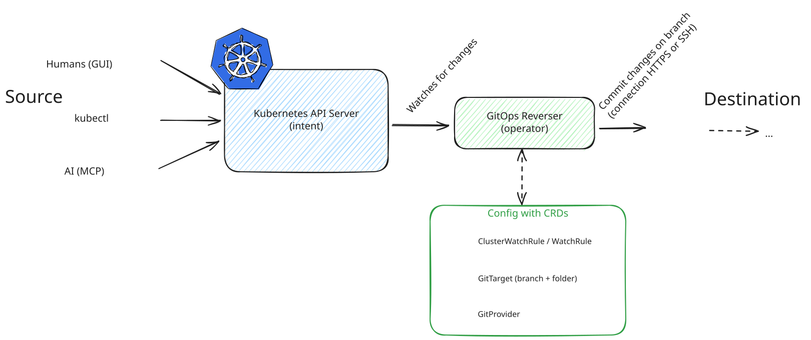

<!--
CLOCK 25:20 — 30 seconds. The config surface: three CRDs, and that is the whole
thing. You have just explained all of it, so this slide is the payoff, not a
lecture — point at each box and name it.

- GitProvider: the connection (HTTPS or SSH).
- ClusterWatchRule / WatchRule: what to claim. A cell is one (GVR, scope) —
  a namespaced type opens one watch per namespace, a cluster-scoped type opens one.
  Three rules, four cells. You pay for what you claim.
- GitTarget: branch + folder, and the file layout template.
- The bit people miss: opening a cell ITERATES what is already there. Point it at
  a cluster that has run for two years and the existing resources stream into the
  repo. Adoption is two lines of YAML, not an export script.
-->

---

# Two names on one commit

```
commit 423936a8f536ac8e4a74c1d7673264c847f26c3a
Author:     Simon Koudijs <simonkoudijs@gmail.com>
AuthorDate: Tue Sep 15 15:43:01 2026 +0200
Commit:     Simon Koudijs <simonkoudijs@gmail.com>
CommitDate: Tue Sep 15 15:43:01 2026 +0200

    chore: just a normal commit
```

<div class="verdict">
Why is my name on there twice? Because Git has always had two slots — and
they were built for exactly the case where the committer is <em>not</em> the author.
</div>

<!--
CLOCK 25:50 — 15 seconds.

- `git show --format=fuller`. The --format=fuller is REQUIRED; plain git log
  hides the committer and the whole story is invisible without it.
- This is default Git behaviour that almost nobody looks at. Set it up as
  "a slot that has been sitting empty this whole time".
-->

---

# The same thing, filled in properly

```
Author:     Simon7 <simon7@koudijs.dev.test>
AuthorDate: Wed Sep 16 03:51:25 2026 +0000
Commit:     ConfigButler Bot <bot@configbutler.ai>
CommitDate: Wed Sep 16 03:51:25 2026 +0000

    chore(demo1): 1 change from demo:CgZzaW1vbjcSCXJvb20tcGFzcw

    - [CREATE] quizsubmissions/demo1-simon7
```

<div class="verdict">
The cluster made this commit <strong>on a named human's behalf</strong>.
</div>

<!--
CLOCK 26:05 — 10 seconds, then straight into demo 2 at 26:15.

- Author is the person. Committer is the bot, signed.
- Pre-empt the ugly bit yourself: the MESSAGE names the API identity (that
  base64 blob is the OIDC subject); the AUTHOR line names the human. Say it
  before someone asks, or it reads as a rough edge.
- Do NOT show the real repo yet. This is a slide. The reveal is 30 seconds away.
-->

---

<!-- _class: demo -->

# Demo 2

## The same actions, in Git — and the one place the room works together

<div class="subtle">
You are still signed in. You do not have to join again.
</div>

<!--
CLOCK 26:15 — ELEVEN AND THREE QUARTER MINUTES (ends 38:00). Runbook demo 2, with the old step 3 (open the
evaluation round) MOVED TO THE CLOSE and the old step 6 (the orders feed)
folded into the close. Runbook steps are renumbered to match: 1 reveal,
2 filed-two-ways, 3 grant, 4 collision, 5 boundary.

1. THE REVEAL (2 min). Open clusters/k8s.koudijs.dev/demo1/submissions.yaml.
   It has been mirroring since they scanned the code. Let them find their name.
   git show --format=fuller <sha> -> author is them, committer is the bot.
   CONTAINMENT LINE, say it before you are asked: k8s-audit-trail is NOT a Flux
   source. Nothing reconciles from it. An attendee's commit cannot reach a cluster.

2. Same objects, filed two ways (90 SECONDS — the runbook says this survives it).
   demo2/results/<name>.yaml vs demo1/submissions.yaml. One template string:
     "results/{label:voter.configbutler.ai/submitter|_anonymous}.yaml"
   Layout is configuration. The caller neither knows nor cares.

3. GRANT THE ROOM THE ADMIN PAGE (2 min). /room -> tick "Let the room edit the
   coffee menu". A RoleBinding is created BY YOUR TOKEN. Every phone's /me grid
   grows a patch column within seconds, no reload, no re-login.
   SHOW THE COMMIT — strongest artifact in the talk. demo1/authorization.yaml
   gains 18 lines, authored by you. "Who may do what" as a reviewable file.

4. TWO PEOPLE, ONE MENU (5 min). The beat the talk is named for.
   TESTNET voucher fails -> raise maximumUsage -> DO NOT SAVE -> have someone
   else change the same field:
     kubectl -n voter patch coffeeconfig demo-coffee --type=json \
       -p '[{"op":"replace","path":"/spec/vouchers/0/maximumUsage","value":99}]'
   --type=json, NEVER --type=merge. A merge patch eats the whole voucher list.
   Field turns red, Save is DISABLED, Take Theirs / Keep Mine.
   Say, in this order:
     a) the red dot is the browser; underneath, the API server would 409 anyway.
        The UI is a courtesy, the guarantee is Kubernetes'.
     b) change a DIFFERENT field and it just arrives. Only the collision is a
        conflict. A three-way text merge cannot know that.
     c) THEREFORE: the API is the source of truth, the repository is the record.
        If the room takes one sentence home, this is it.
   Then fill in the reason box -> it becomes CommitRequest.spec.message ->
   it becomes the commit message. Save, then "save now".
   Be precise: Kubernetes SAVED it (true now). ConfigButler ACCEPTED a commit
   request. The receipt says commitRequested, not committed.

BUNDLING, if it comes up: three votes in one commit is the 5s WINDOW, not the
CommitRequest. Voting never creates a CommitRequest. Two behaviours, not one.
-->

---

# Now where are we?

<div class="ws">
  <div class="w full"><div class="mark">✓</div><div class="letter">Who</div><div class="note">the Git author — a real person</div></div>
  <div class="w full"><div class="mark">✓</div><div class="letter">When</div><div class="note">AuthorDate</div></div>
  <div class="w full"><div class="mark">✓</div><div class="letter">What</div><div class="note">the diff, reviewable</div></div>
  <div class="w full"><div class="mark">✓</div><div class="letter">Why</div><div class="note">the reason you typed, as the commit message</div></div>
</div>

<div class="verdict">
Same four questions. Same four answers. <strong>Now it is GitOps</strong> — and not one
person in this room has a GitHub account on that repository.
</div>

<!--
CLOCK 38:00 — 45 seconds. THE GREEN SLIDE. This is the payoff of the yellow one.

- Walk the four, left to right, and say what changed since the amber slide.
- The big one is Why: it went from "implied" to "someone typed a sentence, and
  the sentence is in the commit".
- Do not oversell. The next slide is the honest half.
-->

---

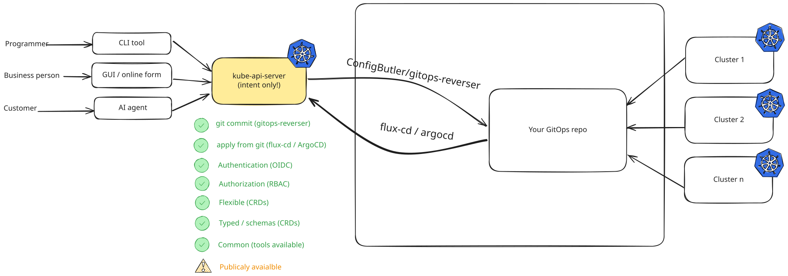

<!--
CLOCK 38:45 — the complete picture. The same diagram they saw at minute 8,
with both arrows drawn in.

- git commit (gitops-reverser) going out, apply from git (Flux/Argo) coming back.
- Publicly available: yes, deliberately.
- One sentence: "this is the whole pattern, and you have now watched every arrow."
-->

---

# Where this shines, where it does not

<div class="cols">
<div>

### Shines

- People already know GitOps — and have started to like it
- You want a very high bar for audit quality
- You want an approval process, and to re-use tooling you already run
- You are letting AI make changes

</div>
<div>

### Avoid if

- The word "KRM" makes your people back away
- It is high-volume — your commit rate *is* your write rate
- It belongs in a database

</div>
</div>

<div class="note">
The orders feed in that app is the other half of this slide: high-frequency, no reviewer,
no reconciler, gone on restart — and deliberately not in Git. A commit per coffee is a
history no human will ever read. Knowing which is which is the skill.
</div>

<!--
CLOCK 39:00 — 60 seconds. Switch to the Orders tab while you say this, if the
laptop is still on the app. Both halves of the argument on one screen.

- Same mechanism, both directions: the commit window is keyed by author, so many
  concurrent authors means the window never coalesces. That is exactly why it is
  wrong for high-frequency writes — and I can show you the line of code.
- Feel free to try the limits. I would like to know where they are.

DO NOT PROMISE:
  - "the commit is observed end to end" — the receipt says accepted.
  - "this scales to your production write path" — one replica, 5s window.
  - "the audit trail is tamper-proof" — it is signed, and nothing reconciles
    from it. Those are the two claims it can back.
-->

---

# Start small

1. Pick **one folder**, or a handful of CRs. Not the repo.
2. Stand up an intent cluster that captures only that. No workloads.
3. Hand out OIDC access — your SSO, GitHub, or something like today's room pass.
4. Decide: does this need a pull request, or can it go straight to main?

<div class="note">
Be honest about 4: most self-service portals in the world deploy the moment you hit Save.
With the right authorization and the right abstraction, straight to main is often fine.
</div>

<!--
CLOCK 40:00 — 45 seconds.

- You do not need Go experts. Every major language has a good Kubernetes client.
- You do not have to write the operators either: Crossplane, KRO, Argo, Helm —
  plenty of KRM-native ways to build an abstraction.
- Bi-directional works and is covered by the e2e tests; it spins up separate
  clusters in GitHub Actions. Mention only if asked.
- Also in the drawer if asked: a prototype GitHub app that gives a repo folder an
  API by firing up a KCP workspace — no workloads, just checks you configure.
-->

---

<!-- _class: lead -->

# One last round

<div class="subtle">
Same phones. Same QR. Last questions of the day.
</div>

<div class="note" style="color:#506070">
Would you run this? What would you point it at first? What would you need first?<br>
reversegitops.dev &nbsp;·&nbsp; github.com/ConfigButler/gitops-reverser &nbsp;·&nbsp; come and find me afterwards
</div>

<!--
CLOCK 40:45 — this is runbook demo 2 step 3, moved here on purpose.

Four questions, in demo-questions.yaml. Leave the results screen projected while
you take questions — the 0-10 "how likely are you to try this" renders as a live
average to one decimal, and it keeps changing while you talk. Read a couple of
the free-text answers out loud: it is a Q&A channel for everyone who would never
raise a hand.

NO contact question, on purpose. Real e-mail addresses would be the only real
personal data in that repository, they are awkward to remove from a history, and
right now you get to say on stage that every identity in there is synthetic
(@demo.invalid). Keep that property. Put your LinkedIn QR next to the room QR
instead, or just ask them to come and find you.

Press Open on `evaluation` from /room. TWO things happen at once:
  - every phone updates without a refresh, and the round appears
  - demo1/quiz-configs.yaml flips state: closed -> live IN PLACE, authored by you
    (demo1/, NOT demo2/ — the demo2 GitTarget does not claim quizsessions)

SHOW THAT DIFF. It is the last artifact of the talk: a one-line change in a file
they have already seen, made by pressing a button, attributed to the person who
pressed it. The close is now a live demo instead of a bullet list.

While they answer, take questions. You have ~5 minutes.

If `evaluation` is already live (a rehearsal left it open), skip the button, let
them vote, and say the sentence instead — a push does NOT close it again,
because the session is seeded and not reconciled.

REMEMBER TO REVOKE the coffee grant before you leave the stage:
  kubectl -n voter delete rolebinding voter-audience-coffee-admin
or untick the switch on /room — and that revoke is a clean +0/-18 commit too.
-->
