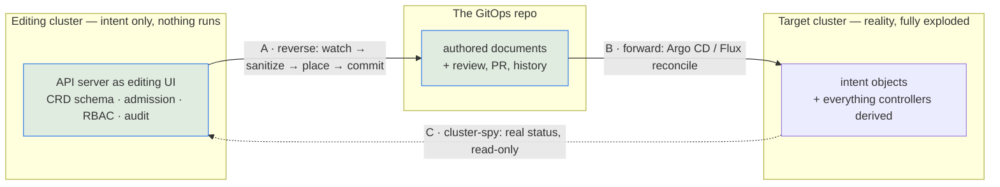

# Reverse GitOps — talk material

> Scratch notes for an advanced-level conference talk. Untracked (`*.ignore.*`), so nothing here
> is linted, linked from, or binding. Verdicts live in
> [`design/support-boundary/support-contract.md`](design/support-boundary/support-contract.md).

---

## 1. The three players

Everything in this document is easier to place once the cast is fixed. There are three, and the
whole design falls out of keeping them apart.

### The target cluster — reality, fully exploded

What is actually running. Every object is here: the ones a human wrote, and the far larger number a
controller derived from them. Helm releases are rendered, `ApplicationSet`s have fanned out,
`ResourceSet`s have expanded, webhooks have defaulted fields, and controllers have written status.

**You do not know in advance that all of it can be reversed — and most of it cannot.** That is not a
gap to be closed; it is the shape of the problem. A rendered `Deployment` has no home file to go
back to, and inventing one would create a second source of truth.

### The GitOps repo — the thing kept in line with the target cluster

Argo CD and Flux exist to guarantee this alignment, and they are good at it. That guarantee is what
makes reverse-GitOps possible at all: if the repo is authoritative for the target cluster, then
**writing to the repo is a legitimate way to change the target cluster** — the long way round, through
review, rather than the short way round, through `kubectl`.

This is where GitOps Reverser commits when it detects an action in the editing cluster.

### The editing cluster — the API server used as an editing surface

A **separate** cluster, deliberately. Hooked up to the internet so people can make changes easily,
and separate in environment and in time from the target — which is exactly what makes producing a
**pull request** natural rather than awkward. You are not racing a reconcile loop; you are composing
a change.

Two consequences worth saying out loud on stage:

- **The Kubernetes API is a very good editing UI, and it is free.** CRD schemas, enums, `required`,
  `minItems`, defaulting, admission webhooks, RBAC, audit, watch — an editing cluster gets all of it
  without anyone building a form. That is why the e2e `IceCreamOrder` CRD is stuffed with enums and
  constraints (see §7): it is the demonstration that **the edit is validated before Git ever sees
  it**. A malformed intent never becomes a commit.
- **Nothing runs there**, so you can install CRDs without their controllers, and the object set is
  naturally the *intent* layer only. Which is the punchline: **the three-cluster split and the
  intent/expansion boundary are the same idea seen from two sides.** The editing cluster physically
  cannot contain expansion output, so it cannot tempt you into reversing it.

Because nothing runs there, the editing cluster is blind to how anything actually behaves — which is
the argument for a **cluster-spy**: a component that ships real status from the real target cluster
back to the editing surface, so an author knows what is genuinely installed and how it is doing
before proposing a change. Status flows one way (target → editor); intent flows the other way
(editor → Git → target). They never cross.

An editing cluster *could* be a live cluster — nothing forbids it, and the bi-directional e2e corner
does exactly that. For the concept it is a sidetrack, and it costs you the two properties above.

### The loop



**Arrow A is the only one GitOps Reverser owns.** Arrow B is Argo CD and Flux doing their job
unchanged — no fork, no plugin, no cooperation required. Arrow C is a separate, read-only concern.

That framing also answers the compatibility question before it is asked. "Does it support Argo CD /
Flux?" is the wrong question, because those tools live entirely on arrow B. The right question is
about arrow A: **does this object have a home file in the repo?**

---

## 2. The thesis

> **Every anti-repetition device you add moves state out of files and into a renderer or a
> controller — and that is exactly the state reverse-GitOps has to put back.**

DRY and reversibility are in tension. The interesting engineering is locating the line, not picking a
side. Every example below is chosen to sit somewhere on that line.

---

## 3. The six families — the opening slide

From [`test/fixtures/gitops-layouts/README.md`](../test/fixtures/gitops-layouts/README.md). Nineteen
real layouts, grouped by **the decision each one forces**, not by tool:

| Family | The question it forces | The thing that decides it |
|---|---|---|
| 1-desired-state | The files **are** the objects | every live object has a home file |
| 2-rendered | The files are **inputs to a renderer** | renderability |
| 3-expanded | A **controller** materialises objects with no home file | provenance |
| 4-machine-written | Git is an **output** | ownership |
| 5-opaque | The object **is not** the object | capability |
| 6-hostile | Every naive parser assumption, broken on purpose | can we read the bytes |

Families 2, 3 and 4 are the three axes of the support model — renderability, provenance, ownership.

**The distinction families 1 and 3 exist to protect.** All three of these involve a controller; only
the third has no home in Git:

- an `Application` in `1-desired-state/argocd-app-of-apps/` is a file a human wrote;
- a Flux `Kustomization` in `1-desired-state/flux-monorepo/` points at a folder of real files;
- an `Application` in `3-expanded/argocd-applicationset-directories/` is synthesised from a directory
  glob and exists only in etcd.

*"Was a controller involved?"* is the wrong question. *"Does this object have a home in Git?"* is the
right one.

---

## 4. The shortlist — four acts and a coda

Four examples, five slides. Each act carries one Flux and one Argo beat so neither tool feels bolted
on; kustomize and Helm each get a full act.

### Act 1 — the baseline that works: `flux-monorepo`

[`test/fixtures/gitops-layouts/1-desired-state/flux-monorepo/`](../test/fixtures/gitops-layouts/1-desired-state/flux-monorepo/)

The canonical Flux shape: `apps/` (base + per-env overlays) + `infrastructure/` + `clusters/<name>/`.
Anti-repetition is real but modest — a new cluster is a new `clusters/` directory, not a copy of the
repo.

- **Two unrelated kinds share the word "Kustomization."** Every file named `kustomization.yaml` is
  `kustomize.config.k8s.io` build config the API server never stores; `clusters/*/apps.yaml` holds
  `kustomize.toolkit.fluxcd.io` CRs it does. The collision appears *inside a single file* — the
  cluster root is a build file whose `resources:` are Kustomization CRs.
- **`apps/` vs `infrastructure/` is a reconciliation-ordering guarantee**, not tidiness — `dependsOn`
  plus `healthChecks`, across directories.
- **The one that matters for reversal:** `apps.yaml` sets `targetNamespace: production`, so an app's
  destination namespace is decided in `clusters/`, not in `apps/`. You cannot know where a folder
  lands by reading that folder.

Opens well because the baseline in
[`support-today.md`](../test/fixtures/gitops-layouts/support-today.md) reports **6 candidates, 6
accepted, 0 refused**. Act 1 is the "this is fine" act, which is what makes Act 2 land.

### Act 2 — the centrepiece: base + overlays, two opposite outcomes

Pair the messy real-world shape with the executable specification:

- [`2-rendered/kustomize-overlays/`](../test/fixtures/gitops-layouts/2-rendered/kustomize-overlays/)
- [`layout-corpus/shapes/6-kustomize-base-and-overlays/`](../test/fixtures/layout-corpus/shapes/6-kustomize-base-and-overlays/)
  and [`shapes/8-base-owned-field-edit/`](../test/fixtures/layout-corpus/shapes/8-base-owned-field-edit/)

The reversal question in one sentence: *one base, three overlays — where does a live edit go?*

- **Three environments are three targets, each rooted at a leaf overlay.** A single target at
  `apps/checkout` is refused by three independent rules that happen to agree: it covers four render
  roots (`LayoutResolved: Ambiguous`), `base/` has fan-in 3 from that vantage point, and a target is
  a write partition. **Read scope is wider than write scope, always.**
- **Same object, two fields, two opposite outcomes** — this is the slide.
  - Bump the image `1.4.0 → 1.5.0`: the value lives in `base/deployment.yaml`, out of reach, so the
    writer **authors a new `images:` block into the overlay's own kustomization** and proves it by
    re-rendering. `test` and `acceptance` still render `1.4.0` — the property base/overlay exists
    for, and which a write into the base would have destroyed.
  - Change `LOG_LEVEL=info → debug`: kustomize has no declaration for an env var, so there is nothing
    to author, and the flush is **refused whole** — `WriteBoundaryRefused`, naming
    `base/deployment.yaml`. From outside the operator: the `kubectl apply` succeeded, the cluster
    runs `debug`, Git has not moved, the GitTarget is `Stalled`.
- **The DRY devices are precisely the refusals.** Same baseline file: `kustomize-overlays` scores
  **1 accepted / 3 refused**, and the reasons read `configMapGenerator, namePrefix, nameSuffix,
  remote-base, secretGenerator`. Every one is an anti-repetition feature. Two concrete reasons why,
  from the fixture itself: generator output carries a **content hash**, so the running
  `ConfigMap frontend-config-abc12` has no single source document; and `namePrefix`/`nameSuffix` mean
  **the applied object's `metadata.name` appears verbatim in no file in the repo**.

The thesis, proven twice in one folder, with a green test and a red one.

### Act 3 — the same problem in Helm, on Argo: `helm-environment-values`

[`2-rendered/helm-environment-values/`](../test/fixtures/gitops-layouts/2-rendered/helm-environment-values/)

Chart in the repo once; `values/common.yaml` + `values/dev.yaml` + `values/production.yaml`; one Argo
`Application` per environment listing `helm.valueFiles` in order. Nothing is duplicated per
environment — this is the Helm answer to base+overlays.

- **The effective config is a merge, not a file.** Chart defaults ← common ← env ← inline
  `helm.parameters`. No file on disk holds the resolved config; **layer order is precedence**.
- **A hidden dotfile is the outermost layer.** `chart/.argocd-source.yaml` is merged over the
  Application's `spec.source`, so it beats the `helm.parameters` in the Application: the tag that
  deploys is the `1.8.4` in the dotfile, not the `1.8.3` in the CR. A directory listing that hides
  dotfiles shows none of this. A sibling `.argocd-source-<appname>.yaml` beats *that*.
- **Reversal consequence:** the baseline finds exactly **one accepted candidate — `argocd/`**. The
  tool sees the two Applications and nothing else; the chart and every values file are invisible.
- **The punchline.** [`helm-light-support-boundary.md`](design/support-boundary/helm-light-support-boundary.md)
  argues a local chart is Act 2 transplanted: *templates are the read-only base (fan-in N), each
  per-environment values file is the fan-in = 1 write surface, and every write is proven by
  re-render.* Helm and kustomize stop being two problems. Its five-property table (deterministic
  render, traceable input→output, findable candidate edit, locality, checkable fan-in) is a
  ready-made slide, and the honest wrinkle is worth saying: kustomize computes the entry to author in
  closed form, Helm has to **search** a declared input surface and then prove the candidate.

Thirty-second war story to close, from
[`layout-corpus/specific-examples/homelab-argocd/`](../test/fixtures/layout-corpus/specific-examples/homelab-argocd/):
sanitization strips no Argo key by default, and a committed `argocd.argoproj.io/tracking-id` makes
the document claim ownership on behalf of a *different* Application and hard-fails that
Application's sync. It has to be denied by exact key, not by prefix strip, because the rest of that
prefix is user data.

### Act 4 — where reversal stops: expansion

Two fixtures, both DRY taken one step further, one per ecosystem:

- [`3-expanded/argocd-applicationset-directories/`](../test/fixtures/gitops-layouts/3-expanded/argocd-applicationset-directories/)
  — carries a **measured observation against real Argo CD v3.4.5**: `mkdir apps/worker && git commit
  && git push`, authoring **no** `Application` CR at all, produced `app-worker Synced Healthy`. A
  folder name became a deployed application. The most vivid 20 seconds in the corpus.
- [`3-expanded/flux-resourceset-inline/`](../test/fixtures/gitops-layouts/3-expanded/flux-resourceset-inline/)
  — flux-operator's guides pitch `ResourceSet` **explicitly as a replacement for base + overlays**,
  collapsing an `app1/{base,overlays/tenant1,overlays/tenant2}` tree into a single file. One document
  carries the template *and* its inputs; nine live objects, zero files. It is literally the Act 2
  fixture re-expressed, so the two slides answer each other.

Then the closer:
[`3-expanded/flux-resourceset-pull-requests/`](../test/fixtures/gitops-layouts/3-expanded/flux-resourceset-pull-requests/)
— a preview environment per open pull request. Same mechanism, one change that breaks a deeper
assumption: **the inputs are not in the repository.** Desired state is "however many PRs carry the
`preview` label right now", which no repository scan can ever know.

Land it on the contract in one line: **edit the intent layer; never edit the expansion layer.** The
`ResourceSet` CR is editable — `spec.inputs` is a real surface. What it expands is not, and never
will be.

### Coda — Git is an output too

[`4-machine-written/flux-image-automation/`](../test/fixtures/gitops-layouts/4-machine-written/flux-image-automation/)
plus the `.argocd-source-frontend-production.yaml` already shown in Act 2 — written and committed by
Argo CD Image Updater. **Both ecosystems have a bot committing to the repo**, and in Flux's case a
`# {"$imagepolicy": ...}` **YAML comment is load-bearing**. If you are going to write to Git, you
must know who else does; both are `Refused` in the contract for exactly that reason. One slide, and
the cleanest bridge to "what does a reverse-GitOps tool refuse, and why is refusing the feature".

---

## 5. Full inventory — `gitops-layouts` (19 real-world shapes)

Direction key: **A** live→Git · **B** Git→live · **C** repo read-only (scan/discovery) ·
**D** live observation only · **E** proven round trip.

★ = shortlisted above.

| Fixture | Tools | Renderer | Isolates | Dir. | Talk value |
|---|---|---|---|---|---|
| ★ [flux-monorepo](../test/fixtures/gitops-layouts/1-desired-state/flux-monorepo/) | Flux | kustomize | apps/infra/clusters; CR-vs-build-file collision; cross-dir namespace | C | **High** — the shared baseline everyone recognises |
| [argocd-app-of-apps](../test/fixtures/gitops-layouts/1-desired-state/argocd-app-of-apps/) | Argo | plain | Application-that-describes vs. object merely *named* `application.yaml` | C | Medium — 15-second contrast with the ApplicationSet slide |
| [argocd-plain](../test/fixtures/gitops-layouts/1-desired-state/argocd-plain/) | Argo | plain | multi-doc files, `directory.include/exclude`, non-manifest YAML | C | Low — too easy for this audience |
| [repo-per-environment](../test/fixtures/gitops-layouts/1-desired-state/repo-per-environment/) | either | none | env boundary is a **repo** boundary; no shared base exists in Git | C | Medium — the perfect strawman: maximum reversibility, zero DRY |
| ★ [kustomize-overlays](../test/fixtures/gitops-layouts/2-rendered/kustomize-overlays/) | both | kustomize | generators, prefixes, remote base, hidden dotfile | C | **Highest** — the centrepiece |
| [kustomize-overlay-minimal](../test/fixtures/gitops-layouts/2-rendered/kustomize-overlay-minimal/) | both | kustomize | the same shape with nothing fancy — 2/2 accepted | C | Medium — a 10-second "un-fancy passes" control before the fancy one fails |
| [helm-chart](../test/fixtures/gitops-layouts/2-rendered/helm-chart/) | either | Helm | `templates/` is not KRM, `crds/` **is**, `values.schema.json` carries types | C | Medium — mainly for one honest admission (§9) |
| ★ [helm-environment-values](../test/fixtures/gitops-layouts/2-rendered/helm-environment-values/) | Argo | Helm | merge-is-the-config; layer order = precedence; `.argocd-source.yaml` | C | **High** — the whole Helm act |
| [argocd-external-helm](../test/fixtures/gitops-layouts/2-rendered/argocd-external-helm/) | Argo | Helm | chart in a remote registry; **three natures in one folder** | C | Medium — only if you want "the chart isn't even in the repo" |
| [rendered-manifests](../test/fixtures/gitops-layouts/2-rendered/rendered-manifests/) | either | CI | Git holds generated output; hash-suffixed names, no stable origin | C | **Medium-high as a one-liner**: the popular "solution", refused because *the next render destroys the edit* |
| ★ [argocd-applicationset-directories](../test/fixtures/gitops-layouts/3-expanded/argocd-applicationset-directories/) | Argo | plain | a folder name becomes an app — **observed on a real cluster** | B | **High** |
| [argocd-applicationset-files](../test/fixtures/gitops-layouts/3-expanded/argocd-applicationset-files/) | Argo | Helm | YAML that is **not KRM at all** — generator input beside a chart | C | Low-medium |
| [argocd-multicluster-matrix](../test/fixtures/gitops-layouts/3-expanded/argocd-multicluster-matrix/) | Argo | Helm | cluster × app matrix; one folder renders N times | B | Medium — strongest *pure* anti-repetition example; cut only for time |
| [flux-helmrelease](../test/fixtures/gitops-layouts/3-expanded/flux-helmrelease/) | Flux | Helm | values inside CRDs — **five delivery mechanisms** — plus `postBuild.substitute` from outside the folder | B | **Medium-high** — the Flux mirror of Act 3 |
| ★ [flux-resourceset-inline](../test/fixtures/gitops-layouts/3-expanded/flux-resourceset-inline/) | Flux | operator | KRM nested in KRM; pitched as base+overlay's replacement | B | **High** |
| ★ [flux-resourceset-pull-requests](../test/fixtures/gitops-layouts/3-expanded/flux-resourceset-pull-requests/) | Flux | operator | **the inputs are not in the repository** | B | **High** — the closer |
| ★ [flux-image-automation](../test/fixtures/gitops-layouts/4-machine-written/flux-image-automation/) | Flux | kustomize | a controller commits to the repo; a comment is load-bearing | B→Git | Medium-high — the coda |
| [sops-encrypted](../test/fixtures/gitops-layouts/5-opaque/sops-encrypted/) | Flux | kustomize | a file simultaneously valid KRM and unreadable | C | Medium — verdict is **Write-only**, a genuinely novel category |
| [mixed-and-hostile](../test/fixtures/gitops-layouts/6-hostile/mixed-and-hostile/) | — | — | every naive assumption broken at once; KRO + Crossplane planted | C | Low for the argument, **high for one laugh** |

### `layout-corpus` — the write-back side (arrow A, executed)

Every folder is a test with a committed `expected-*.patch`. This is where you show an actual commit.

| Scenario | Shows | Talk value |
|---|---|---|
| [shapes/1–4](../test/fixtures/layout-corpus/shapes/) | flat vs tree × namespace serialized vs omitted | Medium — but the framing is excellent: the split is **who supplies the namespace**, and there are exactly three answers (the document, a `kustomization.yaml`, or a deployer outside the repo) |
| [shapes/5](../test/fixtures/layout-corpus/shapes/5-kustomize-single-folder/) | adopt an existing kustomize folder vs. create the root from empty — the same folder, two lines of spec apart | Medium |
| ★ [shapes/6](../test/fixtures/layout-corpus/shapes/6-kustomize-base-and-overlays/) | one target per leaf; base read-only; three rules agreeing | **High** |
| [shapes/7](../test/fixtures/layout-corpus/shapes/7-kustomize-layered/) | same answer, layered | Skip — 6 already made the point |
| ★ [shapes/8](../test/fixtures/layout-corpus/shapes/8-base-owned-field-edit/) | image bump authored into the overlay vs. env var refused | **Highest** |
| ★ [homelab-argocd](../test/fixtures/layout-corpus/specific-examples/homelab-argocd/) | app-of-apps write-back; the tracking-id landmine | High as a 30-second story |
| [homelab-flux](../test/fixtures/layout-corpus/specific-examples/homelab-flux/) | two layers, two targets; **`clusters/*/flux-system` must never be a target** | Medium-high — *"the Kustomization that reconciles a folder is not a licence to co-write it"* is quotable, and it pairs with the coda |

---

## 6. Every corpus in the repo, and which direction it exercises

There are more of these than anyone expects, they are easy to confuse, and each answers a different
question. This table is the map.

| Location | What it holds | Executed by | Direction |
|---|---|---|---|
| [`test/fixtures/gitops-layouts/`](../test/fixtures/gitops-layouts/) | 19 real-world repo shapes, checked in as found. Records observations, never verdicts | `internal/manifestanalyzer` + a generated baseline | **C** — Git in, read-only |
| [`test/fixtures/gitops-layouts/support-today.md`](../test/fixtures/gitops-layouts/support-today.md) | what the analyzer reports for every fixture **today**; generated, not written (`task gitops-layouts-baseline`) | regeneration + review of the diff | **C** |
| [`test/fixtures/layout-corpus/shapes/`](../test/fixtures/layout-corpus/shapes/) | the cross-product of folder shapes; the *same* live object written into all 8, so only the config differs | `TestLayoutCorpus` (`internal/git`) | **A** — live → Git |
| [`test/fixtures/layout-corpus/specific-examples/`](../test/fixtures/layout-corpus/specific-examples/) | ecosystem scenarios: Argo app-of-apps, Flux two-layer, shared `GitProvider` prerequisites | `TestLayoutCorpus` | **A** |
| [`internal/manifestanalyzer/testdata/scan-repo/`](../internal/manifestanalyzer/testdata/scan-repo/) | repo-discovery fixtures, each with a **golden JSON report**: 12 supported, 3 unsupported | analyzer unit tests | **C** |
| [`internal/manifestanalyzer/testdata/contextual-namespace/`](../internal/manifestanalyzer/testdata/contextual-namespace/) | the supported/unsupported boundary for kustomize-inherited namespaces — 7 supported, 12 unsupported (`components`, `generators`, `name-prefix`, `remote-base`, `patches`, `helm`, `diamond-images`, …) | analyzer unit tests | **C** |
| [`internal/manifestanalyzer/testdata/render-fidelity/`](../internal/manifestanalyzer/testdata/render-fidelity/) | 10 render-vs-live token cases: `${...}` in a CRD description, in a KRO template, in an nginx config, `$(...)` native kustomize vars, label-injected tokens | analyzer unit tests + `test/e2e/render_fidelity_e2e_test.go` | **A** (write-path fence) |
| [`test/mutationlab/corpus/`](../test/mutationlab/corpus/) | what Kubernetes actually *tells you* about a mutation, across watch / audit / admission / conversion — 20+ scenarios | `test/mutationlab/e2e/` against a live cluster | **D** — live observation only |
| [`test/e2e/setup/`](../test/e2e/setup/) | the live lab: Argo CD, Flux, flux-operator, kcp, sample-apiserver, Prometheus, audit policy | the e2e suite | **E** — round trip |
| [`test/e2e/setup/demo-only/`](../test/e2e/setup/demo-only/) | the demo cluster: podinfo base/preview/production, a KRO template, Gitea webhook receiver, an audience voting app | `REPO_NAME=demo task test-e2e-demo` | **E** |
| [`test/e2e/templates/`](../test/e2e/templates/) | Go-templated CRs the specs apply: watch rules, git targets, provenance producers, bi-directional wiring | the e2e suite | **A** / **E** |
| [`config/samples/`](../config/samples/) | one sample per product CRD | docs + smoke | — |

**The pair worth putting on a slide** is the first and third rows.
[`test/fixtures/README.md`](../test/fixtures/README.md) states it in one table: `gitops-layouts/` is
**input we did not write and do not control**; `layout-corpus/` is **a specification we did write,
stated as fixtures so it cannot quietly stop being true.** Opposite directions, one folder apart.

And two conventions from those READMEs that make good asides:

- *"A new folder in `gitops-layouts/` is evidence. A new folder in `layout-corpus/` is a promise."*
- **Refusals are fixtures too.** A layout-corpus scenario whose right answer is "we write nothing"
  asserts an `expected-*-status.yaml` instead of a patch. *"A set of examples in which every write
  succeeds is advertising rather than specification."*

---

## 7. Every test CRD, where it lives, and what it is for

The repo installs a lot of custom API. Each one exists to prove a different thing, and several are
directly usable on stage.

| Kind (group) | Defined in | Used by | Why it exists | Direction |
|---|---|---|---|---|
| **IceCreamOrder** (`icecreamorders.<group>`, 5 groups + a legacy `shop.example.com`) | [`test/e2e/templates/icecreamorder-crd.tmpl`](../test/e2e/templates/icecreamorder-crd.tmpl); groups in [`test/e2e/icecream.go`](../test/e2e/icecream.go) | CRD lifecycle, restart-reconcile, Flux bi-directional, Argo bi-directional, wildcard watch rules | **The editing-surface demo.** Namespaced, v1, status subresource, `required`, `minItems`, defaults and **enums on almost every field** (`Cup`/`Cone`/`WaffleBowl`, five flavours, four toppings, five phases). It is the proof that the API server validates intent before a commit exists. One API group per e2e file so cluster-scoped state is not shared across parallel Ginkgo processes | **A**, **E** |
| **CustomResourceDefinition** itself | [`test/e2e/templates/manager/clusterwatchrule-crd.tmpl`](../test/e2e/templates/manager/clusterwatchrule-crd.tmpl) | manager e2e | A `ClusterWatchRule` that watches `apiextensions.k8s.io/customresourcedefinitions` — **the operator mirrors CRDs themselves**, cluster-scoped, under `_cluster/apiextensions.k8s.io/customresourcedefinitions/` | **A** |
| **Widget** v1 ↔ v2 | [`test/mutationlab/corpus/widget/crd-conversion/`](../test/mutationlab/corpus/widget/crd-conversion/) | [`test/mutationlab/e2e/crd_conversion_test.go`](../test/mutationlab/e2e/crd_conversion_test.go) | Multi-version CRD with a conversion webhook. The finding: **watch delivers v2, audit and admission see v1**, and the conversion is recorded in both directions. If you reverse from a watch you are reversing a different version than the one the user submitted | **D** |
| **Flunder** (`wardle.example.com/v1alpha1`) | [`test/e2e/setup/manifests/sample-apiserver/`](../test/e2e/setup/manifests/sample-apiserver/) — an `APIService`, **not a CRD** | [`test/e2e/templates/aggregated-api/`](../test/e2e/templates/aggregated-api/), [`test/mutationlab/corpus/flunder/`](../test/mutationlab/corpus/flunder/) | An **aggregated API server**. The audit body is empty; a proxied delete carries a name but **no uid**; a proxied `deletecollection` returns no body at all. The control that proves it is the *body*, not the name, that is missing: a `generateName` create has an equally name-less `objectRef` and joins fine | **A**, **D** |
| **Widget** (`widgets.example.com`) | [`…/helm-chart/charts/frontend/crds/widgets.example.com.yaml`](../test/fixtures/gitops-layouts/2-rendered/helm-chart/charts/frontend/crds/widgets.example.com.yaml) | scan baseline | The Helm `crds/` directory — **real KRM inside a chart whose `templates/` is not**. This is the known false positive (§9) | **C** |
| **CRD with a literal `${var:=default}` in a schema description** | [`…/render-fidelity/literal-crd-description/`](../internal/manifestanalyzer/testdata/render-fidelity/literal-crd-description/) | analyzer + render-fidelity e2e | The fixture that **killed a plausible feature**: a structural "refuse any managed document containing `${...}`" check broke CRD mirroring outright, because CRD descriptions legitimately carry that text. The correct fence is render-vs-live at the write path | **A** |
| **PodInfoApp** (`kro.run` `ResourceGraphDefinition`) | [`test/e2e/setup/demo-only/podinfo-kro-template.yaml`](../test/e2e/setup/demo-only/podinfo-kro-template.yaml) | the demo | One CR expands into `IngressRoute` + `Deployment` + `Service` + a Traefik `Rule`. **Pure expansion, live on stage**: the CR is editable intent, everything it produces is not | **B** |
| **CoffeeConfig** (`examples.configbutler.ai`) | [`…/voter-gitops/crds/coffeeconfigs.yaml`](../test/e2e/setup/demo-only/voter-gitops/crds/coffeeconfigs.yaml) | the demo, `test/` and `production/` overlays | The demo ships **two instances side by side** — `coffeeconfig-flux.yaml` and `coffeeconfig-reverse-gitops.yaml`. Same kind, same folder: one arrived by arrow B, one by arrow A. If you demo one thing, demo this | **A** vs **B** |
| **QuizSession / QuizSubmission** | [`test/e2e/setup/demo-only/vote/crds/`](../test/e2e/setup/demo-only/vote/crds/) | the demo, with participant RBAC and an APF config | **Audience participation as custom resources.** The room submits objects to the editing cluster; the RBAC and flow-control are there because it is genuinely exposed | **A** |
| **MyApp** (`example.com/v1`) | [`test/e2e/templates/myapp-instance.tmpl`](../test/e2e/templates/myapp-instance.tmpl) | *no Go consumer found by grep* | An orphan template. Listed for completeness; do not build a slide on it | — |
| **GitTarget · GitProvider · WatchRule · ClusterWatchRule · ClusterProvider · CommitRequest** (`configbutler.ai/v1alpha3`) | [`api/v1alpha3/`](../api/v1alpha3/) → [`config/crd/bases/`](../config/crd/bases/) | everything | The product's own control plane. `GitTarget` = one write partition; `WatchRule` = what to capture; `CommitRequest` = an explicit ask, with authorship attributed by admission | control plane |

**One slide's worth of this**: the editing cluster is where `IceCreamOrder`'s enums do their work,
and the target cluster is where `PodInfoApp` explodes into four objects that can never come back.
Two CRDs, two ends of the contract.

---

## 8. Suggested cuts

Drop `argocd-plain`, `argocd-app-of-apps`, `shapes/7`, `argocd-applicationset-files`,
`mixed-and-hostile`, and either `argocd-external-helm` or `helm-environment-values` (keep the
latter). Six examples in a 40-minute advanced talk is already ambitious; **four plus two 20-second
cameos** is the right density.

Keep in reserve, for questions:

- `flux-helmrelease` — if someone asks why Helm was demoed on Argo.
- `sops-encrypted` — if someone asks about secrets. The verdict is **Write-only**: describable and
  replaceable, never readable, because the SOPS `mac` binds the whole document.
- `repo-per-environment` — if someone proposes it as the answer. It is: at the cost of every DRY
  property they came to the talk with.
- `test/mutationlab/corpus/` — if someone asks how you even observe the edit. One killer fact ready:
  a finalized deletion has **two actors**, and the human's `delete` and the controller's finalizer
  `patch` both return bodies carrying the **same** resourceVersion, so two different facts collide
  on one key.

---

## 9. Two honesty beats

Both buy real credibility with an advanced audience.

1. **The `helm-chart` false positive, admitted from the stage.** The corpus README flags it itself: a
   scan reports `charts/frontend/crds` as the *single accepted candidate*, so an onboarding report
   says "1 folder supported" about a chart the tool cannot meaningfully support at all — because
   `crds/` is real KRM while `templates/` is not. Showing a known false positive in your own tool is
   worth more than three green slides.
2. **The baseline is generated, not written.** `task gitops-layouts-baseline` regenerates
   [`support-today.md`](../test/fixtures/gitops-layouts/support-today.md), and the reading rules are
   quotable: *`rc=0` does not mean supported*, and *a missing candidate matters as much as a refusal
   — it means the tool did not explain that part of the repository at all.* Regenerating it live, or
   just showing that **the diff is the review artifact**, makes the boundary argument concrete rather
   than rhetorical.

---

## 10. Live demo

```bash
task clean-cluster
REPO_NAME=demo task test-e2e-demo
```

Brings up [`test/e2e/setup/demo-only/`](../test/e2e/setup/demo-only/): podinfo with
base / preview / production overlays, a KRO `ResourceGraphDefinition`, a Gitea webhook receiver, an
audience voting app with its own CRDs and RBAC, and a Cloudflare tunnel for public access. Demo
images are served from `https://demo.configbutler.ai/podinfo-assets/`.

The demo beat that matches the talk: edit a `CoffeeConfig` in the editing cluster, watch the commit
appear, and point at the `coffeeconfig-flux.yaml` sitting beside it that arrived the other way.
