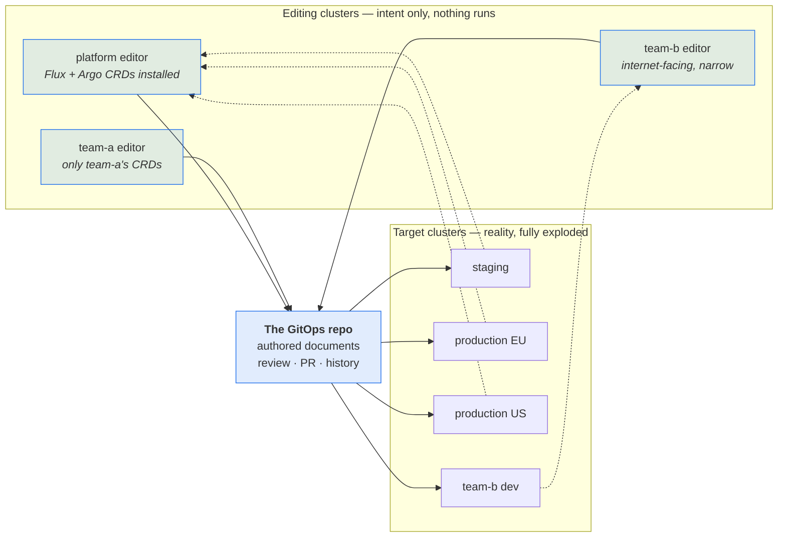
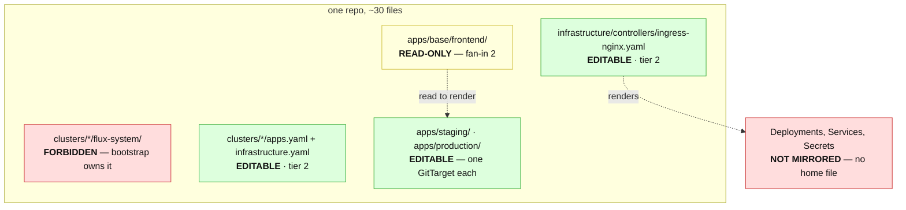

# Reverse GitOps — talk material

> Scratch notes for an advanced-level conference talk. Untracked (`*.ignore.*`), so nothing here
> is linted, linked from, or binding. Verdicts live in
> [`design/support-boundary/support-contract.md`](design/support-boundary/support-contract.md).

---

## 1. The three players (and how many of each)

Everything in this document is easier to place once the cast is fixed. There are three, and the
whole design falls out of keeping them apart.

### The target cluster — reality, fully exploded

What is actually running. Every object is here: the ones a human wrote, and the far larger number a
controller derived from them. Helm releases are rendered, `ApplicationSet`s have fanned out,
`ResourceSet`s have expanded, webhooks have defaulted fields, and controllers have written status.

**You do not know in advance that all of it can be reversed — and most of it cannot.** That is not a
gap to be closed; it is the shape of the problem. A rendered `Deployment` has no home file to go
back to, and inventing one would create a second source of truth.

### The GitOps repo — the thing kept in line with the target cluster

Argo CD and Flux exist to guarantee this alignment, and they are good at it. That guarantee is what
makes reverse-GitOps possible at all: if the repo is authoritative for the target cluster, then
**writing to the repo is a legitimate way to change the target cluster** — the long way round, through
review, rather than the short way round, through `kubectl`.

This is where GitOps Reverser commits when it detects an action in the editing cluster.

### The editing cluster — the API server used as an editing surface

A **separate** cluster, deliberately. Hooked up to the internet so people can make changes easily,
and separate in environment and in time from the target — which is exactly what makes producing a
**pull request** natural rather than awkward. You are not racing a reconcile loop; you are composing
a change.

Two consequences worth saying out loud on stage:

- **The Kubernetes API is a very good editing UI, and it is free.** CRD schemas, enums, `required`,
  `minItems`, defaulting, admission webhooks, RBAC, audit, watch — an editing cluster gets all of it
  without anyone building a form. That is why the e2e `IceCreamOrder` CRD is stuffed with enums and
  constraints (see the [test-CRD catalogue](test-corpora-and-crds.ignore.md)): it is the demonstration that **the edit is validated before Git ever sees
  it**. A malformed intent never becomes a commit.
- **Nothing runs there**, so you can install CRDs without their controllers, and the object set is
  naturally the *intent* layer only. Which is the punchline: **the three-cluster split and the
  intent/expansion boundary are the same idea seen from two sides.** The editing cluster physically
  cannot contain expansion output, so it cannot tempt you into reversing it.

Because nothing runs there, the editing cluster is blind to how anything actually behaves — which is
the argument for a **cluster-spy**: a component that ships real status from the real target cluster
back to the editing surface, so an author knows what is genuinely installed and how it is doing
before proposing a change. Status flows one way (target → editor); intent flows the other way
(editor → Git → target). They never cross.

An editing cluster *could* be a live cluster — nothing forbids it, and the bi-directional e2e corner
does exactly that. For the concept it is a sidetrack, and it costs you the two properties above.

### How many of each? — the part that changes the shape

**Three *roles*, not three clusters.** Say the cardinality out loud early, because almost every
interesting consequence in this talk falls out of it:

| Relationship | Cardinality | Reality |
|---|---|---|
| repo → target clusters | **1 : N** | at minimum test + production; realistically **one per team**, plus per-region and per-tenant. `flux-monorepo` ships this shape natively — `clusters/staging/`, `clusters/production/`, and a new cluster is a new directory |
| repo folder → target clusters | **1 : N** | an overlay usually feeds one cluster; a shared `base/` or `infrastructure/` feeds **all of them** |
| editing clusters → repo | **N : 1** | the boxes partition, so the editing surface can partition with them |
| **box (`GitTarget`) → editing cluster** | **N : 1** | ← **the one invariant.** A box has exactly one editor. Two editing clusters able to author the same document is two writers, which is the failure the whole contract exists to prevent |



Solid arrows fanning in on the left are **A** (reverse: watch → sanitize → place → commit). Solid
arrows fanning out on the right are **B** (Argo CD / Flux reconciling, unchanged). Dotted arrows
coming back are **C** (cluster-spy: real status, read-only).

**Git is the waist of the hourglass.** Editing surfaces fan *in* to it; deployment fans *out* of it.
It is the one serialization point, with one history and one review surface — and that is the real
reason a reverse-GitOps tool writes to Git instead of to a cluster. Writing to Git is the only
operation that respects the waist. Everything else is a shortcut that creates a second source of
truth in a system that has N clusters to disagree with.

**Arrow A is the only one GitOps Reverser owns.** Arrow B is Argo CD and Flux doing their job
unchanged — no fork, no plugin, no cooperation required. Arrow C is a separate, read-only concern.

That framing also answers the compatibility question before it is asked. "Does it support Argo CD /
Flux?" is the wrong question, because those tools live entirely on arrow B. The right question is
about arrow A: **does this object have a home file in the repo?**

### Three consequences of N, worth stating in the intro and cashing later

- **The editing cluster reflects Git; the spy reflects the clusters.** With one target cluster you
  can pretend those are the same thing. With four you cannot: staging and production *will* diverge,
  and the editing cluster must not try to represent both. It represents **intent**. Divergence
  between intent and any given cluster is a **fact the spy displays**, not a conflict anyone
  resolves. That separation is cheap to design in and expensive to retrofit.
- **The editing cluster holds one object per *box*, not one per target cluster.** `frontend` exists
  in four clusters with four different replica counts; in the editing cluster it exists once per
  `GitTarget` that owns a document for it. Which strongly suggests **namespace-per-box** in the
  editing cluster — mirroring the write partition, not any cluster's namespace layout. The shipped
  `rules[].sourceNamespace` on `WatchRule` is exactly the mechanism for that, and the
  one-source-namespace guard on an explicit `serializeNamespace: false` already pushes declared
  namespace-free boxes in the same direction. **A guard shipped for document correctness turns out
  to be the multi-editor layout rule.**
- **"Edit production" is not expressible, and that is correct.** You edit *the folder production
  consumes*. If that folder is a shared base, the edit reaches every cluster consuming it. That is
  GitOps working as designed — but it is a blast radius the author has to be shown before they hit
  save, which is §6.
---

## 2. The thesis

> **Every anti-repetition device you add moves state out of files and into a renderer or a
> controller — and that is exactly the state reverse-GitOps has to put back.**

DRY and reversibility are in tension. The interesting engineering is locating the line, not picking a
side. Every example below is chosen to sit somewhere on that line.

There is a second axis crossing it, and §4 is where it gets named: **whether the intent is a
Kubernetes object or a file a CLI reads.** DRY decides how much state left the files; that axis
decides whether what remains is something a cluster can even see.

---

## 3. The six families — the opening slide

From [`test/fixtures/gitops-layouts/README.md`](../test/fixtures/gitops-layouts/README.md). Nineteen
real layouts, grouped by **the decision each one forces**, not by tool:

| Family | The question it forces | The thing that decides it |
|---|---|---|
| 1-desired-state | The files **are** the objects | every live object has a home file |
| 2-rendered | The files are **inputs to a renderer** | renderability |
| 3-expanded | A **controller** materialises objects with no home file | provenance |
| 4-machine-written | Git is an **output** | ownership |
| 5-opaque | The object **is not** the object | capability |
| 6-hostile | Every naive parser assumption, broken on purpose | can we read the bytes |

Families 2, 3 and 4 are the three axes of the support model — renderability, provenance, ownership.

**The distinction families 1 and 3 exist to protect.** All three of these involve a controller; only
the third has no home in Git:

- an `Application` in `1-desired-state/argocd-app-of-apps/` is a file a human wrote;
- a Flux `Kustomization` in `1-desired-state/flux-monorepo/` points at a folder of real files;
- an `Application` in `3-expanded/argocd-applicationset-directories/` is synthesised from a directory
  glob and exists only in etcd.

*"Was a controller involved?"* is the wrong question. *"Does this object have a home in Git?"* is the
right one.

---

## 4. Where intent lives — the movement into KRM

Here is the axis the six families do not name, and it may be the most load-bearing one in the talk:
**is the intent a Kubernetes API object, or a file that a command-line tool reads?**

Helm and Kustomize are, at bottom, **CLI tools**. They are essential, they are everywhere, and
neither is a Kubernetes API concept. `kustomization.yaml`, `Chart.yaml`, `values.yaml` and
`config.properties` are file formats belonging to a binary and a working directory. You always need
the tool to make sense of them. The cluster only ever sees their *output*.

That is not a criticism — it is a *dating*. It is where the ecosystem started, and the movement since
has been steadily **into KRM**.

### Three phases, and each one moves the reversibility line

| Phase | Where intent lives | Expansion runs | Reverse-GitOps consequence |
|---|---|---|---|
| **1 · CLI-native** — Helm, Kustomize | files a binary reads | offline, at your prompt or in CI | intent is **invisible to a watch**. There is no object to observe, so nothing to reverse |
| **2 · CR-wrapped CLI** — Flux `Kustomization`/`HelmRelease`, Argo `Application` | **split**: a CR triggers, files supply | in a controller, driving the same engine | **the seam is the whole problem.** The CR half is editable KRM; the file half is not |
| **3 · Operator-native** — KRO, Crossplane, flux-operator `ResourceSet` | entirely in the API server | a controller reading etcd | intent is **an ordinary KRM document**. Nothing to invert — just watch it and commit it |

**Argo CD and Flux are phase 2, and they are filling exactly the gap you describe** — a controller
wrapped around a CLI so the cluster can hold *some* of the intent. They do it two different ways, and
it is worth being precise because someone in the room will know:

- **Argo CD execs the binaries.** `argo-cd/util/kustomize/kustomize.go` runs `exec.CommandContext(ctx,
  k.getBinaryPath(), …)`, and `util/helm/helm.go` shells out to `helm`. It even runs
  `kustomize edit set nameprefix` to *mutate* a kustomization before building it.
- **Flux links the libraries.** `sigs.k8s.io/kustomize/api` in `flux2/go.mod` and a dedicated
  `pkg/kustomize` module; the Helm SDK likewise. No process boundary — but the same engine.

Process or linkage, the conclusion is identical: **neither engine's input is an API type.** That is
phase 2's defining property, and its seam.

### The seam explains a finding the doc already reports

[§7](#7-editing-kustomize-folders--what-works-what-is-hard-and-an-opinion) quotes
`values-file-projection.md`: *the refusal is location-dependent, not content-dependent* — the same
Helm values get five different verdicts across six locations. That is not an inconsistency in the
tool. **It is the phase-2 seam showing through.**

- Values **inside** the CR (`HelmRelease.spec.values`, Argo `helm.valuesObject`, `parameters`) —
  phase 3 territory, an ordinary field of an ordinary object. **Editable.**
- Values in a **file** the CR points at (`valueFiles`, `valuesFiles`, a `values/` directory) —
  phase 1 territory. **Refused, or not even seen.**

Same bytes. Same meaning. The verdict is decided by *which side of the seam they landed on*. Once you
put it that way, the projection argument in §7 stops being a proposal and becomes the obvious
consequence: **a projection is a phase-1 file being given a phase-3 identity.**

And the capability model already says so in its own vocabulary — rule 1: *would an API server accept
this document under strict decoding? If not, it needs a projection kind.* That question is precisely
*"which phase is this file from?"*

The delicious case is `kustomization.yaml`: `apiVersion: kustomize.config.k8s.io/v1beta1`,
`kind: Kustomization` — **KRM cosplay.** It has the costume and no API server will ever store it.

### Where KRO and Crossplane shine — and the counterintuitive part

This is where the phase-3 tools earn their place in the talk: **you declare a CR, and the CR *is* the
intent for exploding it.** No binary, no working directory, no file format. The document is stored,
schema-validated, admission-controlled, RBAC'd, audited and *watchable* — which is to say it is
already everything a reverse-GitOps tool needs, for free.

The counterintuitive part, and the line I would actually deliver:

> **KRO and Crossplane do not make reversal easier. They make it unnecessary.**

The entire apparatus of render-inversion — source-form projection, re-render oracles, candidate
search — exists to cope with tools whose intent is not an object. When the intent *is* an object,
you watch it and commit it, and you are done. **The further along this movement a stack sits, the
less reverse-GitOps machinery it needs at all** — which is a much more interesting claim than "we
support KRO".

Three honest qualifications, because an advanced room will supply them if you do not:

- **Phase 3 does not make the *output* reversible — it makes it less so.** A `kustomize build` is at
  least offline and deterministic; a Crossplane composition can consult live resources and external
  APIs. Tier 3 stays tier 3, and gets harder. Operator-native composition **maximises the editable
  surface and minimises the invertible one at the same time** — which is fine, because you never
  wanted to invert the output. You wanted to edit the input, and now the input is an object.
- **The fan-in problem relocates; it does not disappear.** A template inside a CR still has fan-in N
  over its inputs, exactly like an `ApplicationSet.template`. Phase 3 moves the problem from the
  filesystem into the document — and brings a template language *inside a YAML value* with it
  (flux-operator's `<< inputs.tenant >>`, which is render-fidelity territory again).
- **KRM nested in KRM breaks naive readers**, which is why the corpus plants KRO and Crossplane
  documents in [`6-hostile/`](../test/fixtures/gitops-layouts/6-hostile/mixed-and-hostile/) — and
  why its README already flags that as the wrong home: they *"deserve a first-class `3-expanded/`
  fixture, because KRM-nested-in-KRM is mainstream for them, not hostile."* A named gap, not an
  oversight.

### The movement is observable inside Flux itself

The best evidence that this is a real direction of travel and not a vendor pitch: **flux-operator's
`ResourceSet` is Flux moving from phase 2 to phase 3.** It carries the template *and* its inputs in
one document, and the guides pitch it explicitly as a replacement for base + overlays — the
`3-expanded/flux-resourceset-inline` fixture against the `2-rendered/kustomize-overlays` one is the
same intent, expressed on both sides of the movement. You do not need KRO to show this; the
ecosystem is demonstrating it against itself.

And you can demo phase 3 live: the KRO `ResourceGraphDefinition` in the demo cluster turns one
`PodInfoApp` CR into an `IngressRoute`, a `Deployment`, a `Service` and a Traefik `Rule` ([catalogue §3](test-corpora-and-crds.ignore.md)).

---

## 5. Intent is a boundary — and the exploders are intent too

The six families split intent from expansion, which is right but one level too coarse. There are
**three** tiers, and the middle one is where the value is:

| Tier | What it is | Home file? | Example | Verdict |
|---|---|---|---|---|
| 1 | a document that **is** an object | yes | `apps/frontend/deployment.yaml` | Editable |
| 2 | a document that **causes** objects | yes | `ApplicationSet`, `ResourceSet`, `HelmRelease`, KRO `ResourceGraphDefinition`, Crossplane `Composition` | **Editable — and the highest-leverage surface in the repo** |
| 3 | the objects it caused | **no** | the forty generated Applications, the rendered Deployments, the expanded ConfigMaps | Not mirrored |

Almost everyone collapses tiers 2 and 3 into "expansion" and writes both off. That is the mistake,
and the support contract does not make it — it lists `ApplicationSet`, `ResourceSet`, `HelmRelease`,
`ResourceGraphDefinition` and `Composition` all as **editable documents**, with only their *output*
refused.

Three reasons tier 2 is the best surface rather than a grudging exception:

- **Leverage.** One document controls N live objects. Editing an `ApplicationSet`'s generator is
  worth more per edit than editing forty generated Applications — and it is one commit, one review,
  one diff.
- **It is small.** A generator is a handful of fields with a schema. That is exactly what an API
  server is good at presenting and validating.
- **It is inert on the editing cluster.** Nothing expands it there. The same object that is a live
  bomb in the target cluster is just a document in the editing cluster. **The cluster split is what
  makes editing it safe.**

### The asymmetry that gives you the slide

**Editing a generator is easy. Reversing its output is impossible. And it is the same rule as
base-vs-overlay:**

- a change to the `ApplicationSet` *itself* → one document, one commit. Trivially supported.
- a change to a *generated* `Application` → the field lives in a `template` shared by N
  Applications. **Fan-in N.** Refused.

The contract says it in one line: *`ApplicationSet` (the CR) — **editable as a document**, but its
`template` has fan-in N.*

So **fan-in = 1 explains base-vs-overlay and generator-vs-generated with one sentence.** State it
once, early, then spend it three times. It is the closest thing this talk has to a theorem.

One precise boundary worth quoting, because it is the closer from Act 4 restated as a field:
`ResourceSetInputProvider` is **editable**, but `status.exportedInputs` is **live-only and
unwritable**. The CR is yours; the inputs it fetched from the world are not.

### Intent is a boundary somebody declared

The working definition of intent so far has been about **provenance** — a document a human authored
and committed. There is a stronger definition, and it is the one that makes the boxes drawable:

> **Intent is a surface somebody deliberately declared as the thing you are meant to vary.**

A `values.yaml` is exactly that: the chart author saying *these are the knobs*. A
`values.schema.json` makes it typed and machine-checkable. That is not documentation — **it is the
boundary, published**. Somebody thought about which knobs are safe to turn, and then wrote it down
in a form a machine can read.

Three reasons that definition beats the provenance one:

- **It makes the box findable rather than inferred.** You do not have to guess which fields are safe
  to write; the author already said.
- **It is what makes bounded search possible at all.** Helm-light's property 3 is literally *"the
  schema closes the leaf set."* Without a declared surface, band 2 in §7 is not hard — it is
  **unbounded**, and no oracle saves you from an infinite candidate space.
- **It carries judgment.** Editing into a declared surface inherits the thinking that produced it.
  Editing rendered output inherits nothing.

### Every phase-3 tool ships one, and that is not a coincidence

| Tool | Its declared intent surface | Where the declaration lives |
|---|---|---|
| Helm chart | `values.yaml`, plus `values.schema.json` when the author is serious | a file beside the chart |
| kustomize overlay | a **fixed, closed vocabulary the tool itself declares** — `images`, `replicas`, `namespace`, `patches` | the tool's spec, not the repo |
| Argo `ApplicationSet` | the generator's parameters | a field of the CR |
| flux-operator `ResourceSet` | `spec.inputs` | a field of the CR |
| KRO `ResourceGraphDefinition` | `spec.schema` — which **is** a CRD schema | the API server |
| Crossplane | the `CompositeResourceDefinition` | the API server |

Read the right-hand column downward: **that is §4's movement, seen from the intent side.** The
boundary starts as a side-car JSON file and ends up as a CRD inside the API server. And once it is a
CRD, the API server *enforces* it — which is the editing-cluster argument from §1. Three threads, one
idea:

> **A declared intent schema, promoted into the API server, is simultaneously the box, the
> validation, and the editing surface.**

The *locus* of the declaration is also what decides which band of §7 you land in, which is worth its
own line because it explains the whole ladder in one go:

| Declared by | Consequence |
|---|---|
| **the tool** (kustomize) — closed, universal | the candidate edit is **closed-form**. Band 1 |
| **the author** (a chart's values + schema) — open, but typed | **bounded search**. Band 2 |
| **the API** (RGD / XRD) — an object with a schema | **no inversion needed at all**. Just watch it |

A caution worth voicing, because it is where the idea is abused: a chart exposing four hundred
ungrouped values has *declared* a surface without *drawing* a boundary. The declaration only helps to
the extent somebody actually thought about it.

### "I don't want to edit the exploded resources" — and mostly you cannot

You are right that exploded resources are recognisable. The repo measured it:
[`expansion-provenance-markers.md`](facts/expansion-provenance-markers.md), taken 2026-07-13 against
a live Kubernetes v1.36 with Flux v2 + flux-operator and Argo CD v3.4.5 — **observed on real objects,
not read from upstream source.**

The good news is that the evidence exists. The bad news is that it is not the evidence anyone reaches
for first:

- **`ownerReference` catches one producer in five.** `HelmRelease`-rendered objects and
  `ResourceSet`-expanded objects carry **zero** owner references. A gate keyed on it mirrors exactly
  the objects it exists to refuse.
- **Sibling label prefixes, opposite verdicts.** `kustomize.toolkit.fluxcd.io/name` → the source is a
  folder of files → **mirror it**. `helm.toolkit.fluxcd.io/name` → the source is a chart → **never**.
  Same vendor, same shape. Any rule of the form *"gate on `*.toolkit.fluxcd.io/`"* gets one of them
  exactly backwards. This is a terrific 20-second slide.
- **`managedFields[].manager` is the only uniform channel** — `kustomize-controller` and
  `argocd-controller` have homes, `helm-controller` and `flux-operator` do not — and the doc notes no
  design currently uses it.

**And there is a fourth channel, far richer than the other three — Helm writes down what it
installed.** Helm stores every release as a Secret named `sh.helm.release.v1.<release>.v<revision>`,
of type `helm.sh/release.v1`, holding a base64'd, gzipped JSON of the release: the chart metadata,
the **rendered manifest**, and the **values that produced it**. That is not a marker scattered on
objects — it is a complete inventory *plus* a snapshot of the declared intent surface at install
time, versioned per revision. For a Flux `HelmRelease` you can therefore know exactly which objects
belong to the release and which values produced them, inferring nothing from labels. helm-controller
performs real Helm installs, so these exist, and `HelmRelease.spec.storageNamespace` decides where
they live — the corpus fixtures set it deliberately (`flux-system` in
[homelab-flux](../test/fixtures/layout-corpus/specific-examples/homelab-flux/), `ingress-nginx` in
[flux-helmrelease](../test/fixtures/gitops-layouts/3-expanded/flux-helmrelease/)).

*(It does **not** work for Argo CD, because Argo only renders. `util/helm/cmd.go` builds exactly one
command — `helm template <chart> --name-template <name>` — and there is no `install` or `upgrade`
anywhere in `util/helm/`. Argo applies the rendered output with its own controller, so there is no
release, no `sh.helm.release.v1.*` Secret, and `helm list` shows nothing. **The same chart, driven by
two GitOps tools, leaves two completely different amounts of evidence behind** — which is the second
instance on this slide of "same construct, opposite verdict by ecosystem", after the sibling label
prefixes.)*

Two consequences, one line each:

- **It is a read channel, never a write target.** The Secret is machine state — a gzipped blob that
  is expansion output *about* expansion output. Nothing mirrors it to Git.
- **But it is the closest thing to ground truth helm-light could ask for.** The values a release
  actually used are recorded, in-cluster, per revision. A reverse-engineered values edit can be
  checked against what Helm itself wrote down — a stronger oracle than re-render alone, and one
  available on the Flux side only.

And the column that answers your point directly — **only some exploded objects have anywhere to go
back to**, measured:

| Produced by | Home in Git? | Because its source is… |
|---|---|---|
| Flux `Kustomization` → workload | **yes** | a folder of real files |
| Argo `Application` → workload | **yes** | a folder of real files |
| Argo `ApplicationSet` → `Application` | **no** | a generator |
| Flux `HelmRelease` → workload | **no** | a chart |
| flux-operator `ResourceSet` → anything | **no** | a template inside the CR |

Two of five. A controller applied all five, so *"was a controller involved?"* separates none of them
— **"applied by a controller" and "synthesised by a controller" are different things**, and this
table is what makes that distinction measurable rather than philosophical. It is §3's rule with
markers you can key on.

One honest note that belongs on the same slide: sanitization strips
`kustomize.toolkit.fluxcd.io/` today but **not** `helm.toolkit.fluxcd.io/`,
`resourceset.fluxcd.controlplane.io/`, or `meta.helm.sh/release-*`. Committed, each is read back as
user intent — the same family as the Argo tracking-id hazard. It is moot only because the provenance
gate would refuse those objects outright, **and that gate is unbuilt.**

### The rule both halves add up to

Put the declared boundary and the provenance table together and you get what I think is the single
best formulation in this whole document:

> **You never edit an exploded resource. You edit the declared input that produced it — and only when
> the change is expressible there.**

[Shape 8](../test/fixtures/layout-corpus/shapes/8-base-owned-field-edit/) is not a kustomize quirk;
it is this rule's first instance. An image bump *is* expressible in kustomize's declared surface, so
it lands as an overlay `images:` entry. An env var is not, so it is refused. Every producer gets the
same treatment, and the only thing that varies between them is **how rich its declared surface is.**

Which also resolves the apparent contradiction in §4 — that phase 3 makes output *less* invertible
while being the direction of travel:

| | **Invertibility** | **Expressibility** |
|---|---|---|
| the question | can I work backwards from output to input? | can I say what I want in the declared surface? |
| kustomize | good — offline and deterministic | narrow, closed vocabulary |
| Helm | poor | wide, and typed when there is a schema |
| KRO / Crossplane | none — dynamic and cluster-side | widest: the schema **is** the API |

> **You do not need to invert if you can express.**

That is why the movement in §4 is good news rather than bad. It trades an invertibility problem for
an expressibility surface — and expressibility is the one a human can actually reason about, review,
and be held to.

---

## 6. Drawing the box — and how many boxes there are

A reverse-GitOps tool that tries to reverse everything is worse than useless: it will be wrong, and
being wrong here means destroying somebody else's invariant. A tool that reverses a small,
well-chosen surface is genuinely useful. **The engineering is choosing the box — and the box is
drawn by all three players at once.**

`flux-monorepo` is the right example to draw on, because one ~30-file repo contains every verdict:

| Zone | Verdict | Why |
|---|---|---|
| `clusters/*/flux-system/` (`gotk-*`) | **Forbidden** | `flux bootstrap` writes here. Two writers, one folder |
| `clusters/*/apps.yaml`, `infrastructure.yaml` | **Editable — tier 2** | Flux `Kustomization` CRs: they cause expansion, but they are authored documents with home files |
| `infrastructure/controllers/ingress-nginx.yaml` | **Editable — tier 2** | `HelmRepository` + `HelmRelease`: chart version, source ref, inline values |
| whatever that `HelmRelease` renders | **Not mirrored** | no home file, ever |
| `apps/base/frontend/` | **Read-only context** | fan-in 2 (staging + production). Read to render, never written |
| `apps/staging/`, `apps/production/` | **Editable — one `GitTarget` each** | leaf overlays, one write partition per environment |



**The counting punchline:** ~30 files yield **four write partitions** and a handful of watched kinds
(`Kustomization`, `HelmRelease`, `HelmRepository`, `GitRepository`, plus whatever the overlays
hold). The editing surface is a small fraction of the repository — **and that is the feature, not
the compromise.**

### The box is an intersection, and each player contributes one fence

This is the orchestration point, and it is why the three players have to be designed together rather
than assembled:

| Player | The fence it contributes | Mechanism |
|---|---|---|
| **The GitOps repo** | which paths can receive a write at all | `GitTarget.spec.path` — one render root, fan-in 1, everything inside the jail |
| **The editing cluster** | which kinds can be authored at all | which CRDs are installed there. No CRD, no edit — a hard, physical fence, not a policy |
| **The target cluster** | what is actually real, and how it behaves | cluster-spy status; also the only honest answer to "did this land" |
| *(the operator's own knob)* | which of that intersection you **chose** to capture | `WatchRule` / `ClusterWatchRule` — a deliberate allowlist, never a discovery |

The editing surface is the intersection of all four. The `WatchRule` is where you *declare* it.

Two takeaways worth landing explicitly, because they are the ones an audience can act on:

- **You do not widen the box by making the tool smarter. You widen it by choosing a repo layout with
  more fan-in-1 surface.** Your layout determines your editability. That is a decision a team makes
  once, and can go home and revisit.
- **The most DRY layouts have the smallest editable surface.** An `ApplicationSet` matrix or an
  inline `ResourceSet` collapses an entire environment tree into one document — which is one
  editable document and *zero* per-environment edits. Both are legitimate; the trade is real and
  should be made consciously rather than discovered later.

### Fan-out: the second number, and nobody counts it

The model counts **render fan-in** — how many render roots consume a file — and refuses to write
anything above one. With N target clusters there is a second number, pointing the other way:

| | Direction | Question | Today |
|---|---|---|---|
| **Render fan-in** | inside Git | how many render roots consume this file? | counted, and **> 1 refuses** (L2) |
| **Deployment fan-out** | out of Git | how many **clusters** consume this folder? | **not counted, and not knowable from the repo** |

It is not knowable because **the deployer lives in the cluster it deploys to.** The Flux
`Kustomization` or Argo `Application` that points at `apps/production/` is applied to the production
cluster, not committed next to the folder it consumes. A repository scan can see a folder; it cannot
see its audience.

The repo has already met this question one altitude down and decided it deliberately.
[`shapes/README.md`](../test/fixtures/layout-corpus/shapes/README.md) faces exactly this for
namespaces: a namespace-free folder's supplier is a `targetNamespace` or a `destination.namespace`
**living in a different cluster from the repository**, two deployers may point at one folder and land
it in two namespaces, *both correctly* — so there is no post-scan supplier guard, and the rule is:

> **guard what is inside the folder, say nothing about what happens after it leaves.**

I would keep that rule at cluster altitude too, and draw the conclusion it implies:

> **Fan-out is a disclosure, not a fence.** You cannot refuse it — a portable folder consumed by four
> clusters is the intended use, not a fault — but the author must be shown it before they save.
> *"This edit lands in 4 clusters"* is the single most valuable thing an editing surface can put on
> screen, and it is the difference between an overlay edit and a base edit being a **visible**
> choice rather than a discovered one.

And the thing that makes it computable: **the cluster-spy is the fan-out map.** No single component
can know which clusters consume a folder, but each spy knows what its own cluster syncs — repo, path,
revision. The union of those reports *is* the mapping, assembled from the only place it exists. That
is a considerably stronger justification for the spy than status reporting, and it is the one I would
lead with.

### Sharding the editing surface

Because the boxes already partition the repo, the **editors can partition with them** — and the
fence is unusually clean, because it is physical rather than policy: *which CRDs are installed in
that editing cluster.* No CRD, no edit. Nothing to misconfigure.

That buys three things worth having:

- **Trust zones.** The internet-facing editor installs only the narrow, low-risk kinds. Cluster
  entry points — `FluxInstance`, an app-of-apps root `Application`, anything the contract flags as a
  **cluster entry point** — live on an internal editor, or on none.
- **Team ownership without RBAC gymnastics.** One editor per team, holding that team's boxes. The
  blast radius of a compromised editing cluster is *exactly* the set of `GitTarget`s bound to it.
- **They are cheap.** Nothing runs on an editing cluster. Sharding it is close to free, which is not
  true of anything else in this architecture.

The invariant that makes it safe is the one from §1, and it is worth putting on the slide as a rule
rather than a diagram: **every box has exactly one editor.** Two editing clusters able to author the
same document is fan-in 2 at the top of the stack, and it fails for the identical reason a base
shared by two overlays fails.

### The same rule, at four altitudes

Which is the moment to collect it, because it is the spine of the whole design and it shows up as
four apparently unrelated rules:

| Altitude | The rule | What it prevents |
|---|---|---|
| A file inside a render root | fan-in 1 (L2) | one edit silently changing several environments |
| A write inside a target | it stays in `spec.path` (L1) | writing a base you only had permission to read |
| A file behind a projection | one writer per file — projection **xor** inversion | two mechanisms racing on `kustomization.yaml` |
| A box behind an editor | one editing cluster per `GitTarget` | two humans authoring the same document from two API servers |

**Fan-in = 1 is not a kustomize rule. It is the architecture**, and stating it once and cashing it
four times is a better talk than four separate rules that happen to rhyme.

### What I would flag as genuinely open

Since the multiplicity is a new ingredient and not a settled design, these are the questions I would
put on a slide as *open*, which an advanced audience will respect more than four confident answers:

- **Cross-cluster edits have no verb.** "Raise the memory limit everywhere" means editing the shared
  base, which is fan-out N by construction. Shape 6 says *do not point a target at a base*, and the
  [granularity decision](design/support-boundary/gittarget-granularity-and-cross-environment-edits.md)
  parks it as **Option C — a later, narrower verb for shared defaults**, explicitly not the answer
  to "edit every environment". So it is a known deferred verb, not an oversight — but with N
  clusters it is the *most requested thing* that does not exist.
- **Who owns the folder → cluster mapping?** Nobody, today. The spy is the natural home; it needs a
  place to publish to, and that place is probably the editing cluster, which makes the spy a
  writer — into a namespace no box owns.
- **N-way drift has no representation.** Four clusters, one intent, four answers to "is this
  applied?". A single `Ready` condition cannot carry that, and inventing a per-cluster status on the
  `GitTarget` would put target-cluster facts on a repository object. Probably a separate kind; not
  designed.
- **Does an editing cluster edit a box, or a cluster?** Everything above says *a box*, and I believe
  that is right. But it is a UX cliff worth naming from the stage, because every user's first
  sentence will be about a cluster.

---

## 7. Editing kustomize folders — what works, what is hard, and an opinion

You have been probing whether the kustomize folders themselves can be edited. Partly yes — and the
place where it stops is sharp enough to be worth a slide of its own.

### What ships today

Every one of these is proven by rebuilding the folder and comparing before anything is committed:

| Live change | What the writer actually does | Fan-in |
|---|---|---|
| A new object in an overlay | writes the file **and** registers it in that overlay's `resources:` | 1 |
| Edit a document the overlay itself owns | edits in place, wherever it sits — including inside a multi-doc file | 1 |
| Image or replica count of a **base-owned** object | **authors a new `images:` / `replicas:` entry into the overlay's own kustomization** | 1 |
| Delete a base-inherited object in one overlay | authors a `$patch: delete` file plus a `patches:` entry in the overlay | 1 |

The last two are the good ones: the base is never touched, and the other environments keep rendering
exactly what they rendered before.

### Where it stops

- **Any other base-owned field** — an env var, a resource limit, a probe → `WriteBoundaryRefused`,
  and the refusal costs **the whole flush**, not just the offending edit.
- **Generators, `namePrefix` / `nameSuffix`, `components`, remote bases, `helmCharts:`** → refused by
  name.
- **A base shared by more than one overlay, edited in place** → fan-in > 1.
- **Inline and JSON6902 patches, and the deprecated `patchesStrategicMerge` spellings** → refused by
  name. A `path:`-named strategic-merge patch is *tolerated as read-only build context*, and an edit
  to a field that patch owns is refused per object rather than per folder.

### Why the line is exactly there — three bands, not a spectrum

This is the mental model I would put on the slide, because it explains "partly possible but hard"
precisely:

1. **Closed-form + oracle** — the candidate edit is *determined* by the diff; there is nothing to
   search. `images:`, `replicas:`, `resources:`, `$patch: delete`. **The reason these shipped first
   is not that they are common — it is that there is no search.**
2. **Bounded search + oracle** — you must *propose* candidates and test them, but the space is
   bounded by structure or by a schema. Strategic-merge patch authoring into an overlay
   ([`patch-authoring.md`](design/support-boundary/patch-authoring.md)); helm-light's values-leaf
   search bounded by `values.schema.json`. Feasible. **This is the band that is genuinely hard.**
3. **No preimage** — generators, `namePrefix`, remote bases. Not hard: *not an invertible function.*
   A hash-suffixed `ConfigMap frontend-config-abc12` has no name you can point at in the repo, and
   under `namePrefix` the live object's name appears in **no file at all**. There is nothing to
   search *for*.

So: band 2 is hard, band 3 is absent. Those are different problems and they deserve different
answers.

### My opinion

**1. Ship band 2 for kustomize, then stop.** Strategic-merge patch authoring into the overlay is the
highest-value unshipped thing in this area, because it converts the most common refusal — an
ordinary field of a base-owned object — into a normal edit. The expensive half already exists: you
are *already* re-rendering to prove authored `images:` entries. The new work is candidate
generation, not verification, and the failure mode is safe — a proposal that over-reaches is refused
by the oracle rather than written.

**2. Do not chase band 3, and say so loudly.** Refusing generators and `namePrefix` **by name**, with
a reason and a solvable/not-solvable flag, is a better product than a tool that sometimes guesses
right. [`support-today.md`](../test/fixtures/gitops-layouts/support-today.md) already turns that
boundary into a reviewable artifact, which is a stronger claim than any feature list.

**3. The real win is orthogonal to inversion: project the sources.** This is where I would spend the
effort, and the repo has already reasoned its way there for one case.

Every hard case above is hard for the same reason: **the thing you actually want to edit is not a
Kubernetes object.** `config.properties`, `secrets.env`, `values/production.yaml`,
`.argocd-source.yaml` — and `kustomization.yaml` itself. The editing cluster can only express
Kubernetes objects, so none of that is visible to it. Inverting a render is an elaborate way of
guessing at a file you could simply have edited.

[`values-file-projection.md`](design/support-boundary/values-file-projection.md) already makes this
argument for values files, and its central finding is a talk slide on its own: **the refusal is
location-dependent, not content-dependent.** The same Helm values, expressed six ways, get five
different verdicts — editable inline in a `HelmRelease`, editable when a human wraps them in a
`ConfigMap`, refused when they sit as a plain file next to KRM, invisible when they sit alone in a
`values/` directory. Nothing about the *content* changed. Only its location.

The recipe there generalises without modification:

> prove a Git-authored artifact is an input to exactly one consumer → expose it as a virtual editing
> surface → write the YAML-node change back to its one real location in Git.

And the capability model already says which files qualify: rule 1 is *"would an API server accept
this document under strict decoding? If not, it needs a **projection kind** — and that is the only
reason to mint a new kind."* A `kustomization.yaml` fails that test while *looking* like KRM: it
carries `apiVersion: kustomize.config.k8s.io/v1beta1` and `kind: Kustomization`, and no API server
will ever store one. **By the model's own rule, it is a projection candidate** — and it is the
easiest one in the repository, because it is already structured.

The payoff is large: once a `kustomization.yaml` is directly editable, `images:`, `replicas:`,
`namespace:` and `resources:` stop being inversion problems and become plain edits. Band 1 stays as
the convenience path — infer the entry when you can — and "edit the kustomization" becomes the
escape hatch for everything else, replacing a refusal with an action.

Two caveats, one of which the design already handles:

- **Two writers for one file.** If both the projection and the render-inversion can write
  `kustomization.yaml`, you have recreated the exact failure the contract exists to prevent.
  `values-content-architecture.md` already fences this: a projection *"must stay a projection of
  Git — not an additional copy, not a watched cluster object, and never inserted into the normal KRM
  mirror/sweep model."* That fence is load-bearing and it is fan-in = 1 again, one altitude up.
- **A projected `kustomization.yaml` has build-system semantics, and nothing runs on the editing
  cluster.** An author will expect to see the render change and cannot. That points at a capability
  the orchestration still needs: a **dry-run render the editing surface can call** — which is the
  re-render oracle you already have, exposed rather than internal. My honest guess is that this is
  the difference between *an* editing surface and a *usable* one.

There is a pleasing convergence here worth 20 seconds on stage: `values-content-architecture.md`
notes the virtual surface "may eventually be served through an aggregated API" — and
[`test/mutationlab/corpus/flunder/`](../test/mutationlab/corpus/flunder/) has already **measured what
aggregated APIs do to observability**: an empty audit body, a delete that carries a name but no uid,
a deletecollection with no response body at all. The corpus recorded the cost of that route before
anyone took it.

**4. Choose repo layouts; do not merely support them.** The strongest lever is not in the tool at
all. A base with three un-fancy leaf overlays is almost entirely editable. The same application
expressed as an inline `ResourceSet` has an editing surface of exactly one document and no
per-environment edits whatsoever. If editability matters to a team, that is a layout decision — and
it is a better takeaway for the room than any feature.

**In one line:** the kustomize question and the box question are the same question. *"How much of
this repo can I edit?"* is answered by counting fan-in-1 surfaces, and you raise the answer by
changing the repo, by projecting the sources, or by shipping band 2 — in that order of leverage.

---

## 8. The shortlist — four acts and a coda

Four examples, five slides. Each act carries one Flux and one Argo beat so neither tool feels bolted
on; kustomize and Helm each get a full act.

### Act 1 — the baseline that works: `flux-monorepo`

[`test/fixtures/gitops-layouts/1-desired-state/flux-monorepo/`](../test/fixtures/gitops-layouts/1-desired-state/flux-monorepo/)

The canonical Flux shape: `apps/` (base + per-env overlays) + `infrastructure/` + `clusters/<name>/`.
Anti-repetition is real but modest — a new cluster is a new `clusters/` directory, not a copy of the
repo.

- **Two unrelated kinds share the word "Kustomization."** Every file named `kustomization.yaml` is
  `kustomize.config.k8s.io` build config the API server never stores; `clusters/*/apps.yaml` holds
  `kustomize.toolkit.fluxcd.io` CRs it does. The collision appears *inside a single file* — the
  cluster root is a build file whose `resources:` are Kustomization CRs.
- **`apps/` vs `infrastructure/` is a reconciliation-ordering guarantee**, not tidiness — `dependsOn`
  plus `healthChecks`, across directories.
- **The one that matters for reversal:** `apps.yaml` sets `targetNamespace: production`, so an app's
  destination namespace is decided in `clusters/`, not in `apps/`. You cannot know where a folder
  lands by reading that folder.

Opens well because the baseline in
[`support-today.md`](../test/fixtures/gitops-layouts/support-today.md) reports **6 candidates, 6
accepted, 0 refused**. Act 1 is the "this is fine" act, which is what makes Act 2 land.

### Act 2 — the centrepiece: base + overlays, two opposite outcomes

Pair the messy real-world shape with the executable specification:

- [`2-rendered/kustomize-overlays/`](../test/fixtures/gitops-layouts/2-rendered/kustomize-overlays/)
- [`layout-corpus/shapes/6-kustomize-base-and-overlays/`](../test/fixtures/layout-corpus/shapes/6-kustomize-base-and-overlays/)
  and [`shapes/8-base-owned-field-edit/`](../test/fixtures/layout-corpus/shapes/8-base-owned-field-edit/)

The reversal question in one sentence: *one base, three overlays — where does a live edit go?*

- **Three environments are three targets, each rooted at a leaf overlay.** A single target at
  `apps/checkout` is refused by three independent rules that happen to agree: it covers four render
  roots (`LayoutResolved: Ambiguous`), `base/` has fan-in 3 from that vantage point, and a target is
  a write partition. **Read scope is wider than write scope, always.**
- **Same object, two fields, two opposite outcomes** — this is the slide.
  - Bump the image `1.4.0 → 1.5.0`: the value lives in `base/deployment.yaml`, out of reach, so the
    writer **authors a new `images:` block into the overlay's own kustomization** and proves it by
    re-rendering. `test` and `acceptance` still render `1.4.0` — the property base/overlay exists
    for, and which a write into the base would have destroyed.
  - Change `LOG_LEVEL=info → debug`: kustomize has no declaration for an env var, so there is nothing
    to author, and the flush is **refused whole** — `WriteBoundaryRefused`, naming
    `base/deployment.yaml`. From outside the operator: the `kubectl apply` succeeded, the cluster
    runs `debug`, Git has not moved, the GitTarget is `Stalled`.
- **The DRY devices are precisely the refusals.** Same baseline file: `kustomize-overlays` scores
  **1 accepted / 3 refused**, and the reasons read `configMapGenerator, namePrefix, nameSuffix,
  remote-base, secretGenerator`. Every one is an anti-repetition feature. Two concrete reasons why,
  from the fixture itself: generator output carries a **content hash**, so the running
  `ConfigMap frontend-config-abc12` has no single source document; and `namePrefix`/`nameSuffix` mean
  **the applied object's `metadata.name` appears verbatim in no file in the repo**.

The thesis, proven twice in one folder, with a green test and a red one.

### Act 3 — the same problem in Helm, on Argo: `helm-environment-values`

[`2-rendered/helm-environment-values/`](../test/fixtures/gitops-layouts/2-rendered/helm-environment-values/)

Chart in the repo once; `values/common.yaml` + `values/dev.yaml` + `values/production.yaml`; one Argo
`Application` per environment listing `helm.valueFiles` in order. Nothing is duplicated per
environment — this is the Helm answer to base+overlays.

- **The effective config is a merge, not a file.** Chart defaults ← common ← env ← inline
  `helm.parameters`. No file on disk holds the resolved config; **layer order is precedence**.
- **A hidden dotfile is the outermost layer.** `chart/.argocd-source.yaml` is merged over the
  Application's `spec.source`, so it beats the `helm.parameters` in the Application: the tag that
  deploys is the `1.8.4` in the dotfile, not the `1.8.3` in the CR. A directory listing that hides
  dotfiles shows none of this. A sibling `.argocd-source-<appname>.yaml` beats *that*.
- **Reversal consequence:** the baseline finds exactly **one accepted candidate — `argocd/`**. The
  tool sees the two Applications and nothing else; the chart and every values file are invisible.
- **The punchline.** [`helm-light-support-boundary.md`](design/support-boundary/helm-light-support-boundary.md)
  argues a local chart is Act 2 transplanted: *templates are the read-only base (fan-in N), each
  per-environment values file is the fan-in = 1 write surface, and every write is proven by
  re-render.* Helm and kustomize stop being two problems. Its five-property table (deterministic
  render, traceable input→output, findable candidate edit, locality, checkable fan-in) is a
  ready-made slide, and the honest wrinkle is worth saying: kustomize computes the entry to author in
  closed form, Helm has to **search** a declared input surface and then prove the candidate.

Thirty-second war story to close, from
[`layout-corpus/specific-examples/homelab-argocd/`](../test/fixtures/layout-corpus/specific-examples/homelab-argocd/):
sanitization strips no Argo key by default, and a committed `argocd.argoproj.io/tracking-id` makes
the document claim ownership on behalf of a *different* Application and hard-fails that
Application's sync. It has to be denied by exact key, not by prefix strip, because the rest of that
prefix is user data.

### Act 4 — where reversal stops: expansion

Two fixtures, both DRY taken one step further, one per ecosystem:

- [`3-expanded/argocd-applicationset-directories/`](../test/fixtures/gitops-layouts/3-expanded/argocd-applicationset-directories/)
  — carries a **measured observation against real Argo CD v3.4.5**: `mkdir apps/worker && git commit
  && git push`, authoring **no** `Application` CR at all, produced `app-worker Synced Healthy`. A
  folder name became a deployed application. The most vivid 20 seconds in the corpus.
- [`3-expanded/flux-resourceset-inline/`](../test/fixtures/gitops-layouts/3-expanded/flux-resourceset-inline/)
  — flux-operator's guides pitch `ResourceSet` **explicitly as a replacement for base + overlays**,
  collapsing an `app1/{base,overlays/tenant1,overlays/tenant2}` tree into a single file. One document
  carries the template *and* its inputs; nine live objects, zero files. It is literally the Act 2
  fixture re-expressed, so the two slides answer each other.

Then the closer:
[`3-expanded/flux-resourceset-pull-requests/`](../test/fixtures/gitops-layouts/3-expanded/flux-resourceset-pull-requests/)
— a preview environment per open pull request. Same mechanism, one change that breaks a deeper
assumption: **the inputs are not in the repository.** Desired state is "however many PRs carry the
`preview` label right now", which no repository scan can ever know.

Land it on the contract in one line: **edit the intent layer; never edit the expansion layer.** The
`ResourceSet` CR is editable — `spec.inputs` is a real surface. What it expands is not, and never
will be. That is §5 arriving on stage: these two fixtures are tier 2 and tier 3 standing next to
each other, and the audience has already been given the rule that separates them.

### Coda — Git is an output too

[`4-machine-written/flux-image-automation/`](../test/fixtures/gitops-layouts/4-machine-written/flux-image-automation/)
plus the `.argocd-source-frontend-production.yaml` already shown in Act 2 — written and committed by
Argo CD Image Updater. **Both ecosystems have a bot committing to the repo**, and in Flux's case a
`# {"$imagepolicy": ...}` **YAML comment is load-bearing**. If you are going to write to Git, you
must know who else does; both are `Refused` in the contract for exactly that reason. One slide, and
the cleanest bridge to "what does a reverse-GitOps tool refuse, and why is refusing the feature".

---

## 9. Where the full inventory went

The complete catalogue — all 19 `gitops-layouts` fixtures with talk-value ratings, the
`layout-corpus` write-back scenarios, every corpus in the repo with the direction it exercises, and
every test CRD — is in **[`test-corpora-and-crds.ignore.md`](test-corpora-and-crds.ignore.md)**.

Only the four examples in §8 need stage time. The rest is reference for answering questions.

---

## 10. Suggested cuts

Drop `argocd-plain`, `argocd-app-of-apps`, `shapes/7`, `argocd-applicationset-files`,
`mixed-and-hostile`, and either `argocd-external-helm` or `helm-environment-values` (keep the
latter). Six examples in a 40-minute advanced talk is already ambitious; **four plus two 20-second
cameos** is the right density.

Keep in reserve, for questions:

- `flux-helmrelease` — if someone asks why Helm was demoed on Argo.
- `sops-encrypted` — if someone asks about secrets. The verdict is **Write-only**: describable and
  replaceable, never readable, because the SOPS `mac` binds the whole document.
- `repo-per-environment` — if someone proposes it as the answer. It is: at the cost of every DRY
  property they came to the talk with.
- `test/mutationlab/corpus/` — if someone asks how you even observe the edit. One killer fact ready:
  a finalized deletion has **two actors**, and the human's `delete` and the controller's finalizer
  `patch` both return bodies carrying the **same** resourceVersion, so two different facts collide
  on one key.

---

## 11. Two honesty beats

Both buy real credibility with an advanced audience.

1. **The `helm-chart` false positive, admitted from the stage.** The corpus README flags it itself: a
   scan reports `charts/frontend/crds` as the *single accepted candidate*, so an onboarding report
   says "1 folder supported" about a chart the tool cannot meaningfully support at all — because
   `crds/` is real KRM while `templates/` is not. Showing a known false positive in your own tool is
   worth more than three green slides.
2. **The baseline is generated, not written.** `task gitops-layouts-baseline` regenerates
   [`support-today.md`](../test/fixtures/gitops-layouts/support-today.md), and the reading rules are
   quotable: *`rc=0` does not mean supported*, and *a missing candidate matters as much as a refusal
   — it means the tool did not explain that part of the repository at all.* Regenerating it live, or
   just showing that **the diff is the review artifact**, makes the boundary argument concrete rather
   than rhetorical.

---

## 12. Live demo

```bash
task clean-cluster
REPO_NAME=demo task test-e2e-demo
```

Brings up [`test/e2e/setup/demo-only/`](../test/e2e/setup/demo-only/): podinfo with
base / preview / production overlays, a KRO `ResourceGraphDefinition`, a Gitea webhook receiver, an
audience voting app with its own CRDs and RBAC, and a Cloudflare tunnel for public access. Demo
images are served from `https://demo.configbutler.ai/podinfo-assets/`.

The demo beat that matches the talk: edit a `CoffeeConfig` in the editing cluster, watch the commit
appear, and point at the `coffeeconfig-flux.yaml` sitting beside it that arrived the other way.
