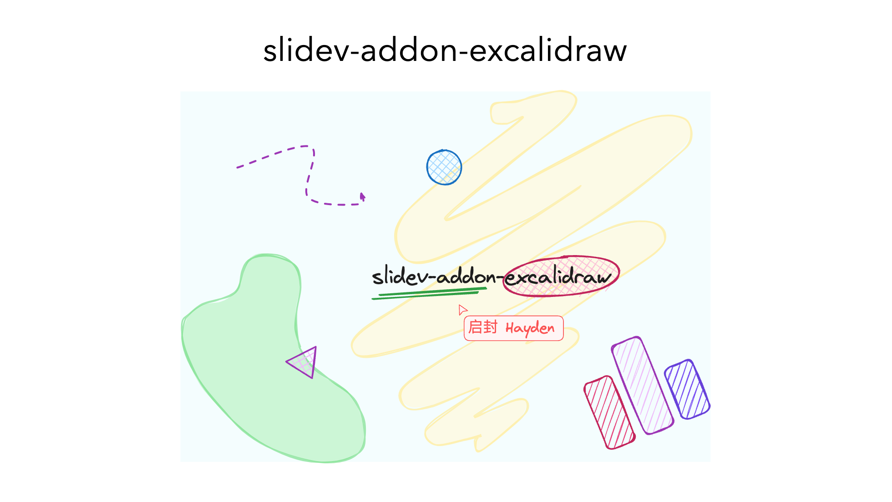

Updates

Added support for rendering a single frame only.

Ensured seeded random effects use a stable seed for identical objects. This is especially helpful for slide sequences that gradually build up an image across slides.

Libraries are now retrieved through package.json.

Fonts are downloaded locally, while keeping the online fallback in place.

Added caching for renderings.

A specific frame can now be selected, and identical elements render consistently across frames. This is done by keeping the seed stable, which avoids small visual shifts in elements that remain in the same position.

Added unit tests to validate this behavior.

TODO

Made a start on MAGIC-MOVE.md. It is good enough for now, but there are still some technically interesting things left to explore.

Update the README.

Decide whether to open a PR or maintain this as a fork.

---

# Based upon slidev-addon-excalidraw

show excalidraw in [slidev](https://sli.dev/)



```md
---
layout: center
---
<div class="flex flex-col items-center">

# slidev-addon-excalidraw

<Excalidraw
  drawFilePath="./example.excalidraw.json"
  class="w-[600px]"
  :darkMode="false"
  :background="false"
/>

</div>
```

## Installation

```bash
pnpm add slidev-addon-excalidraw
```

### Usage

-   Define this addon in `frontmatter`

```yaml
addons:
    - slidev-addon-excalidraw
```

-   or in `package.json`

```json
 "slidev": {
    "addons": [
      "slidev-addon-excalidraw-renderer"
    ]
  },
```

## Components

### Excalidraw

> [!NOTE]
> excalidraw file must be in `public`, and drawFilePath must be relative to your [Public Base Path](https://vitejs.dev/guide/build.html#public-base-path).

```vue
<Excalidraw
  drawFilePath="./example.excalidraw.json"
  class="w-[600px]"
  :darkMode="false"
  :background="false"
/>
```

### Options

| Name | Type | Default | Description |
| --- | --- | --- | --- |
| `drawFilePath` | `string` | `undefined` | The path to the excalidraw json file. It must be relative to your [Public Base Path](https://vitejs.dev/guide/build.html#public-base-path). |
| `darkMode` | `boolean` | `false` | Whether to use dark mode. |
| `background` | `boolean` | `false` | Whether to show the background. |